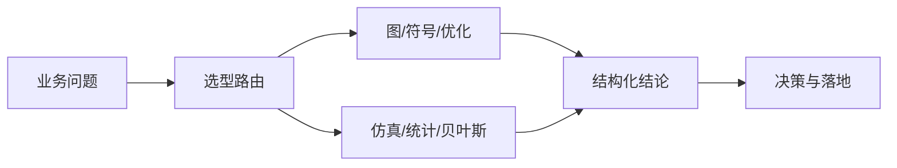

## 是什么

让算法团队把图算法（networkx）、符号数学（sympy）、多目标优化（pymoo）、离散仿真（simpy）、统计建模（statsmodels）、贝叶斯推断（pymc）整合成一套统一工具集，帮你把"业务问题（如路径规划、参数调优、不确定性量化）"翻译成"可复现、可解释的数学模型与最优解"，把决策从经验拍脑袋升级到结构化结论。

## 怎么用

1. 先把业务问题归类到 6 个原型之一（图、符号、优化、仿真、统计、贝叶斯），让选型不再靠工程师个人偏好。
2. 用 networkx 把"关系数据"（社交、知识图谱、供应链）转成图结构，让 PageRank、社区发现、最短路径一键产出业务洞察。
3. 用 pymoo 在"成本、收益、风险"等多目标之间求 Pareto 前沿（帕累托前沿），帮决策者看清"取舍空间"而不是只给一个推荐解。
4. 用 simpy 在不烧真金白银的前提下模拟排队、客服、生产节拍，让上线前先看清吞吐瓶颈。
5. 用 pymc 给关键指标加上"置信区间 + 后验分布"，让 A/B 测试结论从"涨了 2%"升级到"涨幅 95% 概率落在 1.2%–2.8%"。

## 架构图



# Algorithm Team Core Toolkit

## Overview

算法团队核心工具集，覆盖图算法、数学建模、优化、仿真等领域。

## Quick Reference

| 工具 | 场景 | 典型应用 |
|------|------|----------|
| **networkx** | 图算法 | 社交网络、知识图谱、路径规划 |
| **sympy** | 符号计算 | 公式推导、自动微分 |
| **pymoo** | 多目标优化 | 参数调优、资源分配 |
| **simpy** | 离散事件仿真 | 排队系统、流程模拟 |
| **statsmodels** | 统计建模 | 时间序列、回归分析 |
| **pymc** | 贝叶斯推断 | 不确定性量化、A/B测试 |

## 子Skills

- `networkx/` - 图论算法
- `sympy/` - 符号数学
- `pymoo/` - 多目标优化
- `simpy/` - 离散仿真
- `statsmodels/` - 统计模型
- `pymc/` - 概率编程

## 常用模式

### 图算法 (NetworkX)
```python
import networkx as nx

G = nx.DiGraph()
G.add_edges_from([(1,2), (2,3), (1,3)])

# 最短路径
path = nx.shortest_path(G, 1, 3)

# PageRank
pr = nx.pagerank(G)

# 社区发现
communities = nx.community.louvain_communities(G)
```

### 多目标优化 (pymoo)
```python
from pymoo.algorithms.moo.nsga2 import NSGA2
from pymoo.optimize import minimize

algorithm = NSGA2(pop_size=100)
res = minimize(problem, algorithm, ('n_gen', 200))
```

### 贝叶斯推断 (PyMC)
```python
import pymc as pm

with pm.Model() as model:
    mu = pm.Normal('mu', mu=0, sigma=1)
    obs = pm.Normal('obs', mu=mu, sigma=1, observed=data)
    trace = pm.sample(1000)
```

### 离散仿真 (SimPy)
```python
import simpy

def process(env):
    while True:
        yield env.timeout(1)
        print(f"Time: {env.now}")

env = simpy.Environment()
env.process(process(env))
env.run(until=10)
```

---

猪哥云-数据产品部 | 算法团队专用
