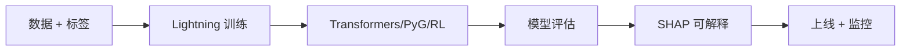

## 是什么

把 PyTorch Lightning（训练框架）、Transformers（预训练大模型）、PyG（图神经网络）、Stable-Baselines3（强化学习）、SHAP（模型可解释性）打包成算法团队的深度学习全链路工具集，帮你把"原始数据 + 业务标签"变成"可上线、可解释、可监控的模型服务"，让模型从实验脚本走向稳定线上资产。

## 怎么用

1. 先用 PyTorch Lightning 把训练流程标准化（数据加载、训练循环、验证、保存），让团队成员的实验代码风格统一、可复现。
2. 用 Hugging Face Transformers 直接微调中文 BERT/LLM（大语言模型），把"从零训练"的周级成本压到"微调"的小时级。
3. 用 PyG（PyTorch Geometric）把用户关系、商品关联、知识图谱转成图神经网络任务，让推荐、风控、链接预测拿到关系信号红利。
4. 用 Stable-Baselines3 在仿真环境里跑强化学习策略，让定价、调度、库存决策从规则配置升级到自适应策略。
5. 上线前用 SHAP 给关键模型出"特征贡献度报告"，让业务方、合规方看得懂模型为什么这样判，降低"黑盒拒贷/拒推"风险。

## 架构图



# Algorithm Team Deep Learning Toolkit

## Overview

算法团队深度学习工具集，从模型训练到部署全覆盖。

## Quick Reference

| 工具 | 场景 | 典型应用 |
|------|------|----------|
| **pytorch-lightning** | 模型训练 | 标准化训练流程 |
| **transformers** | NLP/LLM | 预训练模型微调 |
| **torch_geometric** | 图神经网络 | GNN、节点分类、链接预测 |
| **stable-baselines3** | 强化学习 | RL算法实现 |
| **shap** | 模型解释 | 特征重要性、可解释AI |

## 子Skills

- `pytorch-lightning/` - 深度学习训练框架
- `transformers/` - Hugging Face预训练模型
- `torch_geometric/` - 图神经网络
- `stable-baselines3/` - 强化学习
- `shap/` - 模型可解释性

## 常用模式

### 标准训练流程 (PyTorch Lightning)
```python
import pytorch_lightning as pl

class Model(pl.LightningModule):
    def __init__(self):
        super().__init__()
        self.layer = nn.Linear(10, 1)

    def training_step(self, batch, batch_idx):
        x, y = batch
        loss = F.mse_loss(self.layer(x), y)
        self.log('train_loss', loss)
        return loss

    def configure_optimizers(self):
        return torch.optim.Adam(self.parameters(), lr=1e-3)

trainer = pl.Trainer(max_epochs=100, accelerator='gpu')
trainer.fit(model, train_loader)
```

### 图神经网络 (PyG)
```python
from torch_geometric.nn import GCNConv
import torch.nn.functional as F

class GCN(torch.nn.Module):
    def __init__(self):
        super().__init__()
        self.conv1 = GCNConv(num_features, 16)
        self.conv2 = GCNConv(16, num_classes)

    def forward(self, data):
        x, edge_index = data.x, data.edge_index
        x = F.relu(self.conv1(x, edge_index))
        x = self.conv2(x, edge_index)
        return F.log_softmax(x, dim=1)
```

### 强化学习 (Stable-Baselines3)
```python
from stable_baselines3 import PPO

model = PPO("MlpPolicy", "CartPole-v1", verbose=1)
model.learn(total_timesteps=10000)

# 评估
obs = env.reset()
for _ in range(1000):
    action, _ = model.predict(obs)
    obs, reward, done, info = env.step(action)
```

### LLM微调 (Transformers)
```python
from transformers import AutoModelForSequenceClassification, Trainer

model = AutoModelForSequenceClassification.from_pretrained(
    "bert-base-chinese", num_labels=2
)

trainer = Trainer(
    model=model,
    train_dataset=train_dataset,
    eval_dataset=eval_dataset,
)
trainer.train()
```

## 算法团队最佳实践

1. **实验管理**: 使用MLflow/W&B记录所有实验
2. **模型版本**: DVC管理模型和数据版本
3. **可复现性**: 固定随机种子、记录超参数
4. **代码规范**: 使用Lightning模块化代码

---

猪哥云-数据产品部 | 算法团队专用
