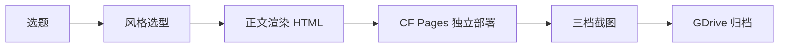

## 是什么

把"深度学习系列"每一期专题报告（访谈、论文、框架、争议）从内容生成、签名视觉风格、独立 CF Pages（Cloudflare Pages）子域名、4K + 移动 + 微信三档截图、到 Google Drive 结构化归档串成一条流水线，帮你把"一个深度学习选题"稳定产出成"一篇有编辑级排版、有独立访问入口、有可分发素材、有可追溯档案"的对外资产。

## 怎么用

1. 先按"内容是否自带视觉符号"决策：自带就委托一套新的签名风格（Hermes、Bloomberg、Anthropic 等），不带就从 html-style-router（风格路由）里选 12 套之一，让每期视觉不重样。
2. 用 deep-learning-skill 生成正文 + 3 层结构 + 引语 + 数据，再用所选风格统一渲染成 HTML，让正文质量和视觉档次同步保底。
3. 用 deploy-cf.sh 把这一期独立部署到 deeplearn-NN-slug.pages.dev（不与往期共域），让每期 URL 是干净的独立入口。
4. 用 render-poster.mjs 一次性产出 4K 主图、移动主图、1080w JPEG 微信版三档海报，让公众号、朋友圈、企业微信、AirDrop 各取所需。
5. 用 archive-gdrive.sh 按 "日期_深度学习_第NN期_标题" 命名归档到 Google Drive 深度学习目录，并在 state/memory 记一条 episode 索引，让后续每一期都能回溯。

## 架构图



# Deep Learning Pipeline

> Single source of truth for the **深度学习系列** editorial pipeline. Each episode is a topic deep-dive (interview / paper / framework / public debate) shipped with a **signature visual style** (never reused across episodes), a **dedicated CF Pages subdomain**, and a **triple-format poster** (4K master + mobile master + WeChat-friendly JPEG).
>
> Established episodes:
> - **#01** (2026-04-25) 罗福莉访谈 · DeepSeek 范式巨变 · OpenClaw 与 Agent 时代 — `luofuli-interview-2026.pages.dev` (legacy, pre-convention)
> - **#02** (2026-04-30) Hermes-Agent · Nous Research · OpenClaw 对比 · EvoMap 抄袭争议 — `deeplearn-02-hermes-agent.pages.dev` (Hermes Terminal style, frozen v11)

## When to invoke

- User says "出第三期 / 下一期 / 新一期" (next episode signal)
- User refers to existing episodes by name (`罗福莉式` / `hermes-agent式`) → continue the series with same delivery contract, fresh style
- User asks to publish a deep-learning topic article and expects CF deploy + GDrive archive (the full delivery loop, not just a doc)
- User says "深度学习管线 / learning pipeline / 专题报告 / 系列文章"

**NOT for**:
- Pure content generation without delivery → use `deep-learning-skill` directly
- One-off articles outside the editorial series → use `html-style-router` + bespoke pipeline
- Daily AI Intel / news digests → use `wechat-content-pipeline` or Hermes daily report

## Why this skill exists (constraints the public web lacks)

The public web teaches "write Markdown → push to Pages". This skill encodes the **non-obvious project constraints** discovered through episodes #01 and #02:

1. **Signature-style-per-episode is load-bearing**, not decorative. If episodes share a style, the URL/file collision the user saw on #02 (`luofuli-interview-2026.pages.dev/hermes-agent/`) recurs every time. Each episode must commission OR pick a unique visual identity.
2. **Sub-path bundling is a banned pattern**. CF Pages projects must be one-per-episode, named by structured slug `<cat>-<NN>-<title>`.
3. **`background-attachment: fixed` is forbidden** on any custom style — it breaks fullPage screenshot capture (Chrome compositor bug). Encoded as v11 invariant in `html-hermes-style/SPEC.md`.
4. **WeChat image-mode delivery requires 1080w JPEG**, not 4K PNG. Three-layer rule (format / dimensions / send method) — encoded into the renderer script.
5. **Wrangler env-var precedence trap**: `CLOUDFLARE_API_TOKEN` env var with insufficient scope blocks deploys; OAuth fallback in `~/.wrangler/config/default.toml` works if env vars are unset for the call.

## Pipeline (5 stages, sequential)

```
A. STYLE      → pick stock or commission custom (one per episode, never reuse)
B. RENDER     → write HTML using picked style; auto-open
C. DEPLOY     → CF Pages dedicated project deeplearn-<NN>-<slug>; --branch=main
D. SCREENSHOT → single Playwright session: 4K + mobile + WeChat JPEG
E. ARCHIVE    → rclone to GDrive deep-learning folder + ledger entry
```

### A. STYLE — pick or commission visual identity

**Decision tree** (`references/style-decision.md`):

- **Source has signature visual identity** (e.g. Hermes Greek mythology, BloombergTerminal-native data product, Anthropic warm-academic) → commission new bespoke `skills/shared/html-<topic>-style/` with SPEC.md. Cost: ~2 hours; lifetime: reusable for any future content of that topic.
- **No signature identity** → pick stock from `html-style-router` (12 tier styles in `09-output-format.md`). Match tone:
  - Interview / editorial → Claude Warm Academic OR The Economist
  - Strategy / market analysis → McKinsey Blue OR BCG Green
  - Pitch / fundraising → Sequoia Green-Gold
  - Data-dense / quantitative → Bloomberg Terminal
  - Technical / framework launch → Stripe Minimalist
- **Banned**: reusing the previous episode's style (Maurice rule "每次都是一个特色风格"). Episode N must NOT use episode N-1's style.

**Output of stage A**: chosen style ID + SPEC.md path. Logged in `references/episodes.json`.

### B. RENDER — write HTML using picked style

Use the existing `deep-learning-skill` for content generation (3-layer structure / pull-quotes / stats / caveats), but override its template with stage A's style. Render path:

```
outputs/reports/<topic-slug>/<date>-<topic-slug>.html
```

**Mandatory body invariants** (any new style MUST honor):
- `<html> { background-color: <bg-deep-token>; }` — solid fallback for fullPage screenshot
- body uses `background-color` solid base + `background-image` gradients with `background-size: 100% 100vh`; **no `background-attachment: fixed`** (v11 invariant)
- Hero/header readable content and article body must share one layout frame token (`.html-frame` / `.report-frame` or style-equivalent); do not mix viewport hero padding such as `8vw` with a separately centered `main` max-width
- `text-rendering: optimizeLegibility` on body
- Footer Maurice signature (no "Author:" prefix), per `09-output-format.md`
- 2份制 sibling: `.md` canonical English version next to `.html` if the article is meant for cross-tool re-ingestion

After write: auto-`open` for visual review.

### C. DEPLOY — CF Pages dedicated project

```bash
bash scripts/deploy-cf.sh <NN> <topic-slug> outputs/reports/<topic-slug>/
```

The script:
1. Stages the HTML as `index.html` in a temp folder
2. Creates project `deeplearn-<NN>-<topic-slug>` if it doesn't exist (production_branch=main)
3. Deploys with `--branch=main` (apex updates, not preview-only)
4. Verifies HTTP 200 + page title via curl
5. Auto-`open`s `https://deeplearn-<NN>-<topic-slug>.pages.dev/`

**Auth handling**: the script auto-unsets `CLOUDFLARE_API_TOKEN` / `CF_API_TOKEN` / `CLOUDFLARE_ACCOUNT_ID` for the call so wrangler falls back to OAuth in `~/.wrangler/config/default.toml`. This bypasses the env-var precedence trap that blocked initial deploys on episode #02.

### D. SCREENSHOT — triple-format poster

```bash
node scripts/render-poster.mjs --html outputs/reports/<topic-slug>/<date>-<topic-slug>.html
```

Single Playwright session producing three siblings:

| File | Viewport | DSF | Type | Quality | Use |
|---|---|---|---|---|---|
| `<date>-<topic-slug>-4k.png` | 1440×900 | 3 | png | — | Master archive, future re-render reference |
| `<date>-<topic-slug>-mobile.png` | 430×932 (isMobile) | 3 | png | — | AirDrop / file-mode WeChat |
| `<date>-<topic-slug>-wechat.jpg` | 1080×1920 (isMobile) | 1 | jpeg | 92 | Image-mode WeChat / 企业微信 (1080w native, ≤2 MB, ratio ≤1:8) |

All three written to the same `outputs/reports/<topic-slug>/` folder.

### E. ARCHIVE — GDrive structured rename + ledger

```bash
bash scripts/archive-gdrive.sh <NN> <topic-slug> outputs/reports/<topic-slug>/
```

Naming convention (mandatory, per Maurice 2026-04-30):

```
<YYYY-MM-DD>_深度学习_第<NN>期_<title-zh-or-mixed>.<ext>
```

Examples:
- `2026-04-30_深度学习_第02期_Hermes-Agent_Nous-Research_OpenClaw对比_EvoMap抄袭争议.html`
- `2026-04-30_深度学习_第02期_Hermes-Agent_4k_screenshot.png`
- `2026-04-30_深度学习_第02期_Hermes-Agent_wechat_screenshot.jpg`

Target folder: `gdrive:` with `--drive-root-folder-id=18Mnv4HyS4sGXOz7i7EiYZ_YATIifiBEv` (the canonical `deep-learning` folder).

After archive, append a `[DEEP-LEARNING-EPISODE]` line to `state/memory/<date>.md` with episode number, title, style ID, CF URL, GDrive folder, and 4 file checksums.

## Gotchas (built from real failures on episodes #01–#02)

1. **`background-attachment: fixed` breaks fullPage capture.** Documented as v11 invariant in `html-hermes-style`. Any new style folder must inherit this rule. Sentinel: if the WeChat poster has white bleed past the first viewport, this is the cause.
2. **Wrangler `--branch=main` is required for production apex.** Without it, deploy lands in preview-only and the apex `<project>.pages.dev` continues serving the previous deployment. Always pass `--branch=main` for prod.
3. **CF env-var precedence trap.** If `CLOUDFLARE_API_TOKEN` is set in shell with insufficient scope (e.g. only Worker:Edit, not Pages:Project:Read), wrangler returns 400 on `/memberships`. Fix: `env -u CLOUDFLARE_API_TOKEN -u CF_API_TOKEN -u CLOUDFLARE_ACCOUNT_ID wrangler ...` falls back to OAuth in `~/.wrangler/config/default.toml`. Encoded into `deploy-cf.sh`.
4. **Empty curl mirror trap.** `curl -sf URL -o file` saved 0-byte file when source returned 200 but body empty (CF revalidation race). Defensive: pair with `curl -sL` and post-write size check.
5. **WeChat 3-layer image-mode rule** — none individually sufficient:
   - Format: JPEG > PNG (PNG over ~3 MB or extreme ratio degrades to file-mode)
   - Dimensions: width 1080 = native preview; >2048 forces server recompression; aspect ratio ≤1:8 keeps preview-mode
   - Send method: macOS `cmd+C` (Preview) → `cmd+V` (WeChat) forces image-clipboard pipe; drag-drop on macOS WeChat is unreliable for >1 MB. For 企业微信 Bot API, use `media/upload?type=image` + `msgtype=image`.
6. **Sub-path bundling is BANNED**. Each episode = own CF Pages project. Maurice rejected `<series-host>/<episode-slug>/` after seeing episode #02 land at `luofuli-interview-2026.pages.dev/hermes-agent/` (URL slug ≠ content). Project name pattern: `deeplearn-<NN>-<title-slug>.pages.dev`.
7. **GDrive file naming is `<date>_深度学习_第<NN>期_<title>`** — not `<title>_<date>`. Date prefix sorts alphabetically by chronology; episode number is part of the structured key. Apply retroactively when discovered.
8. **Style-per-episode is load-bearing.** Reusing a style across episodes erodes the editorial signature. New episode = new style (stock pick OR custom commission). Past episode style references stay in `references/episodes.json` for cross-reference, NOT for reuse.
9. **`scripts/hermes-weixin-send-image.py` default path = image-mode.** The `--as-file` flag preserves HD by sending as file (auto-converts to download chip on receiver). Without the flag, the script uses `native_image_attempts` ladder which auto-picks ≤512 KB preview candidates → image-mode delivery.
10. **CF edge cache holds stale entries past max-age=0.** After redeploying to remove a sub-path, the apex may serve stale content for ~minutes. Cache-bust query (`?bust=$(date +%s)`) confirms backend is correct; user-facing apex clears naturally.

## Files

- `SKILL.md` — this spec (single source of truth)
- `scripts/render-poster.mjs` — Playwright triple-format renderer (4K + mobile + WeChat)
- `scripts/deploy-cf.sh` — CF Pages dedicated-project deploy with OAuth fallback
- `scripts/archive-gdrive.sh` — rclone wrapper with structured naming
- `scripts/episode-next.sh` — query GDrive to discover next episode number
- `references/episodes.json` — registry of past episodes (#01, #02, ...)
- `references/style-decision.md` — when to pick stock vs commission custom

## Composition with other skills

- `deep-learning-skill` (existing) — body content generation (3-layer structure, stats, pull-quotes, dropcaps). This pipeline calls it for stage B's content; overrides its template with stage A's style.
- `html-style-router` — stock style selection for stage A (12 tier styles).
- `html-hermes-style` — example bespoke style; commission template for new bespoke styles in stage A.
- `auto-visual-swarm-review` — optional ≥3-round swarm review of HTML poster after stage B (per Maurice rule `feedback_auto_swarm_review.md`).
- `aesthetic-quality-probe` (PostToolUse hook) — auto-verifies brand-token adherence after Edit/Write of `outputs/reports/**/*.html`.

## Reference: episode registry

See `references/episodes.json` for canonical record of #01 and #02. Schema:
```json
{
  "<NN>": {
    "date": "YYYY-MM-DD",
    "title_zh": "...",
    "title_en": "...",
    "style_id": "html-<style>-style",
    "style_path": "skills/shared/html-<style>-style/SPEC.md",
    "cf_url": "https://<project>.pages.dev/",
    "gdrive_prefix": "<date>_深度学习_第<NN>期_<title>",
    "html_path": "outputs/reports/<topic>/<date>-<topic>.html",
    "screenshots": { "4k": "...", "mobile": "...", "wechat": "..." }
  }
}
```

---

Maurice | maurice_wen@proton.me
