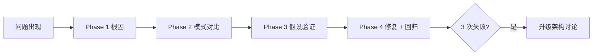

## 是什么

把"模型挂了 / 测试红了 / 线上崩了"的处理流程从"凭经验改改试试"升级成"先定位根因、再做最小修复"的 4 阶段纪律，帮你把"调试"从抓阄式打补丁变成可复用、可解释、可回溯的工程方法，避免补一个洞冒一个新洞。

## 怎么用

1. 第一阶段先读完整错误堆栈、复现问题、对照最近改动、梳理数据流，让"为什么坏了"在动手前就有清晰假设。
2. 第二阶段找历史上能跑通的版本、对比关键差异、理清依赖关系，让"坏的样子"和"好的样子"先并排看清。
3. 第三阶段一次只验一个假设、用最小测试样例、控制单变量，让验证结果可解释不被多个改动污染。
4. 第四阶段先写一个能复现 bug 的失败用例，再做单点修复，最后跑回归，让"修好了"有可验证证据而不是凭感觉。
5. 触发 3-Strike Rule（三振规则）：连续 3 次修复都失败就停手，把问题升级为架构讨论，让团队不被表面 bug 拖入无尽补丁循环。

## 架构图



# Systematic Debugging

**NO FIXES WITHOUT ROOT CAUSE INVESTIGATION FIRST.**

## Gotchas

1. **Don't propose fixes before Phase 1.** The #1 failure mode is jumping to "quick fix" without understanding WHY. Symptom fixes mask root causes and create new bugs.

2. **Multi-component systems need layer-by-layer evidence.** Before guessing which component failed, inject diagnostics at EACH boundary:
   ```bash
   # Layer 1: Entry point
   echo "=== Input data: ==="
   echo "VAR: ${VAR:+SET}${VAR:-UNSET}"
   # Layer 2: Processing
   echo "=== After transform: ==="
   # Layer 3: Output
   echo "=== Final state: ==="
   ```
   Run ONCE to see WHERE it breaks. Then investigate THAT layer only.

3. **3-Strike Rule.** Fix 1: diagnose & targeted fix. Fix 2: different approach. Fix 3: rethink assumptions. **After 3 failed fixes: STOP — this is an architectural problem, not a bug.** Discuss with user before attempting more.

## 4 Phases (Sequential, No Skipping)

```
Phase 1: Root Cause    → Read errors fully, reproduce, check recent changes, trace data flow
Phase 2: Pattern       → Find working examples, compare differences, understand dependencies
Phase 3: Hypothesis    → Single hypothesis, smallest possible test, one variable at a time
Phase 4: Fix           → Create failing test FIRST, implement single fix, verify, check for regressions
```

## Red Flags — STOP and Return to Phase 1

- "Quick fix for now, investigate later"
- "Just try changing X and see"
- Proposing solutions before tracing data flow
- "One more fix attempt" after 2+ failures
- Each fix reveals a new problem in a different place (= architectural issue)

## Supporting References

- `root-cause-tracing.md` — Backward tracing through call stack
- `defense-in-depth.md` — Multi-layer validation after fix
- `condition-based-waiting.md` — Replace timeouts with condition polling
- Related: `verification-before-completion` (verify fix before claiming success)
