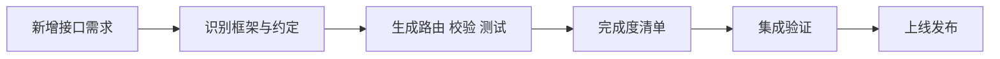

## 是什么

帮你在已有后端里新增一个接口端点时，从识别项目框架、复用现有约定，到生成路由、校验、类型、测试一步到位，让新接口对前端来说看起来像本来就在那里，而不是一处"风格突变"。

## 怎么用

1. 把项目根目录交给本技能，先让它识别框架（Next.js（React 服务端框架）、Express（Node.js Web 框架）、FastAPI、Flask、Gin（Go Web 框架）等）和已有命名风格。
2. 让本技能读 2–3 个现有端点，提取鉴权、校验、错误结构、响应包络等约定，作为新接口的硬约束。
3. 按本技能的脚手架生成 route + schema + service + test 四件套，并按 HTTP 方法语义对齐状态码（创建 201、读取 200、删除 204）。
4. 对照本技能给出的完成度清单逐项打勾：路由可达、鉴权挂上、入参校验、错误结构一致、测试覆盖至少一条异常路径。
5. 合并前在本地用真实请求或集成测试跑通一次，并确认与已有路由不冲突。

## 架构图



# New API Endpoint

Scaffolding and validation workflow for adding API endpoints to existing backends.
Auto-detects the framework, follows project conventions, and ensures the endpoint
is complete (route + handler + validation + types + tests).

## When to Use

- Adding a CRUD endpoint to an existing API
- Exposing a new service capability via HTTP
- Adding a webhook receiver or callback endpoint
- Extending an existing resource with new actions

## Supported Frameworks (Auto-Detect)

| Framework | Detection | Route Pattern |
|-----------|-----------|--------------|
| Next.js App Router | `app/api/` directory | `app/api/[resource]/route.ts` |
| Next.js Pages | `pages/api/` directory | `pages/api/[resource].ts` |
| Express | `express()` in entry file | `router.get('/resource', handler)` |
| Hono | `new Hono()` in entry file | `app.get('/resource', handler)` |
| FastAPI | `@app.get` decorators | `@app.post('/resource')` |
| Flask | `@app.route` decorators | `@app.route('/resource', methods=['POST'])` |
| Go/Gin | `gin.Default()` | `r.POST("/resource", handler)` |
| Go/Chi | `chi.NewRouter()` | `r.Post("/resource", handler)` |
| Cloudflare Workers | `wrangler.toml` + `export default` | `router.post('/resource', handler)` |

## Workflow

### Phase 1: Discovery

1. Detect framework from project files
2. Find existing endpoints to understand conventions:
   - File naming pattern (singular vs plural, kebab vs camel)
   - Auth middleware usage (JWT, API key, session)
   - Validation approach (Zod, Joi, Pydantic, struct tags)
   - Response format (JSON envelope, error shape)
   - Test patterns (integration vs unit, test file location)

### Phase 2: Scaffold

Generate all files for the endpoint:

```
[resource]/
  route.ts          # Route handler (Next.js) or controller
  schema.ts         # Input/output validation schemas
  service.ts        # Business logic (if complex)
  [resource].test.ts # Tests
```

### Phase 3: Checklist

```
Endpoint Completeness:
- [ ] Route registered and reachable
- [ ] HTTP method correct (GET for read, POST for create, etc.)
- [ ] Input validation with proper error messages
- [ ] Auth/authz middleware applied (if required)
- [ ] Response type defined and consistent with other endpoints
- [ ] Error handling follows project pattern (status codes, error shape)
- [ ] Rate limiting considered (if public-facing)
- [ ] Test covers happy path + at least 1 error case
- [ ] TypeScript types exported for client consumption
```

## Conventions by HTTP Method

| Method | Purpose | Status Codes | Body |
|--------|---------|-------------|------|
| GET | Read resource(s) | 200, 404 | Response body |
| POST | Create resource | 201, 400, 409 | Created resource |
| PUT | Replace resource | 200, 404 | Updated resource |
| PATCH | Partial update | 200, 404 | Updated resource |
| DELETE | Remove resource | 204, 404 | Empty |

## Response Envelope (if project uses one)

```typescript
// Success
{ "data": T, "meta"?: { pagination } }

// Error
{ "error": { "code": string, "message": string, "details"?: any } }
```

Always match the existing project's envelope pattern — don't introduce a new one.

## Gotchas

1. **Match the existing error shape exactly.** Every project has a different error format (`{ error: string }` vs `{ code, message }` vs `{ errors: [] }`). Read 2-3 existing endpoints to identify the pattern. A mismatched error shape breaks frontend error handling silently — the client parses `error.message` but your endpoint returns `error.error`.

2. **Next.js App Router `route.ts` exports named functions, not default.** `export async function GET()` not `export default function handler()`. This is the #1 mistake when adding endpoints to App Router projects that also have Pages Router endpoints. Check which router the existing endpoints use before scaffolding.

3. **Don't forget CORS for cross-origin endpoints.** If the API is consumed by a different domain (common with Cloudflare Workers + separate frontend), you need OPTIONS handler + Access-Control headers. Check if the project has global CORS middleware; if not, add it to the new endpoint. Missing CORS fails silently in server logs but throws in the browser.

4. **Validation errors should return 400, not 500.** If Zod/Pydantic throws on invalid input and you don't catch it, the framework returns 500 (Internal Server Error). Always wrap validation in try/catch and return 400 with the validation error details. A 500 on bad input triggers false alerts in monitoring.

5. **Check if the route conflicts with existing routes.** Dynamic routes like `/api/users/[id]` and `/api/users/me` can conflict depending on the framework's route matching order. Express matches first-defined; Next.js uses specificity. Always test that both the new route AND existing routes still work after adding the new one.

## Anti-Patterns

- Never hardcode auth logic in the handler (use middleware)
- Never return raw database errors to the client (information disclosure)
- Never skip input validation even for internal-only endpoints
- Never create endpoints without at least one test
- Never use `any` types for request/response in TypeScript
