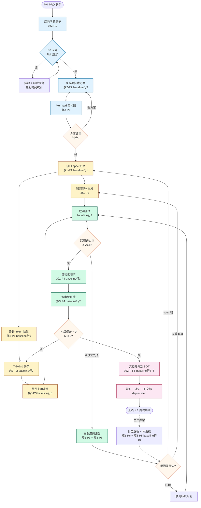

# Tool-Kit 03 · SOP 流程图 · 产品研发岗主链路

> 用 Mermaid flowchart 描述产研岗的端到端工作流。
> 节点 ≤ 20；每个节点显式标注"对应 baseline 行 X"或"对应 prompt 族 Y"，便于评审追溯。

## 主流程图

## 节点对照表

| 节点 ID | 阶段 | 对应 baseline | 对应 prompt | 工作量预估 | Owner |
|---------|------|---------------|-------------|------------|-------|
| Plan1 | Plan | — | 族2·P1 | 0.5 pd | 研发负责人 |
| Plan2 | Plan gate | — | — | — | PM + 研发 |
| Plan3 | Plan | 行 5 | 族2·P2 | 1 pd | 研发负责人 |
| Plan4 | Plan | 行 5 子项 | 族2·P3 | 0.5 pd | 后端架构师 |
| Decision1 | Plan gate | 行 5 | — | — | 评审小组 |
| Do1 | Do | 行 1 | 族1·P1 | 0.5 pd | 后端 |
| Do2 | Do | 行 2 | 族1·P2 | 0.5 pd | 后端 |
| Do3 | Do | 行 9 | 族3·P1 | 0.5 pd | 前端 |
| Do4 | Do | 行 7 | 族3·P2 | 1.5 pd | 前端 |
| Do5 | Do | 行 8 | 族3·P3 | 0.5 pd | 前端架构师 |
| Check1 | Check | 行 2 | — | 1 pd | 前后端 |
| Check2 | Check | — | 族1·P3 + 族3·P5 | 0.5 pd | 联调 owner |
| Check3 | Check | 行 3 | 族1·P4 | 0.75 pd | QA |
| Check4 | Check | 行 7 | 族3·P4 | 0.5 pd | 前端 + 设计 |
| Decision4 | Check gate | 行 7 | — | — | 设计 review |
| Act1 | Act | 行 4 + 行 6 | 族2·P4-5 | 0.75 pd | 文档 owner |
| Act2 | Act | — | — | 0.25 pd | 文档 owner |
| Emergency | 应急 | 行 10 | 族1·P6 + 族3·P5 | 1 pd | oncall |

## 关键 gate 说明

### Gate Plan2 · P0 反向问题是否已回
- **目的**：避免"在假设上盖方案"
- **通过标准**：P0 问题清单全部有 PM 答复（哪怕"按你的假设做"也算回复）
- **不通过处理**：挂起任务 + 给 PM 发提醒；超过 1 天进升级流程

### Gate Decision1 · 方案评审过会
- **目的**：3 选项方案中选定 1 个
- **通过标准**：评审组（PM + 研发负责人 + 设计）签字
- **不通过处理**：回到 Plan3 改方案，不允许直接进入 Do 阶段
- **常见拒绝原因**：方案 A/B/C 差异不显著 / 工作量估算空洞 / 风险评估缺失

### Gate Decision2 · 联调通过率 ≥ 70%
- **目的**：早期发现 spec / 实现不一致
- **通过标准**：所有 case 中 ≥ 70% 一次通过（参见 baseline 行 2 目标）
- **不通过处理**：进入 Check2 失败分析；不允许直接放过
- **常见根因**：80% 是 spec 字段名不一致；其次是错误码不统一

### Gate Decision3 · 失败根因归类
- **目的**：分配修复责任
- **三选一**：spec 错（回 Do1）/ 实现 bug（回 Do2）/ 环境问题（联调环境修复）
- **禁止**："各方都改一点"的和稀泥结论

### Gate Decision4 · 像素自检 H 级 = 0
- **目的**：进设计走查前先自检
- **通过标准**：H 级偏差 = 0 且 M 级 ≤ 2（参见 baseline 行 7 目标 1-2 处/页）
- **不通过处理**：回 Do4 调样式；超过 3 轮 → 重新看 token 是否抽错

## Fallback / 应急路径（虚线）

虚线箭头表示**非常态触发**的应急路径：

### 上线后生产异常 → Emergency
- **触发**：监控报警 / 用户反馈 / oncall 收到问题
- **第一动作**：日志解析 + 前端 console 解析（族 1·P6 + 族 3·P5）
- **不允许**：直接重启服务或回滚（先收集证据再决定回滚）
- **目标**：1 小时内出"假设链 + 修复方案 + 影响范围"三件套

### 联调环境异常 → Wait2
- **触发**：联调环境本身挂了（DB 连不上 / 网关 502）
- **owner**：DevOps / SRE
- **超时升级**：30 分钟内不恢复 → 通知 oncall

## 各阶段平均耗时 (基于 baseline)

| 阶段 | 耗时 | 占比 |
|------|------|------|
| Plan（反向问 + 方案 + 架构图） | 3 pd | 35% |
| Do（spec + 联调脚本 + token + Tailwind + 复用） | 3.5 pd | 41% |
| Check（联调 + 测试 + 像素自检） | 1.25 pd | 15% |
| Act（文档归并 + 发布） | 1 pd | 12% |
| **总计单个中型需求** | **8.5 pd** | **100%** |

> AI 辅助后预期总耗时降到 3 pd（参见 baseline 总量汇总 −70%）。

## 用法约定

1. **顺序不能跳**：Plan → Do → Check → Act 是骨架，不允许"先 Do 再补 Plan"
2. **每个 gate 必走**：失败用例分析、像素自检、文档归并都是 gate，不是可选项
3. **应急路径只在异常时走**：常态下不应该频繁触发 Emergency；触发频次 > 1 次/迭代 = 流程出了问题
4. **可视化做到 PR description**：每个 PR description 顶部贴这张图，并圈出本次 PR 命中哪几个节点

---

Maurice | maurice_wen@proton.me
