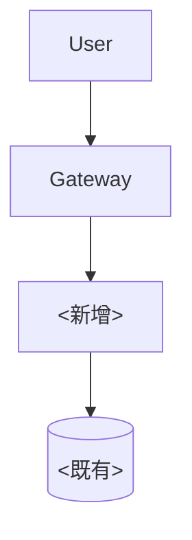

# Tool-Kit 05 · 文档模板 · 产品研发岗 4 件套

> 4 个标准模板：接口文档 + 技术方案 + 前端样式 spec + 联调测试用例。
> 每个模板都对应 `scenarios/` 下某个 prompt 的输出格式。

## 模板索引

| # | 模板名 | 文件路径建议 | 对应 prompt | 对应 baseline |
|---|--------|--------------|-------------|---------------|
| 1 | 接口文档 | `docs/api/<service>.md` | 族1·P1 + P5 | 行 1 + 行 4 |
| 2 | 技术方案 | `docs/tech-spec/<feature>.md` | 族2·P2 + P3 | 行 5 |
| 3 | 前端样式 spec | `design/tokens/<page>-spec.md` | 族3·P1 | 行 9 |
| 4 | 联调测试用例 | `tests/integration/<feature>.spec.md` | 族1·P2 + P4 | 行 2 + 行 3 |

---

## 模板 1 · 接口文档

> 用于：单个接口或单个 service 的对外文档。从 OpenAPI spec 自动生成 + 人工补充上下文。

```markdown
# <Service Name> 接口文档

| 字段 | 值 |
|------|-----|
| Service | <service 名> |
| 版本 | v<major>.<minor> |
| Owner | <名字> |
| 最后更新 | YYYY-MM-DD |
| OpenAPI 源 | `<path-to-spec.yaml>` |
| 联调环境 | `<URL>` |
| 生产环境 | `<URL>` |

## 1. 概述

- 服务用途：<2-3 句话>
- 关键能力：列表
- 上下游依赖：<谁调我 / 我调谁>

## 2. 鉴权

- 鉴权方式：<Bearer Token / API Key / OAuth2>
- Header 格式：<示例>
- Token 获取：<接口或文档链接>

## 3. 接口列表

### 3.1 <接口名> · `<METHOD> /path`

**用途**：<一句话>

**请求**：
```http
POST /api/v1/users HTTP/1.1
Authorization: Bearer <token>
Content-Type: application/json

{
  "phone": "13800000000",
  "verify_code": "123456"
}
```

**请求字段**：
| 字段 | 类型 | 必填 | 说明 | 示例 |
|------|------|------|------|------|
| phone | string | 是 | 手机号，E.164 格式 | 13800000000 |
| verify_code | string | 是 | 6 位短信验证码 | 123456 |

**响应**：
```json
{
  "code": 0,
  "data": {
    "user_id": "u_123abc",
    "token": "eyJ..."
  }
}
```

**响应字段**：
| 字段 | 类型 | 说明 |
|------|------|------|
| code | int | 0 = 成功 |
| data.user_id | string | 用户唯一 ID |
| data.token | string | 登录 token，有效期 7 天 |

**错误码**：
| code | HTTP | 说明 | 排查建议 |
|------|------|------|----------|
| 1001 | 400 | 手机号格式错误 | 检查是否 E.164 |
| 1002 | 401 | 验证码错误 | 检查时效性 |
| 5001 | 500 | 内部错误 | 联系 oncall |

**curl 示例**：
```bash
curl -X POST $API_BASE/api/v1/users \
  -H "Content-Type: application/json" \
  -d '{"phone":"13800000000","verify_code":"123456"}'
```

## 4. 联调注意事项

- <如：测试环境验证码统一为 888888>
- <如：rate limit 每个 IP 每分钟 ≤ 10 次>

## 5. 变更日志

- v1.2 (YYYY-MM-DD): 新增 `device_id` 字段（可选）
- v1.1 (YYYY-MM-DD): 错误码 1003 改为 1002（破坏性，已通知调用方）
- v1.0 (YYYY-MM-DD): 初版

---

Owner: <名字> | <邮箱>
```

---

## 模板 2 · 技术方案

> 用于：单个 feature 的技术方案文档。对应族 2·P2 输出（3 选项 + 决策矩阵）+ 族 2·P3 输出（Mermaid 架构图）。

```markdown
# <Feature Name> 技术方案

| 字段 | 值 |
|------|-----|
| Feature | <名称> |
| 版本 | v<major>.<minor> |
| Owner | <名字> |
| 评审日期 | YYYY-MM-DD |
| 评审人 | <PM + 研发负责人 + 设计> |
| PRD 链接 | `<URL>` |
| Jira / 工单 | `<ID>` |

## 1. 需求理解

（来自族 2·P1 输出）

- **核心交互**：3-5 句话总结
- **数据流向**：谁产生 → 谁消费 → 谁存储
- **关键非功能**：延迟 / 可用性 / 安全 / 合规 哪个是 P0

## 2. 反向问题清单（已与 PM 对齐）

### P0 阻塞类
| # | 问题 | PM 回复 | 回复日期 |
|---|------|---------|----------|
| 1 | <问题> | <答复> | YYYY-MM-DD |

### P1 影响架构选型类
（同上）

### P2 影响细节类（按假设做）
| # | 假设 | PM 是否确认 |
|---|------|--------------|
| 1 | <假设> | 是 / 否 / 沉默默认 |

## 3. 技术方案

### 3.1 方案 A · <一句话定性>

- **核心思路**：2-3 句
- **架构组件**：新增 / 复用的服务、表、队列
- **工作量**：前端 N pd / 后端 M pd / 测试 K pd
- **优点**：3 条
- **缺点**：3 条
- **风险**：技术 / 上线 / 维护

### 3.2 方案 B · <一句话定性>

（同上结构）

### 3.3 方案 C · <一句话定性 — 功能减半对照组>

（同上结构）

### 3.4 决策矩阵

| 维度 | 方案 A | 方案 B | 方案 C |
|------|--------|--------|--------|
| 实现成本 | ... | ... | ... |
| 长期维护 | ... | ... | ... |
| 扩展性 | ... | ... | ... |
| 风险 | ... | ... | ... |
| 与现有系统耦合 | ... | ... | ... |

### 3.5 推荐

- **首选**：方案 X（理由 ≤ 50 字）
- **不推荐**：方案 Y（理由 ≤ 50 字）
- **当 ... 时回到方案 Z**：如时间不够 / 人力减半

## 4. 架构图

（来自族 2·P3 输出）



### 图例
- 节点形状：`([])` = 外部 · `[]` = 服务 · `{}` = 判断 · `(())` = 存储
- 颜色：blue = 新增 · gray = 既有 · red = 待替换
- 箭头：实线 = 同步 · 虚线 = 异步 · 粗线 = 主路径

### 关键路径（≤ 5 步）
1. 用户 → 网关 → ...
2. ...

### 异常路径
- 路径 A 失败 → fallback 到 ...
- 数据库不可用 → 降级 ...

### 容量假设
- 主路径每秒 X 次调用 → 网关 / 服务 / DB 各预期 QPS

## 5. 拆分到接口

| 接口 | METHOD | path | spec 链接 | Owner |
|------|--------|------|-----------|-------|

## 6. 拆分到工单

| 工单 | 描述 | 工作量 | Owner | 状态 |
|------|------|--------|-------|------|

## 7. 风险登记册

| # | 风险 | 影响 | 概率 | 缓解措施 | Owner |
|---|------|------|------|----------|-------|

## 8. 回滚预案

- 上线后回滚步骤：<3-5 步>
- 数据库迁移如何回滚：<是否可逆 / 备份方案>
- 旧逻辑是否保留：<是 / 否 + 保留多久>

---

Owner: <名字> | <邮箱>
```

---

## 模板 3 · 前端样式 spec

> 用于：单页或单个组件的设计 token 文档。对应族 3·P1 输出。

```markdown
# <Page / Component Name> 样式 Spec

| 字段 | 值 |
|------|-----|
| Page / Component | <名称> |
| 版本 | v<major>.<minor> |
| Owner | <前端 + 设计> |
| 最后更新 | YYYY-MM-DD |
| Figma 链接 | `<URL>` |
| 项目 token 文件 | `<path>` |

## 1. Color Tokens

| 用途 | Figma 命名 | 项目 token | hex | 用在哪 |
|------|------------|-----------|-----|--------|
| 主背景 | bg/primary | --color-bg-primary | #FFFFFF | 卡片背景 |
| 主文字 | text/primary | --color-text-primary | #1F2937 | 标题 / 正文 |
| 次文字 | text/secondary | --color-text-secondary | #6B7280 | 副标题 |
| 主 CTA | btn/primary | --color-btn-primary | #3B82F6 | 主按钮 |
| 危险 | feedback/danger | --color-feedback-danger | #EF4444 | 删除 / 错误 |

## 2. Typography Tokens

| 用途 | font-family | size | weight | line-height | letter-spacing | 用在哪 |
|------|-------------|------|--------|-------------|----------------|--------|
| H1 | Inter | 32px | 700 | 1.25 | -0.02em | 页面标题 |
| H2 | Inter | 24px | 600 | 1.33 | -0.01em | 区块标题 |
| Body | Inter | 16px | 400 | 1.5 | 0 | 正文 |
| Caption | Inter | 12px | 400 | 1.4 | 0 | 辅助文字 |

## 3. Spacing Tokens

8pt 网格：4 / 8 / 12 / 16 / 24 / 32 / 48 / 64

| 用途 | 值 | 用在哪 |
|------|-----|--------|
| 卡片 padding | 24px | 主卡片 |
| 卡片间距 | 16px | 卡片之间 |
| 区块间距 | 48px | 大段之间 |

### 偏移项（8pt 不符）
| 用途 | 实际值 | 建议 |
|------|--------|------|
| 头像与名字间距 | 6px | 是否调整为 4 或 8？|

## 4. Shadow / Radius / Border Tokens

| 用途 | 值 | 用在哪 |
|------|-----|--------|
| 卡片 shadow | 0 1px 3px rgba(0,0,0,0.1) | 主卡片 |
| 圆角 sm | 4px | 输入框 |
| 圆角 md | 8px | 卡片 |
| 圆角 lg | 12px | Modal |
| Border 默认 | 1px solid #E5E7EB | 输入框 / 分隔 |

## 5. 交互态

### Button · Primary

| 态 | 背景 | 文字 | border | shadow |
|---|------|------|--------|--------|
| default | #3B82F6 | #FFFFFF | none | none |
| hover | #2563EB | #FFFFFF | none | sm |
| active | #1D4ED8 | #FFFFFF | none | none |
| disabled | #93C5FD | #E5E7EB | none | none |
| focus | #3B82F6 | #FFFFFF | 2px solid #1E40AF outset 2px | sm |

### Input

（同上结构）

## 6. 响应式断点

| Breakpoint | min-width | 布局变化 |
|------------|-----------|----------|
| default (mobile) | 0 | 单列 |
| sm | 640px | 单列 / 字号 +2 |
| md | 768px | 两列 |
| lg | 1024px | 三列 + max-width 1200px 居中 |

## 7. 缺失 / 冲突报告

### 新增 token（项目无此对应）
- <token 名> + 用途 + 建议命名

### 冲突 token（同语义不同值）
- <token 名> + 项目值 vs Figma 值 + 建议保留哪个 + 理由

### 未使用既有 token（项目有但 Figma 未用）
- <token 名> + 是否建议废弃

---

Owner: <名字> | <邮箱>
```

---

## 模板 4 · 联调测试用例

> 用于：单个 feature 的联调用例集合。对应族 1·P2 + P4 输出。

```markdown
# <Feature Name> 联调测试用例

| 字段 | 值 |
|------|-----|
| Feature | <名称> |
| 版本 | v<major>.<minor> |
| Owner | <QA + 后端 + 前端> |
| 最后更新 | YYYY-MM-DD |
| 接口文档 | `<docs/api/...>` |
| OpenAPI 源 | `<path-to-spec.yaml>` |
| 联调环境 | `<URL>` |

## 1. 用例总览

| 用例 ID | 类型 | 接口 | 期望结果 | 优先级 | Owner |
|---------|------|------|----------|--------|-------|
| TC-001 | 正向 | POST /users | 200 + user_id | P0 | 后端 |
| TC-002 | 边界 | POST /users (phone 缺失) | 400 + code 1001 | P0 | 后端 |
| TC-003 | 异常 | POST /users (无 token) | 401 | P0 | 后端 |
| TC-004 | 性能 | POST /users (50 并发) | 通过率 ≥ 95% / P95 ≤ 500ms | P1 | 后端 + QA |

类型词典：
- **正向**：参数完整，期望 200
- **边界**：必填字段缺失 / 长度边界 / 数字边界
- **异常**：鉴权失败 / 接口不存在 / 上游异常
- **性能**：并发 / 大数据量 / 长连接

## 2. 用例详情

### TC-001 · 用户注册正向

**前置条件**：
- 测试环境验证码 `888888` 可用
- 测试手机号 `13800000000` 未注册

**步骤**：
```bash
curl -X POST $API_BASE/api/v1/users \
  -H "Content-Type: application/json" \
  -d '{"phone":"13800000000","verify_code":"888888"}'
```

**预期**：
- HTTP 200
- response.code == 0
- response.data.user_id 存在且非空
- response.data.token 长度 ≥ 64

**断言（自动化）**：
```bash
status=$(curl -s -o /tmp/r -w "%{http_code}" -X POST ...)
test "$status" = "200" || { echo "FAIL: status=$status"; exit 1; }
user_id=$(jq -r .data.user_id /tmp/r)
test -n "$user_id" || { echo "FAIL: user_id empty"; exit 1; }
echo "PASS TC-001"
```

**关联工单**：JIRA-1234

### TC-002 · 手机号缺失

（同上结构）

### TC-003 · 鉴权失败

（同上结构）

### TC-004 · 50 并发性能

**前置条件**：
- 准备 50 个未注册手机号
- 联调环境 dedicated（避免其他流量干扰）

**步骤**：
```bash
# 用 ab 或 k6 跑 50 并发
k6 run --vus 50 --duration 30s scripts/perf/user-register.js
```

**预期**：
- 通过率 ≥ 95%（参见 baseline 行 2 单次通过率目标 70%；性能场景更严格）
- P95 延迟 ≤ 500ms
- P99 延迟 ≤ 1000ms
- 错误率 ≤ 1%

**断言**：
- k6 输出 `checks` 中 success ratio ≥ 0.95
- k6 输出 `http_req_duration` 的 p(95) ≤ 500

## 3. 异常路径用例（联调失败时的修复路径）

按族 1·P3 失败用例分析逻辑：

| 失败现象 | 假设 1（最可能根因） | 验证步骤 | 修复责任 |
|----------|---------------------|----------|----------|
| user_id 为空字符串 | spec 期望非空但后端返回空 | 查后端日志 + 查 DB | 后端 |
| 401 但 token 正确 | token 命名 spec vs 实际不一致 | diff spec vs 实际 header | 前后端对齐 |
| 200 但 data 是 null | 错误码 0 但业务失败 | 后端业务逻辑 review | 后端 |

## 4. 自动化测试集成

- 测试框架：<Jest / PyTest / k6>
- CI 集成：`<.github/workflows/integration-test.yml>`
- 跑测命令：`<npm run test:integration>`
- 报告路径：`<test-report.html>`
- 跑测频次：每个 PR + 每晚 cron

## 5. 测试数据管理

- 测试账号：`<列表 + 用途>`
- 数据清理：每次测试前 reset DB / 测试后清理特定记录
- 敏感数据：不允许真实用户手机号；用 `138/139/137 + 0000xxxx` 范围

## 6. 已知限制

- 测试环境与 prod 环境的差异：<列表>
- 不能在测试环境验证的场景：<列表 + 建议方案>

---

Owner: <名字> | <邮箱>
```

---

## 用法约定

1. **模板是骨架，不是完成品**：每个 `<尖括号>` 占位符必须填具体内容才能提交
2. **4 个模板配套使用**：一个 feature 上线全周期至少触达 3 个（接口文档 + 技术方案 + 测试用例）；前端 feature 加第 4 个（样式 spec）
3. **保持版本号一致**：技术方案 v1.0 上线 → 接口文档 v1.0 + 样式 spec v1.0 + 测试用例 v1.0
4. **deprecate 不删除**：版本升级时旧版加 `> DEPRECATED v1.0 - 见 v2.0` 顶部标记，保留 ≥ 1 周

---

Maurice | maurice_wen@proton.me
