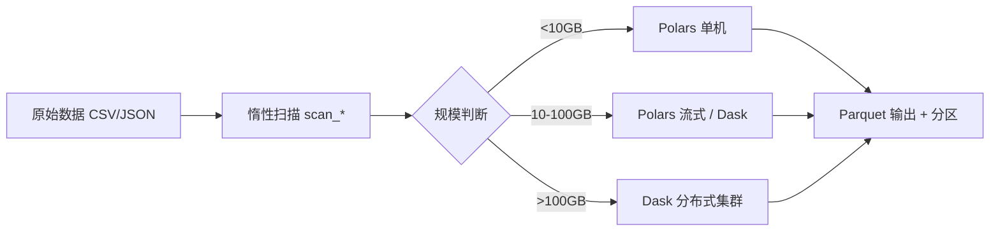

## 是什么

一套面向数据团队的核心处理底座，把 Polars、Dask、Vaex 三种 DataFrame（数据帧）能力按数据规模分层组合，让单机分析、分布式计算（distributed computing）、超大文件惰性扫描共用同一套调用习惯，减少 ETL（抽取-转换-加载）任务的内存溢出与跑批超时。

## 怎么用

1. 按数据规模选引擎：10GB 以下用 Polars 单机跑满 CPU 核心，10–100GB 切换 Polars streaming（流式）或 Dask，100GB 以上交给 Dask 分布式集群兜底。
2. 优先使用 `scan_*` 系列惰性 API（应用程序接口），让查询计划在物理读盘前完成裁剪和谓词下推，避免一次性把全量数据拉进内存。
3. 把原始 CSV 落地为 Parquet（列式存储格式），后续读取吞吐通常提升 10 倍以上，并按日期或类别字段分区便于增量处理。
4. 分布式作业用 `dask.distributed.Client` 启动本地或远程集群，让分组聚合、连接等算子自动切分到 worker（工作节点）执行。
5. 跑大作业前先在采样数据上验证查询计划与输出列，再放到全量数据上跑，避免一次错算消耗整批资源。

## 架构图



# Big Data Processing Toolkit

## Overview

大数据团队核心处理工具集，包含高性能DataFrame库和分布式计算框架。

## Quick Reference

| 工具 | 场景 | 数据规模 |
|------|------|----------|
| **Polars** | 单机高性能分析 | GB级 |
| **Dask** | 分布式/超内存处理 | TB级 |
| **Vaex** | 超大文件惰性处理 | 100GB+ |

## 选择指南

```
数据大小判断:
├── < 10GB → Polars (最快)
├── 10GB - 100GB → Polars (streaming) 或 Dask
├── > 100GB → Dask (分布式)
└── 超大单文件 → Vaex (内存映射)

任务类型:
├── 简单ETL → Polars
├── 复杂管道 → Dask
├── 交互分析 → Vaex
└── 机器学习 → Dask + Dask-ML
```

## 子Skills

- `polars/` - 高性能DataFrame，替代Pandas
- `dask/` - 分布式计算框架
- `vaex/` - 大规模数据惰性处理
- `exploratory-data-analysis/` - 探索性数据分析
- `statistical-analysis/` - 统计分析方法
- `zarr-python/` - 分块数组存储

## 常用模式

### ETL Pipeline (Polars)
```python
import polars as pl

# 读取 -> 转换 -> 写入
(
    pl.scan_csv("raw/*.csv")
    .filter(pl.col("status") == "valid")
    .with_columns(
        pl.col("amount").cast(pl.Float64),
        pl.col("date").str.to_datetime()
    )
    .group_by("category")
    .agg(pl.col("amount").sum())
    .collect()
    .write_parquet("output/summary.parquet")
)
```

### 分布式处理 (Dask)
```python
import dask.dataframe as dd
from dask.distributed import Client

client = Client()  # 启动本地集群

ddf = dd.read_parquet("data/*.parquet")
result = ddf.groupby("key").agg({"value": "sum"}).compute()
```

### 超大文件分析 (Vaex)
```python
import vaex

df = vaex.open("huge_file.hdf5")  # 不加载到内存
df.mean(df.column)  # 惰性计算
```

## 性能最佳实践

1. **文件格式**: Parquet > CSV (10x faster)
2. **惰性计算**: 使用 `scan_*` 而非 `read_*`
3. **列选择**: 尽早选择需要的列
4. **分区策略**: 按日期/类别分区大数据集
5. **并行度**: CPU核心数 = 并行任务数

## 团队使用建议

```bash
# 查看具体skill详情
ai skills info bigdata-core/polars
ai skills info bigdata-core/dask
```

---

猪哥云-数据产品部 | 大数据团队专用
