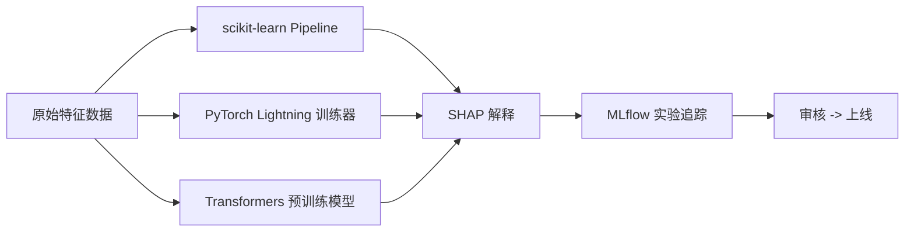

## 是什么

面向数据团队的端到端 ML（机器学习）工具集，把 scikit-learn 传统建模、PyTorch Lightning 深度训练、Transformers 预训练模型、SHAP（模型可解释性）打包成一致的训练-评估-解释流水线，让分类、NLP（自然语言处理）、可解释性等任务都能进 MLflow（实验追踪）留痕。

## 怎么用

1. 按任务类型选框架：结构化分类回归走 scikit-learn Pipeline，文本任务直接调 Transformers 预训练模型，图像或大模型微调切到 PyTorch Lightning 用 GPU（图形处理器）。
2. 用 `Pipeline + cross_val_score` 把预处理和模型绑成一个对象，避免训练-推理时特征处理不一致引发的线上漂移。
3. 大数据训练用 dask-ml 的 `train_test_split` 与分布式估计器，或对线性模型用 `SGDClassifier.partial_fit` 做增量学习，避免一次性把全量样本载入内存。
4. 关键业务模型必须输出 SHAP 解释（全局 summary + 单样本 force_plot），向产品和合规说明模型为什么这样预测。
5. 全流程接 MLflow：记录参数、指标、模型工件，让模型版本和训练数据版本绑定，便于回滚和审计。

## 架构图



# Big Data Machine Learning Toolkit

## Overview

大数据团队机器学习工具集，从传统ML到深度学习全覆盖。

## Quick Reference

| 工具 | 场景 | 规模 |
|------|------|------|
| **scikit-learn** | 传统ML | 中等数据 |
| **PyTorch Lightning** | 深度学习 | GPU训练 |
| **Transformers** | NLP/LLM | 预训练模型 |
| **SHAP** | 模型解释 | 可解释AI |

## 选择指南

```
任务类型:
├── 分类/回归 → scikit-learn
├── 时间序列 → scikit-learn + statsmodels
├── 文本处理 → Transformers
├── 图像处理 → PyTorch Lightning
├── 强化学习 → stable-baselines3
└── 模型解释 → SHAP
```

## 子Skills

- `scikit-learn/` - 传统机器学习
- `pytorch-lightning/` - 深度学习框架
- `transformers/` - NLP预训练模型
- `shap/` - 模型可解释性
- `stable-baselines3/` - 强化学习

## 常用模式

### 标准ML Pipeline (scikit-learn)
```python
from sklearn.pipeline import Pipeline
from sklearn.preprocessing import StandardScaler
from sklearn.ensemble import RandomForestClassifier
from sklearn.model_selection import cross_val_score

pipeline = Pipeline([
    ('scaler', StandardScaler()),
    ('classifier', RandomForestClassifier())
])

scores = cross_val_score(pipeline, X, y, cv=5)
print(f"CV Score: {scores.mean():.3f} ± {scores.std():.3f}")
```

### 深度学习训练 (PyTorch Lightning)
```python
import pytorch_lightning as pl
from pytorch_lightning.callbacks import EarlyStopping

trainer = pl.Trainer(
    max_epochs=100,
    accelerator="gpu",
    callbacks=[EarlyStopping(monitor="val_loss")]
)
trainer.fit(model, train_loader, val_loader)
```

### NLP任务 (Transformers)
```python
from transformers import pipeline

# 文本分类
classifier = pipeline("text-classification", model="bert-base-chinese")
result = classifier("这个产品质量很好")

# 文本生成
generator = pipeline("text-generation", model="gpt2")
```

### 模型解释 (SHAP)
```python
import shap

explainer = shap.TreeExplainer(model)
shap_values = explainer.shap_values(X)

# 特征重要性
shap.summary_plot(shap_values, X)

# 单样本解释
shap.force_plot(explainer.expected_value, shap_values[0], X.iloc[0])
```

## 大数据ML最佳实践

### 1. 大规模训练
```python
# 使用Dask-ML
from dask_ml.model_selection import train_test_split
from dask_ml.linear_model import LogisticRegression

X_train, X_test = train_test_split(X_dask, y_dask)
model = LogisticRegression()
model.fit(X_train, y_train)
```

### 2. 增量学习
```python
from sklearn.linear_model import SGDClassifier

model = SGDClassifier()
for chunk in data_chunks:
    model.partial_fit(chunk.X, chunk.y, classes=[0, 1])
```

### 3. 模型版本管理
```python
import mlflow

with mlflow.start_run():
    mlflow.log_params(params)
    mlflow.log_metrics(metrics)
    mlflow.sklearn.log_model(model, "model")
```

## 团队规范

1. **实验追踪**: 使用MLflow记录所有实验
2. **模型版本**: 模型+数据版本绑定
3. **可解释性**: 关键模型必须提供SHAP解释
4. **部署流程**: 模型 → 测试 → 审核 → 上线

---

猪哥云-数据产品部 | 大数据团队专用
