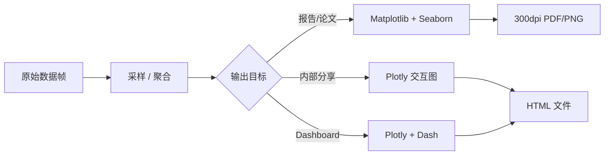

## 是什么

面向数据团队的可视化套件，把 Matplotlib（精细绘图）、Seaborn（统计可视化）、Plotly（交互图表）按输出场景分层组合，让报告、内部分享、Dashboard（仪表盘）三类产物都能从同一份数据集快速出图，并保持配色和分辨率统一。

## 怎么用

1. 按输出目标选库：纸质报告或论文用 Matplotlib + Seaborn 出 300dpi 静态图，内部分享和 Dashboard 用 Plotly 出 HTML 交互图。
2. 大数据出图先采样或聚合，再交给绘图库：万级以上原始点先 `sample` 或按类别 `groupby.agg`，避免浏览器卡死和图形语义被噪声淹没。
3. 探索阶段用 Seaborn `histplot`、`heatmap` 等高阶 API 快速看分布和相关性，正式版再切到 Matplotlib 精细调样式。
4. Plotly `express` 接 `hover_data` 暴露关键字段，让业务方在图上直接看到名称、日期、来源，减少回环问数据来源。
5. 出图前统一规范：标题 14pt、标签 12pt、配色用公司品牌色，报告导出 PDF，分享导出 HTML，避免同一指标多版样式互相打架。

## 架构图



# Big Data Visualization Toolkit

## Overview

大数据团队可视化工具集，覆盖静态图表到交互式Dashboard。

## Quick Reference

| 工具 | 类型 | 场景 |
|------|------|------|
| **Matplotlib** | 静态 | 论文、报告、精细控制 |
| **Seaborn** | 静态 | 统计图表、快速美观 |
| **Plotly** | 交互 | Dashboard、Web展示 |

## 选择指南

```
输出目标:
├── 报告/论文 → Matplotlib + Seaborn
├── 内部分享 → Plotly (交互)
├── Dashboard → Plotly + Dash
└── 实时监控 → Plotly + Streaming
```

## 子Skills

- `matplotlib/` - 基础绑图库
- `seaborn/` - 统计可视化
- `plotly/` - 交互式图表
- `scientific-visualization/` - 科学可视化

## 常用模式

### 快速统计图 (Seaborn)
```python
import seaborn as sns
import matplotlib.pyplot as plt

# 分布图
sns.histplot(data=df, x="value", hue="category")

# 相关性热力图
sns.heatmap(df.corr(), annot=True, cmap="coolwarm")

plt.savefig("report.png", dpi=300)
```

### 交互式Dashboard (Plotly)
```python
import plotly.express as px

fig = px.scatter(
    df, x="x", y="y",
    color="category",
    size="value",
    hover_data=["name", "date"]
)
fig.write_html("dashboard.html")
```

### 大数据可视化技巧

```python
# 采样可视化 (数据量大时)
sample = df.sample(n=10000)
px.scatter(sample, x="x", y="y")

# 聚合后可视化
agg = df.groupby("category").agg({"value": "mean"})
px.bar(agg, x=agg.index, y="value")

# 分位数可视化
px.box(df, x="category", y="value")
```

## 团队规范

1. **颜色方案**: 使用公司品牌色
2. **字体大小**: 标题14pt, 标签12pt
3. **分辨率**: 报告300dpi, Web 72dpi
4. **格式**: PDF用于报告, HTML用于分享

---

猪哥云-数据产品部 | 大数据团队专用
