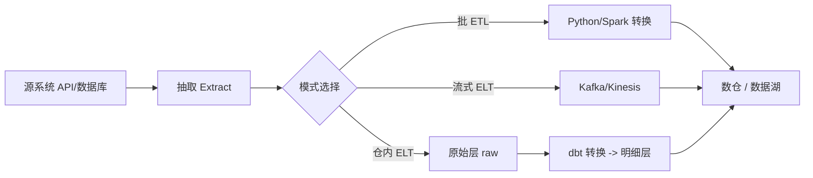

## 是什么

一套生产级数据管道设计规范，覆盖批处理 ETL（抽取-转换-加载）、流式 ELT（抽取-加载-转换）、数据仓库（data warehouse）三种主流模式，让管道天然具备幂等性（idempotency）、增量加载、行数监控、可控的 schema（数据结构）演进。

## 怎么用

1. 按时延要求选模式：T+1 的离线分析走批处理 ETL，秒级实时走 Kafka/Kinesis 流式 ELT，重计算密集的复杂建模交给 ELT + dbt 在数仓内完成。
2. 默认走增量加载（按时间戳或自增 ID 切片），只有当 schema 变更或对账失败时才触发全量刷新，避免每天搬全量数据。
3. 每个阶段写出 `extract / transform / load` 的行数到监控指标，行数对不上立即报警，防止数据静默丢失。
4. 所有写入算子都做幂等设计（按主键 upsert 或先 delete 再 insert），让任务重跑不会产生重复行。
5. Schema 演进只允许加列，不允许在生产环境删列或改列类型，破坏性变更走灰度新表 + 切流方案。

## 架构图

# Data Pipeline Designer

Design production data pipelines: batch ETL, streaming ELT, data warehouse patterns.

## Patterns
- **Batch ETL**: Extract (API/DB) -> Transform (Python/Spark) -> Load (warehouse)
- **Streaming**: Source -> Kafka/Kinesis -> Transform -> Sink
- **ELT**: Extract -> Load raw -> Transform in warehouse (dbt)

## Constraints
1. Always design for idempotency (re-running should not duplicate data)
2. Use incremental loads by default, full refresh only when schema changes
3. Log row counts at each stage for data quality monitoring
4. Schema evolution: additive changes only, never drop columns in production

## Source

GitHub: https://github.com/alirezarezvani/claude-skills
