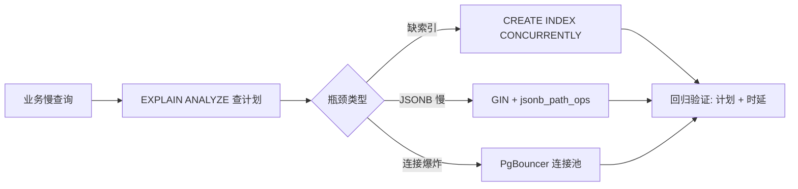

## 是什么

PostgreSQL（关系型数据库）生产实战的优化手册，把查询计划、索引策略、并发连接、schema（表结构）设计的高频坑位写成可执行规则，让慢查询、写锁、JSONB（二进制 JSON）索引膨胀这类问题在上线前就被截住，避免上线后线上慢查告警再来回滚。

## 怎么用

1. 任何慢查询都先跑 `EXPLAIN ANALYZE`（不是 `EXPLAIN`），看实际行数与估算行数的偏差，确认优化器是不是判断错了选择性。
2. 写过滤条件含布尔或枚举字段时优先建 partial index（部分索引），让索引体积下降，更新代价更小，命中率更高。
3. 应用并发连接超过 50 路时，前面挂 PgBouncer（连接池）做连接复用，避免后端进程数爆炸把数据库打挂。
4. 大表加索引必须用 `CREATE INDEX CONCURRENTLY`，避免写锁阻塞业务；JSONB 字段做 `@>` 查询要显式带 `jsonb_path_ops` 操作符类，避免索引体积膨胀 2–3 倍。
5. 生产查询禁止 `SELECT *`，必须显式列出字段；条件里禁止 `NOT IN`，改用 `NOT EXISTS` 或 `LEFT JOIN IS NULL`，避免 NULL 语义引发空结果。

## 架构图

# PostgreSQL Best Practices

Optimize PostgreSQL queries, indexes, and schema for production workloads.

## Constraints
1. Always use EXPLAIN ANALYZE (not just EXPLAIN) to see actual vs estimated rows
2. Prefer partial indexes for queries with WHERE clauses on boolean/enum columns
3. Use connection pooling (PgBouncer) for apps with >50 concurrent connections
4. Never use SELECT * in production queries; always specify columns

## Gotchas
**1. NOT IN is O(n*m) — use NOT EXISTS or LEFT JOIN IS NULL.** NOT IN also returns no rows if the subquery contains a single NULL. NOT EXISTS handles NULLs correctly.
**2. Adding an index on a large table locks writes.** Use CREATE INDEX CONCURRENTLY to avoid blocking. It takes longer but doesn't lock.
**3. JSONB indexes need explicit operator class.** CREATE INDEX ON t USING GIN (data jsonb_path_ops) for @> queries. Without jsonb_path_ops, the index is 2-3x larger.

## Source

GitHub: https://github.com/affaan-m/everything-claude-code
