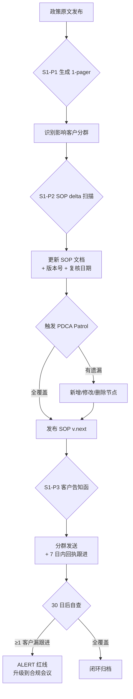
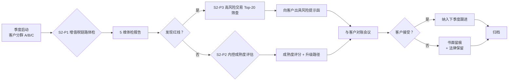
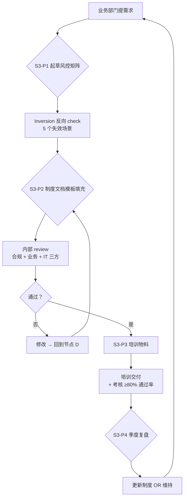
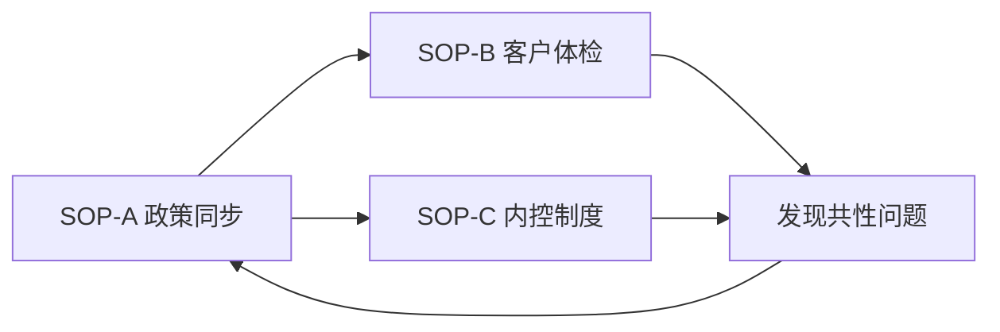

# Tool-Kit 03 · SOP Flowchart · Compliance Expert

> 3 张 mermaid 流程图：覆盖业财税合规专家最高频的 3 个工作流。
> 每张图标注「输入 / 关键控制点 / 输出 / 失效信号」。

---

## SOP-A · 政策变更 → SOP 同步落地

**关键控制点**：
- 节点 E：SOP 文档必须有「政策文号 + 生效日期 + 复核日期」3 字段，缺一不允许保存
- 节点 J：客户回执需附件证明（签字 PDF / 电子签 / 邮件回执），口头确认不算
- 节点 K：30 日是硬阈值（防止 follow-up 被无限延期）

**失效信号**（任一即升级到合规会议）：
1. 政策原文发布 ≥7 日仍无 1-pager
2. SOP 文档复核日期超过 12 个月
3. 客户回执缺失率 ≥10%

---

## SOP-B · 客户合规体检（季度执行）

**关键控制点**：
- 节点 D：「红线」定义必须是制度白名单（如「12 个月内有 ≥2 次申报偏差」），不允许审计员主观判断
- 节点 I：对账会议必须有录音/纪要，客户签字确认风险知情
- 节点 L：客户拒绝接受时，书面留痕保护事务所免责

**失效信号**：
1. 客户体检完成率 <90%/季度
2. 红线发现后 ≥14 日未出具风险提示函
3. 法律保留留痕缺失 ≥1 笔

---

## SOP-C · 内控制度从起草到落地

**关键控制点**：
- 节点 C：Inversion check 必须输出 5 个失效场景 + 5 个对应控制点；少于 5 个不允许进入起草阶段
- 节点 E：三方 review 必须留邮件/会议纪要；缺任一方签字不允许发布
- 节点 I：考核通过率 <80% 必须重新培训，不允许「凑数」勾选

**失效信号**：
1. 起草到发布 ≥45 日（流程僵化信号）
2. 培训覆盖率 <85% 部门人员
3. 季度复盘缺席 ≥1 次

---

## SOP 之间的协同

3 个 SOP 形成闭环：政策变更触发体检、体检发现共性问题倒逼内控修订、内控修订反向影响 SOP-A 的复核频率。

---

Maurice | maurice_wen@proton.me
