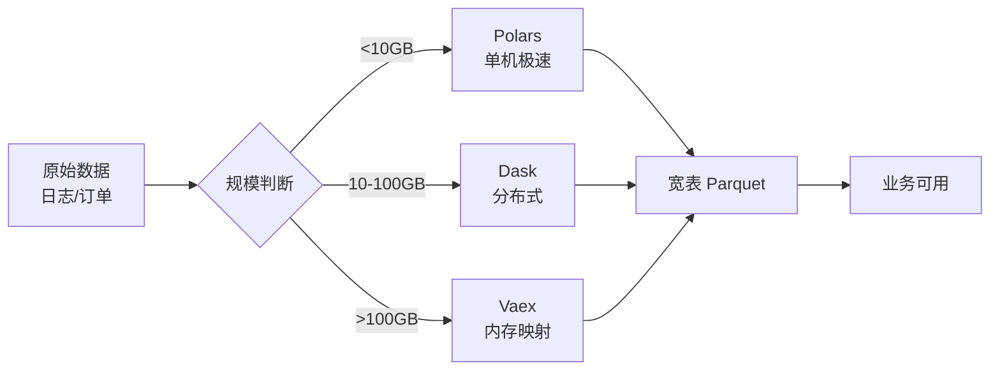

## 是什么

帮你把跑不动的超大原始表（GB 到 TB 级）变成一张能给业务回答问题的干净宽表。让分析不再被"内存不够、跑一晚没出"这种工程坑卡住，决策节奏从"等数据工程师"变成"自己今天就能看"。

## 怎么用

1. 先判断数据规模：10GB 以内挑 Polars（极速 DataFrame，单机就够），10–100GB 看是否需要分布式（分散到多台机器），超过 100GB 上 Dask 或 Vaex（内存映射，把硬盘当内存用）。
2. 把原始日志、订单、行为表导入成统一的列式格式（Parquet，列存压缩，比 CSV 快 10 倍），作为后续所有分析的单一可信源。
3. 写一段最小可跑的 ETL（抽取-清洗-装载）脚本，跑出第一张宽表，先验证业务字段对得上，再补复杂逻辑。
4. 上抽样（先 1% 数据跑通流程），确认逻辑正确再切全量，避免一次跑 8 小时才发现字段错。
5. 把成品宽表落到固定路径，下游图表、模型、看板都从这一张表取数，杜绝口径打架。

## 架构图



# Big Data Processing Toolkit

## Overview

大数据团队核心处理工具集，包含高性能DataFrame库和分布式计算框架。

## Quick Reference

| 工具 | 场景 | 数据规模 |
|------|------|----------|
| **Polars** | 单机高性能分析 | GB级 |
| **Dask** | 分布式/超内存处理 | TB级 |
| **Vaex** | 超大文件惰性处理 | 100GB+ |

## 选择指南

```
数据大小判断:
├── < 10GB → Polars (最快)
├── 10GB - 100GB → Polars (streaming) 或 Dask
├── > 100GB → Dask (分布式)
└── 超大单文件 → Vaex (内存映射)

任务类型:
├── 简单ETL → Polars
├── 复杂管道 → Dask
├── 交互分析 → Vaex
└── 机器学习 → Dask + Dask-ML
```

## 子Skills

- `polars/` - 高性能DataFrame，替代Pandas
- `dask/` - 分布式计算框架
- `vaex/` - 大规模数据惰性处理
- `exploratory-data-analysis/` - 探索性数据分析
- `statistical-analysis/` - 统计分析方法
- `zarr-python/` - 分块数组存储

## 常用模式

### ETL Pipeline (Polars)
```python
import polars as pl

# 读取 -> 转换 -> 写入
(
    pl.scan_csv("raw/*.csv")
    .filter(pl.col("status") == "valid")
    .with_columns(
        pl.col("amount").cast(pl.Float64),
        pl.col("date").str.to_datetime()
    )
    .group_by("category")
    .agg(pl.col("amount").sum())
    .collect()
    .write_parquet("output/summary.parquet")
)
```

### 分布式处理 (Dask)
```python
import dask.dataframe as dd
from dask.distributed import Client

client = Client()  # 启动本地集群

ddf = dd.read_parquet("data/*.parquet")
result = ddf.groupby("key").agg({"value": "sum"}).compute()
```

### 超大文件分析 (Vaex)
```python
import vaex

df = vaex.open("huge_file.hdf5")  # 不加载到内存
df.mean(df.column)  # 惰性计算
```

## 性能最佳实践

1. **文件格式**: Parquet > CSV (10x faster)
2. **惰性计算**: 使用 `scan_*` 而非 `read_*`
3. **列选择**: 尽早选择需要的列
4. **分区策略**: 按日期/类别分区大数据集
5. **并行度**: CPU核心数 = 并行任务数

## 团队使用建议

```bash
# 查看具体skill详情
ai skills info bigdata-core/polars
ai skills info bigdata-core/dask
```

---

猪哥云-数据产品部 | 大数据团队专用
