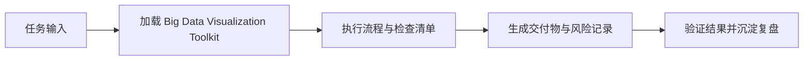

# Big Data Visualization Toolkit

## Overview

大数据团队可视化工具集，覆盖静态图表到交互式Dashboard。

## Quick Reference

| 工具 | 类型 | 场景 |
|------|------|------|
| **Matplotlib** | 静态 | 论文、报告、精细控制 |
| **Seaborn** | 静态 | 统计图表、快速美观 |
| **Plotly** | 交互 | Dashboard、Web展示 |

## 选择指南

```
输出目标:
├── 报告/论文 → Matplotlib + Seaborn
├── 内部分享 → Plotly (交互)
├── Dashboard → Plotly + Dash
└── 实时监控 → Plotly + Streaming
```

## 子Skills

- `matplotlib/` - 基础绑图库
- `seaborn/` - 统计可视化
- `plotly/` - 交互式图表
- `scientific-visualization/` - 科学可视化

## 常用模式

### 快速统计图 (Seaborn)
```python
import seaborn as sns
import matplotlib.pyplot as plt

# 分布图
sns.histplot(data=df, x="value", hue="category")

# 相关性热力图
sns.heatmap(df.corr(), annot=True, cmap="coolwarm")

plt.savefig("report.png", dpi=300)
```

### 交互式Dashboard (Plotly)
```python
import plotly.express as px

fig = px.scatter(
    df, x="x", y="y",
    color="category",
    size="value",
    hover_data=["name", "date"]
)
fig.write_html("dashboard.html")
```

### 大数据可视化技巧

```python
# 采样可视化 (数据量大时)
sample = df.sample(n=10000)
px.scatter(sample, x="x", y="y")

# 聚合后可视化
agg = df.groupby("category").agg({"value": "mean"})
px.bar(agg, x=agg.index, y="value")

# 分位数可视化
px.box(df, x="category", y="value")
```

## 团队规范

1. **颜色方案**: 使用公司品牌色
2. **字体大小**: 标题14pt, 标签12pt
3. **分辨率**: 报告300dpi, Web 72dpi
4. **格式**: PDF用于报告, HTML用于分享

---

猪哥云-数据产品部 | 大数据团队专用

## 是什么

Big Data Visualization Toolkit 用来把 数据分析师 场景里的任务输入转成可执行的流程、检查清单和交付物。

Data visualization toolkit for big data teams. Includes Matplotlib, Seaborn, Plotly for static and interactive charts. Use when creating dashboards, reports, or exploring data visually.

它的价值在于让 数据AI职能线 在 Claude Code、Codex、Gemini、Hermes 或 OpenClaw 中复用同一套岗位能力，而不是依赖一次性的聊天提示词。

## 怎么用

1. 明确当前任务目标、输入材料、约束和期望交付物，再加载 `bigdata-viz`。
2. 按 skill 文档中的流程、检查清单或工具建议执行，优先复用仓库已有规范与真实命令。
3. 把关键判断、风险、验证命令和产出路径记录到当前任务文档或交付说明中。
4. 用最小可证明的检查确认结果有效；发现缺口时回到 skill 清单补齐。

## 架构图


