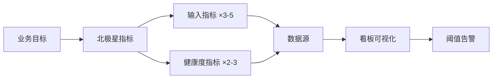

## 是什么

帮你把"我感觉最近用户在掉"这种模糊判断，变成"一个北极星指标 + 5 个输入指标 + 3 个健康度指标"组成的看板，让每周复盘都能直接看图说话，团队对齐节奏从月度提升到天级。

## 怎么用

1. 先选一个北极星指标（North Star Metric，业务最关心的单一价值指标，比如周活跃用户、订单 GMV），其他都是它的支撑指标。
2. 给北极星指标找 3–5 个输入指标（驱动它涨跌的杠杆变量，比如新注册数、留存率、人均下单），方便日常发力。
3. 加 2–3 个健康度指标（产品基础体验信号，比如崩溃率、加载时长、客诉数），防止北极星涨了但根基出问题。
4. 每个指标定义清楚口径（怎么算、从哪取、谁负责），写进数据字典，不然 3 个月后没人记得"活跃"到底是日活还是周活。
5. 设阈值告警（低于 X、高于 Y、环比降 Z%），让看板从"看着用"升级到"主动喊你"。

## 架构图



## Product Metrics Dashboard

Design a comprehensive product metrics dashboard with the right metrics, visualizations, and alert thresholds.

### Context

You are designing a metrics dashboard for **$ARGUMENTS**.

If the user provides files (existing dashboards, analytics data, OKRs, or strategy docs), read them first.

### Domain Context

**Metrics vs KPIs vs NSM**: Metrics = all measurable things. KPIs = a few key quantitative metrics tracked over a longer period. North Star Metric = a single customer-centric KPI that is a leading indicator of business success.

**4 criteria for a good metric** (Ben Yoskovitz, *Lean Analytics*): (1) Understandable — creates a common language. (2) Comparative — over time, not a snapshot. (3) Ratio or Rate — more revealing than whole numbers. (4) Behavior-changing — the Golden Rule: "If a metric won't change how you behave, it's a bad metric."

**8 metric types**: Vanity vs Actionable (only actionable metrics change behavior), Qualitative vs Quantitative (WHAT vs WHY — you need both; never stop talking to customers), Exploratory vs Reporting (explore data to uncover unexpected insights), Lagging vs Leading (leading indicators enable faster learning cycles, e.g. customer complaints predict churn).

**5 action steps**: (1) Audit metrics against the 4 good-metric criteria. (2) Update dashboards — ensure all key metrics are good ones. (3) Identify vanity metrics — be careful how you use them. (4) Classify leading vs lagging indicators. (5) Pick one problem and dig deep into the data.

For case studies and more detail: [Are You Tracking the Right Metrics?](https://www.productcompass.pm/p/are-you-tracking-the-right-metrics) by Ben Yoskovitz

### Instructions

1. **Identify the metrics framework** — organize metrics into layers:

   **North Star Metric**: The single metric that best captures core value delivery

   **Input Metrics** (3-5): The levers that drive the North Star

   **Health Metrics**: Guardrails that ensure overall product health

   **Business Metrics**: Revenue, cost, and unit economics

2. **For each metric, define**:

   | Metric | Definition | Data Source | Visualization | Target | Alert Threshold |
   |---|---|---|---|---|---|
   | [Name] | [Exact calculation: numerator/denominator, time window] | [Where the data comes from] | [Line chart / Bar / Number / Funnel] | [Goal value] | [When to trigger an alert] |

3. **Design the dashboard layout**:

   ```
   ┌─────────────────────────────────────────────┐
   │  NORTH STAR: [Metric] — [Current Value]     │
   │  Trend: [↑/↓ X% vs last period]             │
   ├──────────────────┬──────────────────────────┤
   │  Input Metric 1  │  Input Metric 2          │
   │  [Sparkline]     │  [Sparkline]             │
   ├──────────────────┼──────────────────────────┤
   │  Input Metric 3  │  Input Metric 4          │
   │  [Sparkline]     │  [Sparkline]             │
   ├──────────────────┴──────────────────────────┤
   │  HEALTH: [Latency] [Error Rate] [NPS]       │
   ├─────────────────────────────────────────────┤
   │  BUSINESS: [MRR] [CAC] [LTV] [Churn]        │
   └─────────────────────────────────────────────┘
   ```

4. **Set review cadence**:
   - **Daily**: Operational health (errors, latency, critical flows)
   - **Weekly**: Input metrics and engagement trends
   - **Monthly**: North Star, business metrics, OKR progress
   - **Quarterly**: Strategic review and metric recalibration

5. **Define alerts**:
   - What thresholds trigger investigation?
   - Who gets alerted and through what channel?
   - What's the expected response time?

6. **Recommend tools** based on the user's context:
   - Amplitude, Mixpanel, PostHog for product analytics
   - Looker, Metabase, Mode for SQL-based dashboards
   - Datadog, Grafana for operational health

Think step by step. Save the dashboard specification as a markdown document.

---

### Further Reading

- [The Ultimate List of Product Metrics](https://www.productcompass.pm/p/the-ultimate-list-of-product-metrics)
- [The North Star Framework 101](https://www.productcompass.pm/p/the-north-star-framework-101)
- [The Product Analytics Playbook: AARRR, HEART, Cohorts & Funnels for PMs](https://www.productcompass.pm/p/the-product-analytics-playbook-aarrr)
- [AARRR (Pirate) Metrics: The 5-Stage Framework for Growth](https://www.productcompass.pm/p/aarrr-pirate-metrics)
- [The Google HEART Framework: Your Guide to Measuring User-Centric Success](https://www.productcompass.pm/p/the-google-heart-framework)
- [Funnel Analysis 101: How to Track and Optimize Your User Journey](https://www.productcompass.pm/p/funnel-analysis)
- [Are You Tracking the Right Metrics?](https://www.productcompass.pm/p/are-you-tracking-the-right-metrics)
- [Continuous Product Discovery Masterclass (CPDM)](https://www.productcompass.pm/p/cpdm) (video course)
