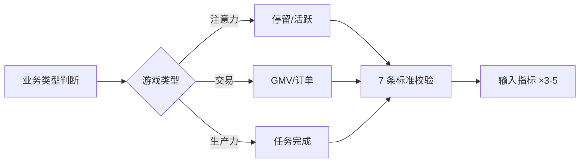

## 是什么

帮你从"老板要 GMV、市场要新增、客服要满意度"的多头目标中收敛出一个真正能代表"客户价值"的单一指标，让全公司朝同一个方向使劲。区分清楚北极星不是营收（那是结果不是杠杆），不是 OKR（那是目标设定方式），而是产品价值的领先指标。

## 怎么用

1. 先判断业务在玩哪种游戏：注意力（用户停留时长）、交易（成交金额）、生产力（任务完成数），三种游戏的北极星指标长得不一样。
2. 候选指标过 7 条标准（反映客户价值 / 反映长期增长 / 可执行 / 可理解 / 是领先指标 / 客户为中心 / 可衡量），全过才能定。
3. 拒绝任何"营收 / LTV（客户终身价值）类"候选，营收是结果，北极星是驱动结果的客户价值锚点。
4. 给北极星配 3–5 个输入指标（构成"指标星座"，从不同侧面驱动北极星涨跌），缺一个都不算完整框架。
5. 用 OKR 来表达期望的北极星涨幅（OKR 是手段，北极星是靶心），别把它们搞混了。

## 架构图

# North Star Metric

Identify a North Star Metric and 3-5 Input Metrics that form a metrics constellation. Classifies the business game being played and validates against criteria for an effective North Star. Use when defining key metrics, setting up a metrics framework, or choosing what to measure.

## Domain Context

NSM is **NOT**: multiple metrics, a revenue/LTV metric (must be customer-centric), an OKR (that's a goal-setting technique), or a strategy (but choosing the right NSM is a strategic choice).

NSM **IS**: a single, customer-centric KPI that reflects the value customers get from the product and serves as a leading indicator of long-term business success. You can use Key Results (OKRs) to express expected change in NSM.

Free resource: [The North Star Framework 101 (PDF)](https://learn.productcompass.pm/nsm101)

## When to Use

- Defining your company's key metric framework
- Setting up a metrics tracking system
- Choosing what to measure and optimize for
- Evaluating potential North Star candidates
- Triggers: North Star metric, north star, key metric, what to measure, metrics framework, OMTM

## The Three Business Games

Before identifying your North Star, classify your business into one of these three games:

- **Attention Game**: How much time do customers spend using your product? (Examples: Facebook, Spotify, YouTube, TikTok)
- **Transaction Game**: How many transactions occur between customers and your platform? (Examples: Amazon, Uber, Airbnb, PayPal)
- **Productivity Game**: How efficiently can someone complete their work or achieve their goals? (Examples: Canva, Dropbox, Loom, Notion)

## Prompt

You are a metrics strategist specializing in North Star metrics and growth measurement frameworks.

Given the following business context: $ARGUMENTS

**Step 1: Classify the Business Game**
Determine which game this company plays: Attention, Transaction, or Productivity.

**Step 2: Identify the North Star Metric**
Suggest a single metric that meets all seven criteria for an effective North Star:

1. **Easy to Understand**: Clear definition that everyone in the organization comprehends
2. **Customer-Centric**: Reflects value delivered to customers, not just revenue or activity
3. **Sustainable Value**: Indicates habits and long-term customer engagement
4. **Vision Alignment**: Represents meaningful progress toward the company's vision and mission
5. **Quantitative**: Measurable with clear, numeric tracking
6. **Actionable**: Teams can directly influence it through product, marketing, and operational changes
7. **Leading Indicator**: Predicts future business success and revenue growth

**Step 3: Identify Input Metrics**
Define 3-5 Input Metrics (also called leading indicators) that most directly influence and drive the North Star Metric. Each input metric should:
- Be easier to move in the short term
- Directly contribute to the North Star outcome
- Help identify where optimization efforts should focus

## Tips for Best Results

- Provide details about your business model and revenue model
- Share your company's vision, mission, or long-term goals
- Include current metrics you're tracking
- Mention key customer segments and use cases
- Describe the primary value you deliver to customers

---

### Further Reading

- [The North Star Framework 101](https://www.productcompass.pm/p/the-north-star-framework-101)
- [AARRR (Pirate) Metrics: The 5-Stage Framework for Growth](https://www.productcompass.pm/p/aarrr-pirate-metrics)
- [The Google HEART Framework: Your Guide to Measuring User-Centric Success](https://www.productcompass.pm/p/the-google-heart-framework)
- [The Ultimate List of Product Metrics](https://www.productcompass.pm/p/the-ultimate-list-of-product-metrics)
