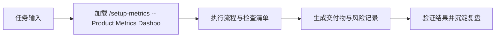

# /setup-metrics -- Product Metrics Dashboard Design

Design a comprehensive metrics framework for your product or feature — from selecting the right North Star to defining alert thresholds that catch problems early.

## Invocation

```
/setup-metrics SaaS project management tool
/setup-metrics New checkout flow we just launched
/setup-metrics             # asks what you're measuring
```

## Workflow

### Step 1: Understand What to Measure

Ask the user:
- What product or feature area are you setting up metrics for?
- What stage is it in? (pre-launch, recently launched, mature)
- What are the current business goals or OKRs?
- Do you have existing metrics? What's missing or broken?
- What analytics tools are you using? (helps tailor implementation advice)

### Step 2: Define the Metrics Framework

Apply the **metrics-dashboard** skill:

**North Star Metric:**
- Identify the single metric that best captures the value your product delivers to users
- Validate against criteria: measures value delivery, is a leading indicator, is actionable
- Define the metric precisely (formula, data source, time window)

**Input Metrics (3-5):**
- Identify the levers that drive the North Star
- Each input metric should be directly actionable by a team
- Map the causal chain: Input → North Star → Business Outcome

**Health Metrics (3-5):**
- Metrics that should stay stable — if they degrade, something is wrong
- Examples: error rates, latency, support ticket volume, NPS, churn rate
- Define "healthy" ranges and degradation thresholds

**Counter-Metrics (1-2):**
- Metrics that could indicate you're optimizing the wrong way
- Example: if North Star is "daily active users", counter-metric is "session quality" to prevent empty engagement

### Step 3: Design Alert Thresholds

For each metric:

| Metric | Green | Yellow | Red | Check Frequency |
|--------|-------|--------|-----|----------------|
| [metric] | [healthy range] | [warning] | [critical] | [daily/weekly] |

- **Yellow**: Investigate — something may be off
- **Red**: Act immediately — page someone or escalate

### Step 4: Create Dashboard Spec

```
## Metrics Dashboard: [Product/Feature]

**North Star**: [metric name]
**Definition**: [precise formula]
**Current value**: [if known]
**Target**: [goal]

### Input Metrics
| Metric | Definition | Owner | Target | Current |
|--------|-----------|-------|--------|---------|

### Health Metrics
| Metric | Healthy Range | Yellow Threshold | Red Threshold |
|--------|-------------|-----------------|---------------|

### Counter-Metrics
| Metric | Why It Matters | Watch For |
|--------|---------------|-----------|

### Metrics Tree
North Star: [metric]
├── Input: [metric 1] → driven by [team/action]
├── Input: [metric 2] → driven by [team/action]
├── Input: [metric 3] → driven by [team/action]
└── Counter: [metric] → watch for [degradation signal]

### Implementation Notes
- Data sources: [where each metric comes from]
- Refresh frequency: [real-time / hourly / daily]
- Tool recommendations: [based on user's stack]

### Review Cadence
- **Daily**: Glance at North Star and health metrics
- **Weekly**: Review input metrics trends, discuss in team standup
- **Monthly**: Deep dive — are inputs driving the North Star as expected?
- **Quarterly**: Reassess the metrics framework itself
```

Save as a markdown file to the user's workspace.

### Step 5: Offer Next Steps

- "Want me to **write SQL queries** to compute these metrics?"
- "Should I **create OKRs** based on this metrics framework?"
- "Want me to **build a cohort analysis** to set realistic baselines?"
- "Should I **set up a weekly metrics review template**?"

## Notes

- A good North Star is rare — most teams pick vanity metrics. Push for a metric that captures *user value delivered*, not just engagement
- Input metrics should be MECE (mutually exclusive, collectively exhaustive) in explaining the North Star
- If the product is pre-launch, define metrics now but note that baselines will need calibration after launch
- Counter-metrics prevent Goodhart's Law — when a metric becomes a target, it ceases to be a good metric
- Recommend starting with fewer metrics, well-instrumented, over a sprawling dashboard nobody checks

## 是什么

/setup-metrics -- Product Metrics Dashboard Design 用来把 数据分析师 场景里的任务输入转成可执行的流程、检查清单和交付物。

Design a product metrics dashboard with North Star metric, input metrics, health metrics, and alert thresholds

它的价值在于让 数据AI职能线 在 Claude Code、Codex、Gemini、Hermes 或 OpenClaw 中复用同一套岗位能力，而不是依赖一次性的聊天提示词。

## 怎么用

1. 明确当前任务目标、输入材料、约束和期望交付物，再加载 `pm-cmd-setup-metrics`。
2. 按 skill 文档中的流程、检查清单或工具建议执行，优先复用仓库已有规范与真实命令。
3. 把关键判断、风险、验证命令和产出路径记录到当前任务文档或交付说明中。
4. 用最小可证明的检查确认结果有效；发现缺口时回到 skill 清单补齐。

## 架构图


