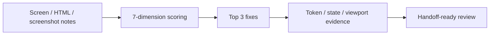

# Skill · aesthetic-probe

> Source: Designer pack
> When to use: 界面或设计交付前做证据化 design QA，避免层级混乱、token 偏离、状态缺失和移动端风险。

## 是什么

这是一套设计评审清单，把"好不好看"拆成 7 个可评分维度。它服务于设计质量与工程交付，不替 PM 判断产品方向，也不把验证原型包装成最终设计。

## 怎么用

1. 打开待审界面或截图描述，明确 PM 的原始目标。
2. 分别检查层级、间距、字体、颜色、可点击识别、状态完整性和响应式。
3. 用 1-5 分打分，禁止只写审美形容词。
4. 选 Top 3 修复项，每项绑定 component、token、state 和验证 viewport。
5. 输出 Keep / Change / Remove 清单，避免评审无限发散。

## 架构图

## Trigger phrases

- "审一下这个设计"
- "aesthetic 检查"
- "上线前设计 QA"
- "卡片看起来乱"
- "移动端会不会出问题"

## Inputs

- HTML 文件路径、线上 URL、截图描述或设计说明
- Reference token set or brand constraints
- Target viewport list：mobile / tablet / desktop

## Outputs

- 7 维评分（满分 5）
- Top 3 修复建议
- Keep / Change / Remove 清单
- Handoff risks：component / token / state / viewport

## 7 Dimensions

| Dimension | 5-point standard | 1-point smell |
| --- | --- | --- |
| Hierarchy clarity | primary task is obvious | many elements compete |
| Spacing rhythm | dense but breathable | cramped or random gaps |
| Type discipline | consistent scale and weights | arbitrary size/weight drift |
| Color discipline | semantic accents only | decorative or excessive accents |
| Interaction affordance | controls are recognizable | decoration and action blur |
| State completeness | key states covered | happy path only |
| Responsive readiness | mobile and desktop both work | desktop-only approval |

## Procedure

1. **Read target intent** -> confirm what the screen is supposed to help users do.
2. **Score each dimension** -> cite observable evidence.
3. **Rank fixes** -> priority = severity x user impact x implementation clarity.
4. **Bind fixes** -> every fix names component, token/state, and viewport.
5. **Escalate product questions** -> unclear product decisions go to PM.

## Gotchas

- 不要把"顺眼"当作合格。
- 不要给 4-5 分但没有具体缺陷。
- 不要只看桌面端。
- 不要新增产品功能作为设计修复。

## Worked example

- Input: finance dashboard screenshot notes + enterprise token set.
- Output: hierarchy 3 / spacing 4 / type 4 / color 5 / affordance 3 / states 2 / responsive 3, plus 3 fixes tied to card header, filter state, and mobile table behavior.

Maurice | maurice_wen@proton.me
