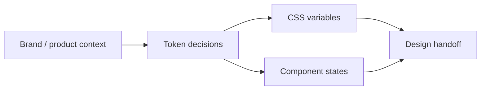

# Skill · design-tokens

> Source: Designer pack
> When to use: 需要把界面视觉系统化，避免颜色 / 字号 / 间距 / 圆角 / 阴影在不同页面漂移。

## 是什么

这是一套把品牌与界面规则沉淀成可复用 design tokens 的方法。它让视觉决策从"这一处看着顺眼"变成可检查、可复用、可交付的变量系统，也让 PM 原型进入设计阶段后不会被一次性美化成不可维护的视觉债。

## 怎么用

1. 先确认本次设计使用的风格和约束：品牌、产品线、可访问性、组件库。
2. 定义颜色、字体、间距、圆角、阴影、焦点态和状态态 token。
3. 用语义命名 token，不用颜色名或一次性命名。
4. 输出 token cheatsheet，说明何时使用每个 token。
5. 审计已有界面，把硬编码视觉值替换为 token。

## 架构图

## Trigger phrases

- "设计令牌" / "design tokens" / "色板" / "type scale"
- "这个页面风格漂了"
- "改品牌色但别改结构"
- "把视觉规范交给前端"

## Inputs

- 品牌或产品语境
- 已有设计 / HTML / CSS / 截图描述
- 目标风格：如 refined SaaS、enterprise console、warm assistant、custom brand
- 组件库或工程限制

## Outputs

- CSS `:root` variables 或 Tailwind theme extend
- Token usage table：token / value / usage / component examples
- Drift audit：hardcoded value / replacement token / priority

## Procedure

1. **Define scope** -> full system or focused screen token pass.
2. **Name semantic tokens** -> `--color-accent` not `--color-purple`.
3. **Cover states** -> hover / active / disabled / selected / focus / danger.
4. **Generate cheatsheet** -> readable by PM, designer, and frontend engineer.
5. **Audit drift** -> flag hardcoded values and inconsistent state styling.

## Gotchas

- 不要混用多套 token 系统。
- 不要把 token 写成具体颜色名，避免品牌变化时语义失效。
- 不要只定义静态颜色，状态 token 同样重要。
- 不要为了美化 PM 原型而绕过可维护的视觉系统。

## Worked example

- Input: "finance-tax compliance dashboard, restrained enterprise tone"
- Output: `tokens.css`, component-state token table, and a drift audit for current screen.

Agent Foundry Team
