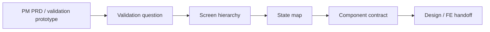

# Skill · experience-architecture

> Source: Designer pack
> When to use: PM 已有 PRD / 原型 / 流程草图，需要把体验结构、页面层级、状态和工程 handoff 合理化。

## 是什么

这是一套把产品意图转成体验架构的设计方法。它不替 PM 写 PRD，也不替 PM 生成验证原型；它接收已经收敛的产品假设，输出用户路径、页面层级、状态覆盖和组件交付契约，让设计评审从"好不好看"前移到"用户是否能完成任务"。

## 怎么用

1. 先确认 PM 的 validation question：这个流程到底要验证什么。
2. 把每个 screen 拆成 primary job、primary action、secondary action 和 supporting evidence。
3. 标出 empty / loading / error / success / disabled / selected / mobile state。
4. 删除重复界面与没有决策价值的信息块。
5. 输出 screen x component x state x data shape 的 handoff 表。

## 架构图

## Trigger phrases

- "审一下这个产品流程"
- "把这个原型整理成设计 handoff"
- "页面层级不清楚"
- "这个流程要给前端实现，状态还没定"
- "设计师介入，但不要重写 PRD"

## Inputs

- PM PRD、流程草图、已生成的验证原型或页面截图描述
- 目标用户任务和 primary decision
- 目标终端：desktop / mobile / both
- 已知约束：品牌、组件库、工程框架、上线时间

## Outputs

- Experience map：entry / primary path / exit
- Screen hierarchy：每屏主行动、次行动、支撑信息
- State map：空态、加载、错误、成功、禁用、选中、移动端
- Handoff table：screen / component / state / data shape / responsive constraint / owner
- Open questions：只列需要 PM 或 FE 决策的问题

## Procedure

1. **Clarify PM intent** -> 复述 validation question，不新增产品假设。
2. **Map screen jobs** -> 每屏只能有一个 primary job。
3. **Rank actions** -> primary CTA、secondary action、passive info 分级。
4. **Map states** -> 补齐非 happy path 和 mobile path。
5. **Create handoff** -> 用表格描述组件、状态、数据形状和响应式限制。
6. **Escalate decisions** -> 涉及目标、优先级、原型方向的问题交回 PM。

## Gotchas

- 不要把设计评审变成新 PRD。
- 不要把 PM 的验证原型当成最终视觉稿。
- 不要新增第 6 个 screen 来解决层级问题，先删除或合并。
- 不要只审 happy path；状态缺失是工程返工的主要来源。

## Worked example

- Input: PM provides 4-screen onboarding validation prototype.
- Output: 3-screen experience map, state coverage table, component handoff, and 4 PM/FE open questions.

Maurice | maurice_wen@proton.me
