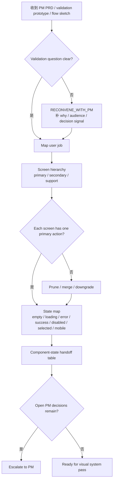
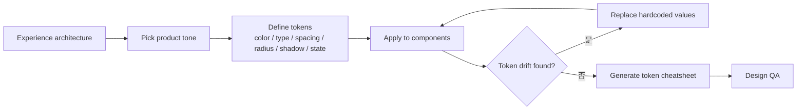
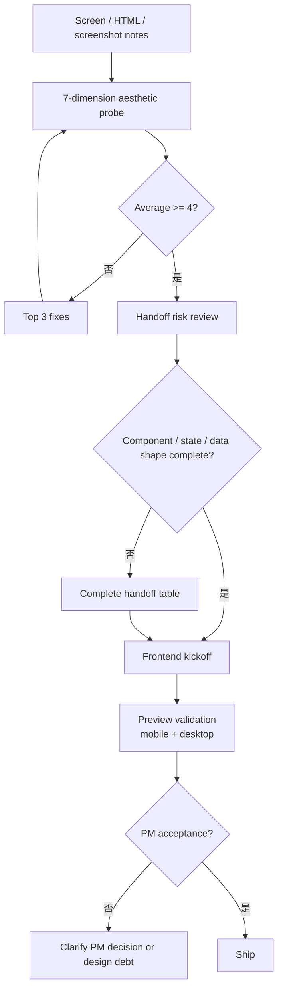

# Tool-Kit 03 · SOP Flowchart · Designer

> 3 张 mermaid 流程图覆盖设计师最高频工作流：PM 输入评审、设计系统化、工程 handoff。

## SOP-A · PM Flow → Experience Architecture

**关键控制点**：
- 节点 B：PM 的验证问题不清楚时，设计师不替 PM 做产品判断。
- 节点 F：每屏只能有一个 primary action；多个主行动说明层级未收敛。
- 节点 H：非 happy path 和 mobile state 必须在设计阶段暴露。

**失效信号**：
1. Designer starts rewriting PRD instead of isolating design debt.
2. Screen hierarchy depends on verbal explanation.
3. PM validation question changes during design review.
4. Mobile state is deferred to engineering.

## SOP-B · Visual System → Token Discipline

**关键控制点**：
- Token 先于单屏美化；组件只引用语义 token。
- 状态 token 与 focus token 必须覆盖，否则前端实现会各写各的。
- 不为了美化 PM 原型绕过 design system。

**失效信号**：
1. Same semantic state uses different colors across cards.
2. Border radius changes because a single card "felt better".
3. Focus state is absent from the token set.
4. Brand swap changes layout or product flow.

## SOP-C · Design QA → Engineering Handoff

**关键控制点**：
- Aesthetic probe 必须绑定 component、token、state、viewport，不接受纯主观评语。
- Handoff 表必须包含 screen / component / state / data shape / responsive constraint。
- PM 不通过时先判断是 PM 假设变更还是设计债务，不能直接让前端反复改。

**失效信号**：
1. Review says "looks fine" without scores.
2. Top 3 fixes do not name component, token, state, and viewport.
3. Frontend receives screenshots without data shape.
4. PM rejection is treated as pure frontend bug.

---

Agent Foundry Team
