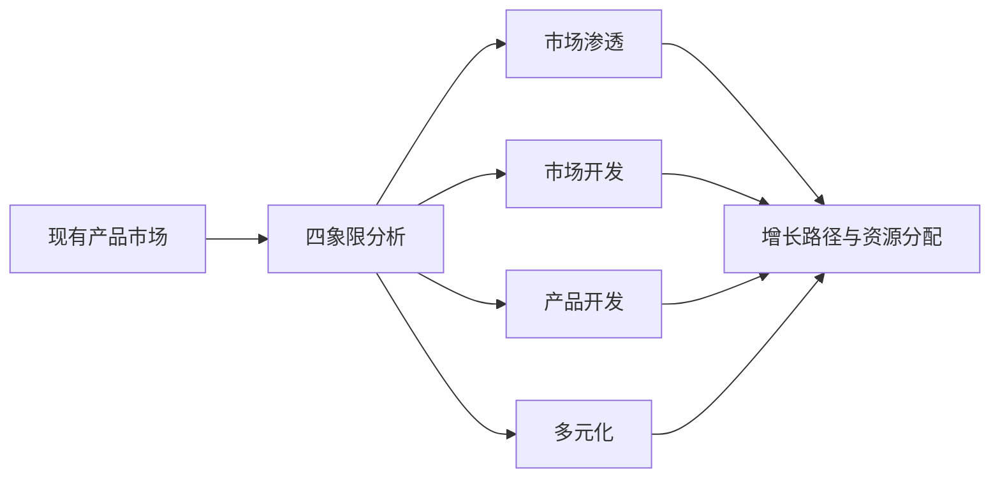

## 是什么

Ansoff 矩阵（Ansoff Matrix，增长方向矩阵）帮你把"我们下一步往哪儿长"这个最容易拍脑袋的决定，拆成产品 × 市场的四个象限，让增长路径从直觉变成可对比、可分配预算的战略选项。

## 怎么用

1. 先把现有产品和现有市场写清楚，不允许混淆"我以为的市场"和"客户真实在用的市场"。
2. 在四个象限里各列 2–3 条增长机会，给每条机会标上市场规模和资源投入的量级。
3. 用风险-回报和资源紧约束（Resource Constraint，资源紧约束）做排序，挑出 1–2 个主攻象限。
4. 把主攻象限的机会翻译成季度 KPI（Key Performance Indicator，关键绩效指标）和负责人。
5. 在董事会节奏（季度或半年度）复盘一次象限假设是否仍然成立。

## 架构图

# Ansoff Matrix

## Metadata
- **Name**: ansoff-matrix
- **Description**: Generate an Ansoff Matrix analysis mapping growth strategies across market penetration, market development, product development, and diversification.
- **Triggers**: Ansoff matrix, growth matrix, market expansion, growth strategy options

## Instructions

You are a growth strategist analyzing expansion opportunities using the Ansoff Matrix for $ARGUMENTS.

Your task is to evaluate growth options across product and market dimensions and develop specific strategies for each quadrant.

## Input Requirements
- Current product(s) and market definition
- Current market penetration and performance
- Customer insights and market opportunities
- Company capabilities and constraints
- Growth targets and timelines
- Competitive dynamics

## Ansoff Matrix Framework

### 2x2 Matrix: Products vs. Markets

|  | Current Market | New Market |
|---|---|---|
| **Current Product** | Market Penetration | Market Development |
| **New Product** | Product Development | Diversification |

---

### 1. Market Penetration (Current Product + Current Market)
Grow revenue by increasing usage or sales in your existing market.

**Strategies:**
- Increase frequency of product usage
- Expand use cases within existing customer base
- Acquire competitors' customers
- Reduce churn and improve retention
- Upsell and cross-sell existing customers
- Lower prices to capture price-sensitive segments
- Increase marketing and brand awareness
- Improve customer experience to drive referrals

**Examples:**
- Netflix adding games to increase engagement
- Starbucks encouraging multiple visits per week
- Adobe expanding Adobe Creative Cloud subscriptions

**Risk Level:** Low (familiar market, product, capabilities)

**Typical Timeline:** 6-12 months

---

### 2. Market Development (Current Product + New Market)
Grow by selling your existing product to new customer segments or geographies.

**Strategies:**
- Expand into new geographies or regions
- Target new customer segments or personas
- Sell through new channels or partnerships
- Adapt product for new use cases
- Partner with complementary companies
- Localize product for new markets
- Build brand awareness in new markets

**Examples:**
- Facebook expanding internationally
- Uber moving into new cities and countries
- Slack selling to non-tech industries

**Risk Level:** Medium (new market dynamics, but proven product)

**Typical Timeline:** 12-24 months

---

### 3. Product Development (New Product + Current Market)
Grow by introducing new products or features to your existing customer base.

**Strategies:**
- Add new features to existing product
- Create adjacent product lines
- Bundle products for greater value
- Develop premium/lite versions
- Integrate adjacent capabilities
- Create complementary products
- Upgrade product experience or performance

**Examples:**
- Spotify adding podcasts
- Amazon Prime expanding services (video, music, grocery)
- Figma adding prototyping and FigJam

**Risk Level:** Medium (existing customers but new product)

**Typical Timeline:** 12-18 months

---

### 4. Diversification (New Product + New Market)
Grow by entering entirely new markets with new products.

**Strategies:**
- Related diversification: leveraging existing competencies
- Unrelated diversification: entering new domains
- Acquire companies in new markets/products
- Strategic partnerships or joint ventures
- Build new business units
- Apply capabilities to adjacent problems

**Examples:**
- Amazon expanding from books to cloud services (AWS)
- Apple expanding from computers to phones, wearables, services
- Microsoft moving from software to cloud (Azure) and gaming (Xbox)

**Risk Level:** High (new market, new product, new capabilities)

**Typical Timeline:** 24+ months, requires significant investment

---

## Output Process
1. Define current market and product clearly
2. Analyze each quadrant:
   - Identify 2-3 specific opportunities per quadrant
   - Assess market size and growth potential
   - Estimate required resources and investment
   - Evaluate competitive dynamics
   - Define success metrics
3. Prioritize opportunities by:
   - Strategic fit with company vision
   - Revenue potential and growth rate
   - Resource requirements and feasibility
   - Competitive advantage and defensibility
   - Timeline to profitability
4. Develop go-to-market strategy for top 2-3 opportunities
5. Create phased roadmap and milestones
6. Identify risks and mitigation plans
7. Define success metrics and leading indicators

## Strategic Questions
- Which quadrant offers the best risk-reward profile?
- Where do our capabilities give us competitive advantage?
- Which opportunities align best with our vision and values?
- What partnerships or acquisitions would accelerate growth?
- How does each option impact our brand and positioning?

## Notes
- Market penetration is lowest risk; diversification is highest risk
- Most companies should excel in one quadrant before expanding
- Avoid spreading too thin across all four quadrants simultaneously
- Consider sequential strategy: penetration first, then market development
- Reassess Ansoff Matrix annually or when market conditions shift

---

### Further Reading

- [The Product Management Frameworks Compendium + Templates](https://www.productcompass.pm/p/the-product-frameworks-compendium)
