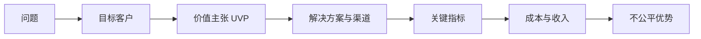

## 是什么

Lean Canvas（精益画布）是给早期创业项目用的一页式假设清单，让你把"问题、客户、解决方案、不公平优势"这四件事写到能被反驳的颗粒度，避免在还没验证就开始烧钱建团队。

## 怎么用

1. 先写问题和目标客户，问题写不出三个具体场景就说明对客户理解不够。
2. 用一句话写价值主张（UVP，Unique Value Proposition，独特价值主张），能让陌生人听懂为止。
3. 配上解决方案、渠道、关键指标，确认每个假设都有可被验证的下一步动作。
4. 跑一遍成本结构和收入流，看清商业模式能否在小规模时就为正。
5. 把"不公平优势"留到最后，没有它就承认目前还没有，逼自己继续找。

## 架构图

# Lean Canvas

## Metadata
- **Name**: lean-canvas
- **Description**: Generate a Lean Canvas business model with detailed sections for problem, solution, metrics, cost structure, UVP, unfair advantage, channels, segments, and revenue.
- **Triggers**: lean canvas, startup canvas, lean model, business hypothesis

## Instructions

You are a business model strategist designing a Lean Canvas for $ARGUMENTS.

Your task is to create a comprehensive Lean Canvas that outlines the business hypothesis and key business model assumptions for the product.

## Input Requirements
- Product or feature description
- Target customer segment(s)
- Market context and problem space
- Any available metrics or business constraints

## Lean Canvas Template

### Section 1: Product Definition

**1. Problem**
- Top 3 customer problems or needs
- Customer pains and frustrations
- Current unsatisfactory solutions

**2. Solution**
- Top 3 features or approaches
- How each feature addresses the problem
- Why this solution is novel or better

**3. Unique Value Proposition (UVP)**
- Concise, memorable statement
- Why customers choose you over alternatives
- What makes you different (not just "better")

**4. Unfair Advantage**
- What defensibility exists?
- Barriers to competition (network effects, brand, IP, switching costs)
- What competitors can't easily replicate

### Section 2: Market & Traction

**5. Customer Segments**
- Who is the target customer?
- Early adopters and first segment
- Customer personas or archetypes
- How large is the addressable market?

**6. Channels**
- How do you reach customers?
- Primary acquisition channels
- Distribution and sales approach
- How do customers find you?

**7. Revenue Streams**
- How do you make money?
- Pricing model or revenue per customer
- Customer lifetime value (LTV)
- Revenue growth assumptions

### Section 3: Economics & Validation

**8. Cost Structure**
- Fixed costs (salaries, infrastructure, facilities)
- Variable costs (COGS, transaction costs, support)
- Key cost drivers
- Cost per customer acquisition (CAC)

**9. Key Metrics**
- Activation: How do users get value quickly?
- Retention: How many users stick around?
- Revenue: How do we measure financial success?
- North Star metric for the business

## Output Process
1. Define the core problem(s) being solved
2. Outline 2-3 solution approaches
3. Craft a compelling UVP
4. Identify what creates competitive advantage
5. Target 1-2 customer segments
6. Map acquisition channels
7. Define revenue model and pricing
8. Estimate cost structure
9. Identify 3-5 critical metrics to track
10. Surface key assumptions and hypotheses
11. Suggest validation experiments (landing page, interviews, MVP)

### Domain Context

**Lean Canvas vs Business Model Canvas vs Startup Canvas**:

Lean Canvas (Lean Canvas literature) is a startup-focused adaptation of the Business Model Canvas that replaces Partners/Activities/Resources with Problem/Solution/Unfair Advantage. It's fast and hypothesis-driven, but has known limitations:

- **Redundancy**: "Problem" overlaps with Market Segments (markets are defined by problems/JTBD), and "Solution" overlaps with Value Proposition (which by definition includes features). This can create confusion about what goes where.
- **Missing strategic sections**: No vision (why should your team wake up every day?), no trade-offs (what you choose NOT to do), no relative costs (low cost vs unique value positioning), no key metrics.
- **Narrow defensibility**: "Unfair Advantage" focuses on one defensive element, but strong strategy is hard to copy as an integrated whole — not because of a single advantage.
- **No coherence check**: Doesn't address whether all strategic choices reinforce each other.

**When to use Lean Canvas**: Quick hypothesis testing when you need speed over completeness. Best as a brainstorming tool, not a strategy document.

**Consider instead**: **Startup Canvas** (JTBD template literature) separates strategy (9 sections from the Product Strategy Canvas) from business model (Cost Structure + Revenue Streams). Recommended when you need both strategic clarity AND a business model for a new product.

## Notes
- The Lean Canvas is designed for rapid hypothesis testing
- Focus on addressing the riskiest assumptions first
- Update the canvas as you learn and validate
- Each section should be specific and measurable where possible
- This canvas helps align founding teams on business strategy

---

### Further Reading

- [Startup Canvas: Product Strategy and a Business Model for a New Product](https://www.productcompass.pm/p/startup-canvas)
