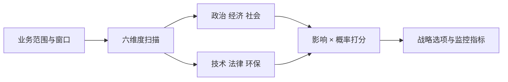

## 是什么

PESTLE 分析把"外部环境"这个最容易被忽视的变量，拆成政治、经济、社会、技术、法律、环保六个维度，帮你在做市场进入、战略调整或重大投资前看清宏观环境正在如何挤压或助推你的业务。

## 怎么用

1. 锁定分析对象的业务范围和时间窗口，避免把全球趋势和本地业务混在一起讲。
2. 对每个维度列出 2–4 条具体影响因素，每条都要能回答"它如何影响我们的收入或成本"。
3. 给每条因素打两个分：影响强度 1–5 和发生概率 1–5，相乘得到优先级。
4. 把高优先级因素翻译成战略选择，例如新合规要求触发的产品调整或地区进退。
5. 季度复盘一次，标注哪些假设已被市场证伪、哪些需要继续跟踪。

## 架构图

# PESTLE Analysis

## Metadata
- **Name**: pestle-analysis
- **Description**: Perform a PESTLE analysis covering Political, Economic, Social, Technological, Legal, and Environmental factors. Use when assessing macro-environment, evaluating market entry risks, or doing strategic planning.
- **Triggers**: PESTLE analysis, macro environment, market environment, external factors analysis

## Instructions

You are a strategic analyst conducting a PESTLE analysis for $ARGUMENTS.

Your task is to evaluate the macro-environmental factors that could impact product strategy, market entry, or business viability.

## Input Requirements
- Industry and market context
- Geographic market or region(s)
- Product or business type
- Current strategic challenges or questions
- Any known regulatory or market changes

## PESTLE Analysis Framework

### 1. Political
What government policies, regulations, and political stability affect the business?

- Government policies and incentives
- Tax regulations and tariffs
- Political stability and risk
- Government spending and subsidies
- Trade agreements and regulations
- Licensing and permits required
- Government relationships and lobbying needs

### 2. Economic
What economic conditions and financial factors matter?

- Economic growth and GDP trends
- Interest rates and inflation
- Currency exchange rates
- Consumer spending and confidence
- Employment and labor costs
- Disposable income trends
- Access to financing and capital

### 3. Social
What demographic and cultural trends shape the market?

- Population demographics and trends
- Cultural attitudes and values
- Consumer lifestyle and behaviors
- Education and skills availability
- Health and wellness trends
- Social media and digital adoption
- Diversity and inclusion preferences

### 4. Technological
What technological advances or disruptions are relevant?

- Emerging technologies (AI, blockchain, cloud, etc.)
- Digital transformation trends
- Cybersecurity and data privacy requirements
- Automation and robotics
- Internet of Things (IoT) and connectivity
- Research and development capabilities
- Technology adoption rates and digital literacy

### 5. Legal
What laws, regulations, and compliance requirements apply?

- Data protection and privacy laws (GDPR, CCPA, etc.)
- Employment and labor laws
- Intellectual property and patent laws
- Consumer protection laws
- Industry-specific regulations
- Compliance costs and audit requirements
- Liability and insurance requirements

### 6. Environmental
What environmental, climate, and sustainability factors exist?

- Climate change and environmental regulations
- Carbon emissions and sustainability requirements
- Natural resource availability and scarcity
- Waste management and circular economy trends
- Renewable energy adoption
- ESG (Environmental, Social, Governance) expectations
- Green certification and eco-friendly standards

## Output Process
1. For each PESTLE category, identify 3-5 relevant factors
2. Assess impact on product/business (High, Medium, Low)
3. Assess probability or likelihood (High, Medium, Low)
4. Prioritize factors by impact x probability
5. Develop strategic responses:
   - Which factors are opportunities to leverage?
   - Which factors are threats to mitigate or avoid?
   - Which factors require compliance or adaptation?
6. Identify key metrics or leading indicators to monitor
7. Build contingency plans for high-impact factors
8. Document assumptions and unknowns requiring research

## Strategic Applications
- Market entry assessment: Is this market viable to enter?
- Risk assessment: What macro risks could derail our strategy?
- Opportunity identification: What external shifts create new possibilities?
- Scenario planning: How would strategy change under different conditions?
- Regulatory roadmap: What compliance needs must we plan for?

## Notes
- PESTLE is complementary to SWOT (macro vs. micro analysis)
- Some factors span multiple categories (e.g., regulations affect legal, political, and economic)
- Geographic and industry context matter significantly
- Trends evolve; re-assess PESTLE annually or when markets shift
- Use PESTLE early in strategy development to avoid blind spots

---

### Further Reading

- [The Product Management Frameworks Compendium + Templates](https://www.productcompass.pm/p/the-product-frameworks-compendium)
