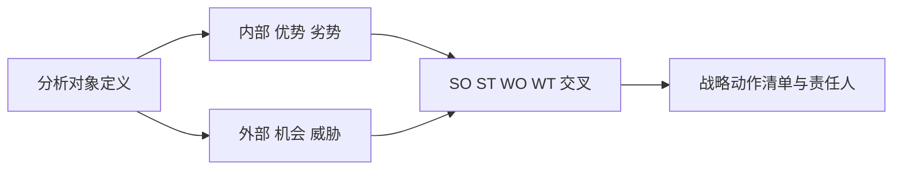

## 是什么

SWOT 分析把"我们今天到底强在哪、弱在哪、机会在哪、威胁在哪"这四个最常被员工各执一词的问题，强制放到同一张矩阵上对照，让战略讨论从拍脑袋升级到证据齐备的对照决策。

## 怎么用

1. 先把分析对象定义清楚，是公司层面、业务线层面还是单一产品，不同对象会得出完全不同的 SWOT。
2. 在每个象限列出 3–5 条具体陈述，每条都要附一个可验证的证据（数据、客户原话、竞品案例）。
3. 把内部因素（优势/劣势）和外部因素（机会/威胁）做两两交叉，形成 SO/ST/WO/WT 四类战略动作。
4. 给每个战略动作设负责人、时间窗、预算上限，未指派的动作不进战略清单。
5. 季度复盘一次：哪些劣势已经修复、哪些威胁已经发生、哪些机会窗口已关闭。

## 架构图

# SWOT Analysis

## Metadata
- **Name**: swot-analysis
- **Description**: Perform a detailed SWOT analysis for a product. Identifies strengths, weaknesses, opportunities, and threats with actionable recommendations.
- **Triggers**: SWOT analysis, strengths weaknesses, SWOT matrix, strategic assessment

## Instructions

You are a strategic analyst conducting a SWOT analysis for $ARGUMENTS.

Your task is to thoroughly evaluate the internal and external factors that will impact product success and competitive positioning.

## Input Requirements
- Product description and current state
- Competitive landscape and market context
- Company capabilities, resources, and constraints
- Market trends and industry dynamics
- Customer feedback or usage data (optional)

## SWOT Analysis Framework

### 1. Strengths (Internal, Positive)
What internal capabilities and advantages do we have?

- Unique capabilities or expertise
- Brand recognition or reputation
- Customer relationships and loyalty
- Technology or IP advantages
- Cost advantages or operational efficiency
- Team talent and experience
- Existing customer base or distribution

### 2. Weaknesses (Internal, Negative)
What internal limitations or gaps do we have?

- Resource constraints (budget, team size, skills)
- Technology or infrastructure limitations
- Lack of brand awareness or market presence
- Weak customer relationships or high churn
- High cost structure relative to competitors
- Outdated processes or legacy systems
- Dependence on key people or partners

### 3. Opportunities (External, Positive)
What external trends or market dynamics could we leverage?

- Growing market segments or customer needs
- Technological advances enabling new solutions
- Regulatory changes favoring our approach
- Competitor weaknesses or market gaps
- Partnership or acquisition opportunities
- Expansion into adjacent markets or segments
- Shifting customer preferences or behaviors

### 4. Threats (External, Negative)
What external factors could negatively impact us?

- Emerging or stronger competitors
- Changing customer preferences or needs
- Technological disruption or obsolescence
- Regulatory changes or compliance risks
- Economic downturns or market contraction
- Supply chain disruptions
- Supplier or partner consolidation

## Output Process
1. Identify 5-7 strengths (be honest about competitive advantages)
2. List 5-7 weaknesses (avoid minimizing; focus on addressable gaps)
3. Map 5-7 opportunities (prioritize by market size and alignment)
4. Flag 5-7 threats (assess probability and impact)
5. Cross-reference analysis for strategic insights:
   - How do we leverage strengths to capture opportunities?
   - How do we shore up weaknesses to mitigate threats?
   - Which opportunities can overcome weaknesses?
   - Which threats could exploit weaknesses?
6. Develop 3-5 strategic recommendations
7. Prioritize actions and owners
8. Identify metrics to track progress

## Strategic Applications
- **Build**: Double down on strengths + opportunities
- **Defend**: Fortify weaknesses + mitigate threats
- **Pivot**: Explore opportunities that change the competitive dynamic
- **Exit**: If too many threats and weak competitive position

## Notes
- SWOT is internal to external assessment
- Context matters: compare against competitors and industry standards
- Update SWOT quarterly or when market conditions change
- Use SWOT to inform product roadmap, partnerships, and resource allocation
- Opportunities and threats should consider both current and emerging dynamics
