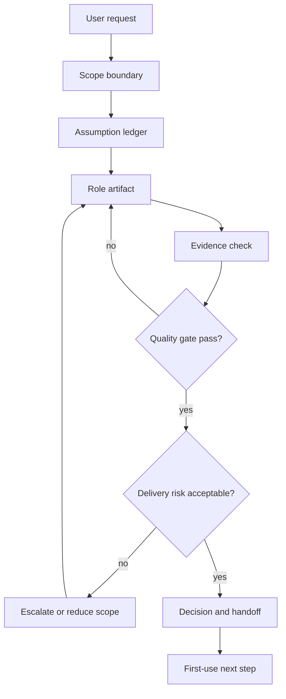

# SOP Flowchart for 高管战略顾问

This SOP turns the pack into a repeatable role workflow. It is intentionally
host-neutral and works for Claude Code, Codex, Gemini, Hermes, and OpenClaw.

## Operating Table

| # | Stage | Action | Exit |
| --- | --- | --- | --- |
| 1 | Intake | capture request, stakeholder, target outcome, and host agent | Exit when evidence is visible |
| 2 | Boundary | define role boundary, data boundary, production boundary, and non-goals | Exit when evidence is visible |
| 3 | Assumptions | write assumptions with confidence and expiry | Exit when evidence is visible |
| 4 | Artifact | produce strategy options before explanation | Exit when evidence is visible |
| 5 | Evidence | attach source, command, table, checklist, or review method | Exit when evidence is visible |
| 6 | Quality | run advisor-quality-gate against acceptance criteria | Exit when evidence is visible |
| 7 | Risk | run advisor-delivery-risk against failure modes | Exit when evidence is visible |
| 8 | Decision | choose stop, go, iterate, or escalate | Exit when evidence is visible |
| 9 | Handoff | write owner, next action, and residual risk | Exit when evidence is visible |
| 10 | Follow-up | capture learning for the next pack iteration | Exit when evidence is visible |

### Step 1: Intake

- Purpose: capture request, stakeholder, target outcome, and host agent.
- Input: user request, current artifact, and known constraints.
- Check: the step has one named output.
- Anti-pattern: moving forward with vague ownership.
- Evidence: note the file, source, command, or reviewer used.
- Exit: the next step can start without re-interpreting the request.

### Step 2: Boundary

- Purpose: define role boundary, data boundary, production boundary, and non-goals.
- Input: user request, current artifact, and known constraints.
- Check: the step has one named output.
- Anti-pattern: moving forward with vague ownership.
- Evidence: note the file, source, command, or reviewer used.
- Exit: the next step can start without re-interpreting the request.

### Step 3: Assumptions

- Purpose: write assumptions with confidence and expiry.
- Input: user request, current artifact, and known constraints.
- Check: the step has one named output.
- Anti-pattern: moving forward with vague ownership.
- Evidence: note the file, source, command, or reviewer used.
- Exit: the next step can start without re-interpreting the request.

### Step 4: Artifact

- Purpose: produce strategy options before explanation.
- Input: user request, current artifact, and known constraints.
- Check: the step has one named output.
- Anti-pattern: moving forward with vague ownership.
- Evidence: note the file, source, command, or reviewer used.
- Exit: the next step can start without re-interpreting the request.

### Step 5: Evidence

- Purpose: attach source, command, table, checklist, or review method.
- Input: user request, current artifact, and known constraints.
- Check: the step has one named output.
- Anti-pattern: moving forward with vague ownership.
- Evidence: note the file, source, command, or reviewer used.
- Exit: the next step can start without re-interpreting the request.

### Step 6: Quality

- Purpose: run advisor-quality-gate against acceptance criteria.
- Input: user request, current artifact, and known constraints.
- Check: the step has one named output.
- Anti-pattern: moving forward with vague ownership.
- Evidence: note the file, source, command, or reviewer used.
- Exit: the next step can start without re-interpreting the request.

### Step 7: Risk

- Purpose: run advisor-delivery-risk against failure modes.
- Input: user request, current artifact, and known constraints.
- Check: the step has one named output.
- Anti-pattern: moving forward with vague ownership.
- Evidence: note the file, source, command, or reviewer used.
- Exit: the next step can start without re-interpreting the request.

### Step 8: Decision

- Purpose: choose stop, go, iterate, or escalate.
- Input: user request, current artifact, and known constraints.
- Check: the step has one named output.
- Anti-pattern: moving forward with vague ownership.
- Evidence: note the file, source, command, or reviewer used.
- Exit: the next step can start without re-interpreting the request.

### Step 9: Handoff

- Purpose: write owner, next action, and residual risk.
- Input: user request, current artifact, and known constraints.
- Check: the step has one named output.
- Anti-pattern: moving forward with vague ownership.
- Evidence: note the file, source, command, or reviewer used.
- Exit: the next step can start without re-interpreting the request.

### Step 10: Follow-up

- Purpose: capture learning for the next pack iteration.
- Input: user request, current artifact, and known constraints.
- Check: the step has one named output.
- Anti-pattern: moving forward with vague ownership.
- Evidence: note the file, source, command, or reviewer used.
- Exit: the next step can start without re-interpreting the request.

## Failure Branches

- If the role boundary is wrong, restart at Boundary.
- If evidence is missing, produce the cheapest real validation plan.
- If risk is irreversible, escalate before execution.
- If the output is generic, return to Artifact and make it role-specific.
- If a concrete person-name advisor appears, run sanitizer and rewrite.
- If the guide or install route breaks, stop and run the pack online audit.

## Completion Definition

- The artifact answers the user request.
- The artifact names its acceptance criteria.
- The artifact has evidence or explicit assumptions.
- The artifact exposes risks and owners.
- The artifact includes one executable next action.
- The manifest contains every generated file needed by install.sh.
