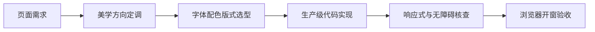

## 是什么

帮你从零搭一个不像 AI 模板的前端界面，让你的官网、落地页、控制台一眼就有自己的调性，而不是又一个紫色渐变加 Inter 字体的"AI 味"作品。

## 怎么用

1. 把要做的页面用途、目标用户、想要的气质告诉它，越具体越好。
2. 它会先帮你定一个明确的美学方向，比如极简、复古、编辑刊物、工业感，不允许"哪种都行"。
3. 它选好字体、配色、版式之后才动手写代码，所有选择都给你一句话理由。
4. 它会把响应式、CJK（中日韩文字）排版、无障碍这些细节一并处理，不留尾巴。
5. 出稿后它会自动在浏览器里打开成品，让你当场对照需求验收。

## 架构图

This skill guides creation of distinctive, production-grade frontend interfaces that avoid generic "AI slop" aesthetics. Implement real working code with exceptional attention to aesthetic details and creative choices.

The user provides frontend requirements: a component, page, application, or interface to build. They may include context about the purpose, audience, or technical constraints.

## Gotchas

1. **Never default to Inter/Roboto/system fonts.** The #1 "AI slop" marker is generic typography. Every project needs a deliberate font choice — even if it's just picking something unexpected from Google Fonts. Pair a display font with a body font; never use one font for everything.

2. **Purple gradients on white = instant AI detection.** This specific combination has become the universal marker for AI-generated UI. Avoid it completely. If the user doesn't specify a color scheme, pick something with character — not the default Tailwind purple/indigo.

3. **CSS `min(vw, px)` locks the upper bound — use pure viewport units.** For responsive scaling across 1K-6K displays, `min(10vw, 100px)` stops growing at 100px. Use pure `vw/vh/%` units. Also: `flex:1` stretches text cards unnaturally on wide screens.

4. **CJK text needs `word-break: keep-all` to prevent orphaned characters.** Single Chinese characters wrapping to a new line looks broken. Apply `word-break: keep-all; overflow-wrap: break-word` on all Chinese-facing pages.

5. **Default to light theme.** Chinese users predominantly prefer light themes. Only use dark theme when explicitly requested or when the design intent requires it (e.g., Bloomberg-style dashboards, gaming interfaces).

6. **Always open the finished HTML in the browser.** After generating any standalone HTML deliverable, run `open <file.html>` so the user can immediately verify. Don't just write the file and declare done.

## Design Thinking

Before coding, understand the context and commit to a BOLD aesthetic direction:
- **Purpose**: What problem does this interface solve? Who uses it?
- **Tone**: Pick an extreme: brutally minimal, maximalist chaos, retro-futuristic, organic/natural, luxury/refined, playful/toy-like, editorial/magazine, brutalist/raw, art deco/geometric, soft/pastel, industrial/utilitarian, etc. There are so many flavors to choose from. Use these for inspiration but design one that is true to the aesthetic direction.
- **Constraints**: Technical requirements (framework, performance, accessibility).
- **Differentiation**: What makes this UNFORGETTABLE? What's the one thing someone will remember?

**CRITICAL**: Choose a clear conceptual direction and execute it with precision. Bold maximalism and refined minimalism both work - the key is intentionality, not intensity.

Then implement working code (HTML/CSS/JS, React, Vue, etc.) that is:
- Production-grade and functional
- Visually striking and memorable
- Cohesive with a clear aesthetic point-of-view
- Meticulously refined in every detail

## Frontend Aesthetics Guidelines

Focus on:
- **Typography**: Choose fonts that are beautiful, unique, and interesting. Avoid generic fonts like Arial and Inter; opt instead for distinctive choices that elevate the frontend's aesthetics; unexpected, characterful font choices. Pair a distinctive display font with a refined body font.
- **Color & Theme**: Commit to a cohesive aesthetic. Use CSS variables for consistency. Dominant colors with sharp accents outperform timid, evenly-distributed palettes.
- **Motion**: Use animations for effects and micro-interactions. Prioritize CSS-only solutions for HTML. Use Motion library for React when available. Focus on high-impact moments: one well-orchestrated page load with staggered reveals (animation-delay) creates more delight than scattered micro-interactions. Use scroll-triggering and hover states that surprise.
- **Spatial Composition**: Unexpected layouts. Asymmetry. Overlap. Diagonal flow. Grid-breaking elements. Generous negative space OR controlled density.
- **Backgrounds & Visual Details**: Create atmosphere and depth rather than defaulting to solid colors. Add contextual effects and textures that match the overall aesthetic. Apply creative forms like gradient meshes, noise textures, geometric patterns, layered transparencies, dramatic shadows, decorative borders, custom cursors, and grain overlays.

NEVER use generic AI-generated aesthetics like overused font families (Inter, Roboto, Arial, system fonts), cliched color schemes (particularly purple gradients on white backgrounds), predictable layouts and component patterns, and cookie-cutter design that lacks context-specific character.

Interpret creatively and make unexpected choices that feel genuinely designed for the context. No design should be the same. Vary between light and dark themes, different fonts, different aesthetics. NEVER converge on common choices (Space Grotesk, for example) across generations.

**IMPORTANT**: Match implementation complexity to the aesthetic vision. Maximalist designs need elaborate code with extensive animations and effects. Minimalist or refined designs need restraint, precision, and careful attention to spacing, typography, and subtle details. Elegance comes from executing the vision well.

Remember: Claude is capable of extraordinary creative work. Don't hold back, show what can truly be created when thinking outside the box and committing fully to a distinctive vision.

## CJK Typography Anti-Patterns (Mandatory for Chinese/Japanese/Korean content)

Single-character orphans (孤字) and mid-word line breaks are CRITICAL defects in CJK layouts. Apply these rules on every CJK-facing page:

### Prevention Rules

1. **`text-pretty` on all paragraph/description text** — CSS `text-wrap: pretty` prevents orphan words at line ends. Apply to `
`, subtitles, descriptions, CTA copy, and any multi-line text block.
2. **`whitespace-nowrap` on atomic inline items** — Dates ("2026 年 3 月 25 日 周三"), times ("14:00 - 16:00"), names, locations, badges, legend items, and any metadata that must stay on one line.
3. **Never use `grid-cols-*` for metadata inside narrow card grids** — When cards are in multi-column layouts (2-3 cols), inner grid subdivision creates cells too narrow for CJK+English mixed text. Use `flex flex-wrap` instead, so items flow naturally and wrap at item boundaries, not mid-text.
4. **`flex-shrink-0` on all icons inside flex rows** — Prevents SVG icons from squeezing when text wraps.
5. **Avoid showing long compound titles in narrow containers** — e.g., "讲师 C -- AI Coding 方向负责人" in a 170px cell. Either truncate (`truncate`), show only the primary field (name only), or use `whitespace-nowrap` + `overflow-hidden`.

### Audit Checklist (run before shipping any CJK page)

- [ ] Resize viewport from 768px to 1440px and check for single-character line breaks
- [ ] Verify all date/time/location metadata stays on one line at all breakpoints
- [ ] Check multi-column card layouts at `md` breakpoint for text overflow
- [ ] Confirm no orphan characters at paragraph ends (especially 1-2 char words like "的", "了", "实战")
