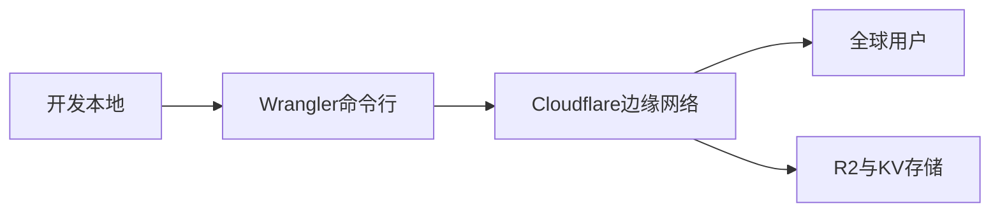

## 是什么

把应用一键部署到 Cloudflare 全球边缘网络（Workers + Pages + R2 + KV 等托管产品），让产品在用户最近的节点上就近响应，把首字节时间（TTFB，首字节响应时间）从数百毫秒压到几十毫秒，同时按调用次数计费，闲时近零成本。

## 怎么用

1. 先用 `wrangler whoami` 确认登录状态，避免后面 Deploy 卡在鉴权环节浪费排查时间。
2. 根据项目形态选产品：纯静态站走 Pages，需要服务端逻辑走 Workers，需要对象存储走 R2，需要键值缓存走 KV。
3. 在 `wrangler.toml`（Workers 配置文件）里固定生产/预览环境的绑定，避免人肉切环境出事故。
4. 用 `wrangler deploy --dry-run` 先做一次仿真发布，看产物体积和绑定是否符合预期。
5. 正式发布后用 `wrangler tail` 观察实时日志，确认线上请求成功率符合 SLO（Service Level Objective，服务质量目标）。

## 架构图



# Cloudflare Deploy

Consolidated skill for building on the Cloudflare platform. Use decision trees below to find the right product, then load detailed references.

## Prerequisites

- When sandboxing blocks the deployment network calls, rerun with `sandbox_permissions=require_escalated`.
- The deployment might take a few minutes. Use appropriate timeout values.

## Authentication (Required Before Deploy)

Verify auth before `wrangler deploy`, `wrangler pages deploy`, or `npm run deploy`:

```bash
npx wrangler whoami    # Shows account if authenticated
```

Not authenticated? → `references/wrangler/auth.md`
- Interactive/local: `wrangler login` (one-time OAuth)
- CI/CD: Set `CLOUDFLARE_API_TOKEN` env var

## Quick Decision Trees

### "I need to run code"

```
Need to run code?
├─ Serverless functions at the edge → workers/
├─ Full-stack web app with Git deploys → pages/
├─ Stateful coordination/real-time → durable-objects/
├─ Long-running multi-step jobs → workflows/
├─ Run containers → containers/
├─ Multi-tenant (customers deploy code) → workers-for-platforms/
├─ Scheduled tasks (cron) → cron-triggers/
├─ Lightweight edge logic (modify HTTP) → snippets/
├─ Process Worker execution events (logs/observability) → tail-workers/
└─ Optimize latency to backend infrastructure → smart-placement/
```

### "I need to store data"

```
Need storage?
├─ Key-value (config, sessions, cache) → kv/
├─ Relational SQL → d1/ (SQLite) or hyperdrive/ (existing Postgres/MySQL)
├─ Object/file storage (S3-compatible) → r2/
├─ Message queue (async processing) → queues/
├─ Vector embeddings (AI/semantic search) → vectorize/
├─ Strongly-consistent per-entity state → durable-objects/ (DO storage)
├─ Secrets management → secrets-store/
├─ Streaming ETL to R2 → pipelines/
└─ Persistent cache (long-term retention) → cache-reserve/
```

### "I need AI/ML"

```
Need AI?
├─ Run inference (LLMs, embeddings, images) → workers-ai/
├─ Vector database for RAG/search → vectorize/
├─ Build stateful AI agents → agents-sdk/
├─ Gateway for any AI provider (caching, routing) → ai-gateway/
└─ AI-powered search widget → ai-search/
```

### "I need networking/connectivity"

```
Need networking?
├─ Expose local service to internet → tunnel/
├─ TCP/UDP proxy (non-HTTP) → spectrum/
├─ WebRTC TURN server → turn/
├─ Private network connectivity → network-interconnect/
├─ Optimize routing → argo-smart-routing/
├─ Optimize latency to backend (not user) → smart-placement/
└─ Real-time video/audio → realtimekit/ or realtime-sfu/
```

### "I need security"

```
Need security?
├─ Web Application Firewall → waf/
├─ DDoS protection → ddos/
├─ Bot detection/management → bot-management/
├─ API protection → api-shield/
├─ CAPTCHA alternative → turnstile/
└─ Credential leak detection → waf/ (managed ruleset)
```

### "I need media/content"

```
Need media?
├─ Image optimization/transformation → images/
├─ Video streaming/encoding → stream/
├─ Browser automation/screenshots → browser-rendering/
└─ Third-party script management → zaraz/
```

### "I need infrastructure-as-code"

```
Need IaC? → pulumi/ (Pulumi), terraform/ (Terraform), or api/ (REST API)
```

## Product Index

### Compute & Runtime
| Product | Reference |
|---------|-----------|
| Workers | `references/workers/` |
| Pages | `references/pages/` |
| Pages Functions | `references/pages-functions/` |
| Durable Objects | `references/durable-objects/` |
| Workflows | `references/workflows/` |
| Containers | `references/containers/` |
| Workers for Platforms | `references/workers-for-platforms/` |
| Cron Triggers | `references/cron-triggers/` |
| Tail Workers | `references/tail-workers/` |
| Snippets | `references/snippets/` |
| Smart Placement | `references/smart-placement/` |

### Storage & Data
| Product | Reference |
|---------|-----------|
| KV | `references/kv/` |
| D1 | `references/d1/` |
| R2 | `references/r2/` |
| Queues | `references/queues/` |
| Hyperdrive | `references/hyperdrive/` |
| DO Storage | `references/do-storage/` |
| Secrets Store | `references/secrets-store/` |
| Pipelines | `references/pipelines/` |
| R2 Data Catalog | `references/r2-data-catalog/` |
| R2 SQL | `references/r2-sql/` |

### AI & Machine Learning
| Product | Reference |
|---------|-----------|
| Workers AI | `references/workers-ai/` |
| Vectorize | `references/vectorize/` |
| Agents SDK | `references/agents-sdk/` |
| AI Gateway | `references/ai-gateway/` |
| AI Search | `references/ai-search/` |

### Networking & Connectivity
| Product | Reference |
|---------|-----------|
| Tunnel | `references/tunnel/` |
| Spectrum | `references/spectrum/` |
| TURN | `references/turn/` |
| Network Interconnect | `references/network-interconnect/` |
| Argo Smart Routing | `references/argo-smart-routing/` |
| Workers VPC | `references/workers-vpc/` |

### Security
| Product | Reference |
|---------|-----------|
| WAF | `references/waf/` |
| DDoS Protection | `references/ddos/` |
| Bot Management | `references/bot-management/` |
| API Shield | `references/api-shield/` |
| Turnstile | `references/turnstile/` |

### Media & Content
| Product | Reference |
|---------|-----------|
| Images | `references/images/` |
| Stream | `references/stream/` |
| Browser Rendering | `references/browser-rendering/` |
| Zaraz | `references/zaraz/` |

### Real-Time Communication
| Product | Reference |
|---------|-----------|
| RealtimeKit | `references/realtimekit/` |
| Realtime SFU | `references/realtime-sfu/` |

### Developer Tools
| Product | Reference |
|---------|-----------|
| Wrangler | `references/wrangler/` |
| Miniflare | `references/miniflare/` |
| C3 | `references/c3/` |
| Observability | `references/observability/` |
| Analytics Engine | `references/analytics-engine/` |
| Web Analytics | `references/web-analytics/` |
| Sandbox | `references/sandbox/` |
| Workerd | `references/workerd/` |
| Workers Playground | `references/workers-playground/` |

### Infrastructure as Code
| Product | Reference |
|---------|-----------|
| Pulumi | `references/pulumi/` |
| Terraform | `references/terraform/` |
| API | `references/api/` |

### Other Services
| Product | Reference |
|---------|-----------|
| Email Routing | `references/email-routing/` |
| Email Workers | `references/email-workers/` |
| Static Assets | `references/static-assets/` |
| Bindings | `references/bindings/` |
| Cache Reserve | `references/cache-reserve/` |

## Troubleshooting

### Escalated Network Access

If deployment fails due to network issues (timeouts, DNS errors, connection resets), rerun the deploy with escalated permissions (use `sandbox_permissions=require_escalated`). The deploy requires escalated network access when sandbox networking blocks outbound requests.

Example guidance to the user:

```
The deploy needs escalated network access to deploy to Cloudflare. I can rerun the command with escalated permissions—want me to proceed?
```
