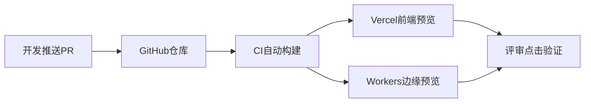

## 是什么

把前端（Vercel）、边缘（Cloudflare Workers）和 CI（GitHub Actions，持续集成）三段流水线串起来，给每个 PR（Pull Request，合并请求）出一个可点击的预览地址，让产品、设计、利益相关方能在合并前真实点一遍，把生产事故拦在合并之前。

## 怎么用

1. 在 PR 提交后用 `gh pr status` 看 CI 是否绿灯，红的先修，不要急着点 Merge。
2. 用 `vercel ls` 拿到本次 PR 的前端预览 URL，把它扔进 PR 评论区让评审人直接点开。
3. 若涉及边缘逻辑，用 `wrangler deploy --env preview` 出一份带版本号的 Workers 预览。
4. 把前端预览 URL 与 Workers 预览端点串通走一次关键链路，验证端到端可用而不是只看截图。
5. 验证通过再合并，并在合并后 5 分钟内复查生产指标曲线，确认没有回归。

## 架构图



# Deploy Preview

Multi-CLI deployment preview pipeline combining frontend (Vercel), edge (Cloudflare Workers), and CI/CD (GitHub Actions) status.

## Quick Start

Check deployment readiness for current project:
```bash
# 1. Git status (clean working tree required)
git status --porcelain | wc -l | xargs -I{} test {} -eq 0 && echo "CLEAN" || echo "DIRTY"

# 2. GitHub PR + CI status
gh pr view --json state,statusCheckRollup,mergeable 2>/dev/null || echo "no open PR"

# 3. Vercel preview status
vercel ls 2>&1 | head -10

# 4. Wrangler Worker preview
wrangler deployments list 2>/dev/null | head -5
```

## Deployment Flows

### Flow A: Frontend (Vercel)
```bash
# Preview deploy (no production)
vercel --no-wait 2>&1

# Check preview URL
vercel inspect <deployment-url>

# Promote to production (HITL required)
vercel --prod
```

### Flow B: Edge Worker (Cloudflare)
```bash
# Dry run (local dev)
wrangler dev --local

# Preview deploy (non-production)
wrangler deploy --dry-run

# Production deploy (HITL required)
wrangler deploy
```

### Flow C: Full Stack (Vercel + Worker + GitHub)
```bash
# 1. Create PR
gh pr create --title "feat: ..." --body "..."

# 2. Wait for CI checks
gh pr checks --watch

# 3. Preview URLs auto-generated by Vercel/Cloudflare integrations

# 4. Merge when ready (HITL)
gh pr merge --squash
```

## Pre-Deploy Checklist

```
Deploy Readiness:
- [ ] git working tree clean
- [ ] all CI checks passing (gh pr checks)
- [ ] no critical vulnerabilities (trivy fs)
- [ ] preview URL accessible and tested
- [ ] environment variables set (vercel env ls / wrangler secret list)
```

## Output Format

```json
{
  "project": "project-name",
  "branch": "feature/...",
  "git_clean": true,
  "ci_status": "passing|failing|pending",
  "previews": {
    "vercel": "https://project-xxx.vercel.app",
    "worker": "https://project.workers.dev"
  },
  "blockers": [],
  "ready": true
}
```

## HITL Gates

These operations require explicit human approval per safety rules:
- `vercel --prod` (production frontend deploy)
- `wrangler deploy` (production Worker deploy)
- `gh pr merge` (merge to main)

## Gotchas

1. **`vercel ls` hangs if not linked — run `vercel link` first.** A fresh clone or new project has no `.vercel/` directory. `vercel ls` and `vercel inspect` will prompt for login interactively, blocking the agent. Always check for `.vercel/project.json` before running any Vercel command; if missing, run `vercel link --yes` first.

2. **Wrangler needs `wrangler.toml` — don't assume it exists.** Running `wrangler deploy` or `wrangler dev` without a `wrangler.toml` (or `wrangler.json`) in the project root throws a cryptic "no config found" error. Check for the config file before invoking any Wrangler command. Some projects use `wrangler.jsonc` instead.

3. **`gh pr checks --watch` can hang forever on pending external checks.** Third-party CI integrations (Vercel Deploy, Cloudflare Pages) may stay "pending" indefinitely if the webhook is misconfigured. Set a timeout: `timeout 300 gh pr checks --watch || echo "TIMEOUT"`. Never block the pipeline on an external check without a deadline.

4. **Preview URLs are NOT production URLs — don't validate against production DNS.** Vercel preview URLs (`*-xxx.vercel.app`) and Cloudflare preview URLs use different origins than production. CORS policies, cookie domains, and CSP headers may differ. A "working preview" does not guarantee production will work — always test the specific deployment target.

5. **CF Pages projects use `wrangler pages` not `wrangler deploy`.** If the project is a Cloudflare Pages deployment (not a Worker), `wrangler deploy` does nothing useful. Use `wrangler pages deploy <dist-dir>` instead. Check `wrangler.toml` for `[pages]` section or look for a `functions/` directory to distinguish Pages from Workers.

## CLI Dependencies

- **vercel** (deploy): frontend preview + production deployment
- **wrangler** (deploy): Cloudflare Workers deployment
- **gh** (platform): PR management, CI status, code review
- **trivy** (security): pre-deploy vulnerability scan
