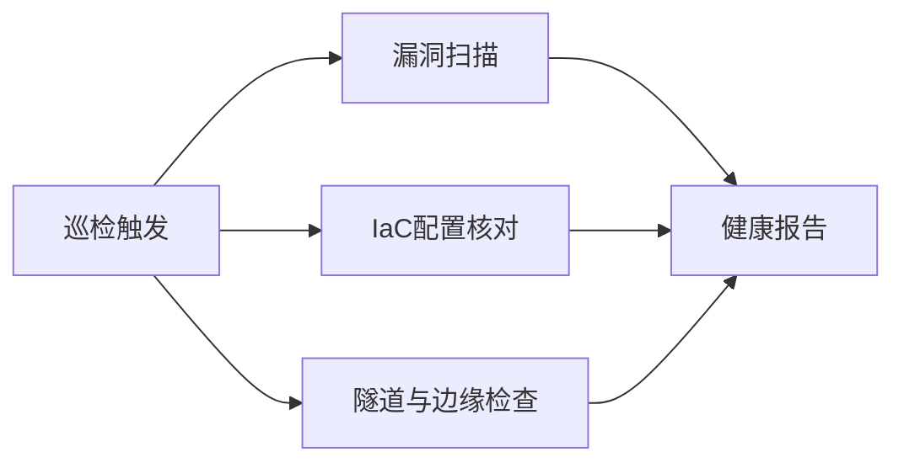

## 是什么

一套定期巡检脚手架：把漏洞扫描（Trivy）、IaC（Infrastructure as Code，基础设施即代码）校验（Terraform）、隧道与边缘健康检查（cloudflared + wrangler）串成一条流水线，让团队每天能用 3 分钟拿到一份红黄绿的基础设施健康报告，提前暴露未修复的 CVE 与配置漂移。

## 怎么用

1. 用 `trivy fs .` 扫整库依赖与机密信息，先关掉高危项再说优化。
2. 用 `terraform plan` 对比线上态与代码态，确认没有人手工改过生产配置（配置漂移）。
3. 用 `cloudflared tunnel list` 与 `wrangler deployments list` 核对隧道与 Workers 是否仍在跑预期版本。
4. 把每一步的退出码汇总成一份巡检报告，红色项进 Issue，黄色项进周会跟进。
5. 把巡检脚本挂到每日定时任务（cron）或 CI，让异常自己冒出来而不是靠人想起来查。

## 架构图



# Infrastructure Patrol

Multi-CLI infrastructure health check combining security scanning, IaC validation, and network tunnel verification.

## Quick Start

Run full patrol on current project:
```bash
# 1. Security scan (vulnerabilities + secrets)
trivy fs --scanners vuln,secret --format json . | jq '.Results[] | {Target, Vulnerabilities: (.Vulnerabilities // [] | length), Secrets: (.Secrets // [] | length)}'

# 2. Terraform validate (if .tf files exist)
find . -name '*.tf' -maxdepth 3 | head -1 && terraform validate -json || echo '{"valid": true, "note": "no terraform files"}'

# 3. Cloudflare tunnel status
cloudflared tunnel list --output json 2>/dev/null | jq '.[].name' || echo "no tunnels"

# 4. Wrangler deployment status
wrangler deployments list --json 2>/dev/null | jq '.[0] | {id, created_on, strategy}' || echo "no workers"
```

## Patrol Levels

### L1: Quick Scan (< 30s)
- trivy fs (vuln only, skip db update)
- terraform fmt -check
- ai doctor --cli --json

### L2: Standard Patrol (< 2min)
- trivy fs (vuln + secret + config)
- terraform validate + plan (dry-run)
- cloudflared tunnel list
- wrangler deployments list

### L3: Deep Audit (< 10min)
- trivy repo (full repo scan with SBOM)
- terraform plan -detailed-exitcode
- trivy config (IaC misconfig scan on .tf files)
- DNS + SSL certificate checks

## Output Format

```json
{
  "patrol_level": "L2",
  "timestamp": "ISO8601",
  "results": {
    "security": {"vulnerabilities": 0, "secrets": 0, "misconfigs": 0},
    "iac": {"valid": true, "drift": false},
    "network": {"tunnels_active": 1, "workers_deployed": 3},
    "cli_health": {"total": 12, "ok": 10, "missing": 2}
  },
  "verdict": "PASS|WARN|FAIL",
  "actions": ["list of recommended actions if WARN/FAIL"]
}
```

## Integration

- PreToolUse hook: auto-trigger L1 scan before `terraform apply` or `wrangler deploy`
- Cron: weekly L2 patrol on all devices (fleet-cron-drift.sh compatible)
- DNA: security findings auto-create DNA capsules for cross-agent inheritance

## CLI Dependencies

All CLIs from `configs/cli-registry.json`:
- **trivy** (security): vuln + secret + config scanning
- **terraform** (infra): IaC validation and drift detection
- **cloudflared** (network): tunnel health
- **wrangler** (deploy): Worker deployment status
- **ai doctor --cli**: CLI availability baseline
