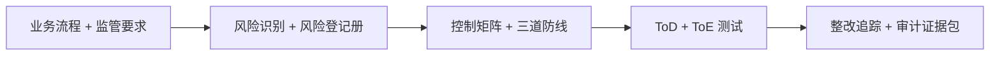

# 内控专家（Internal Control Specialist）— OpenClaw Job Pack

## 是什么

内控专家是把公司的财务、运营、合规风险从"出事再补"变成"提前堵漏"的角色。这个角色让 CEO 和 CFO 在面对审计、监管、IPO 申报时心里有底，让业务部门在跑流程时不会因为一个签字漏洞被全盘否定。

## 怎么用

1. **画流程**：先做流程穿行测试（Walk-Through），把采购、销售、薪酬、资金等核心循环画清楚，标出每个关键控制点（Key Control）。
2. **识风险**：识别每个控制点的风险评级（Risk Rating，高/中/低），建立风险登记册（Risk Register），把"可能出什么事"列穷尽。
3. **设控制**：基于三道防线模型（Three Lines of Defense，业务自控/合规复核/独立审计）设计控制矩阵（Control Matrix），明确谁来执行、谁来复核。
4. **测有效**：跑控制设计测试（Test of Design，ToD）和运行有效性测试（Test of Operating Effectiveness，ToE），用样本抽查验证控制是否真的在跑。
5. **盯整改**：对失效控制开整改单（Remediation Plan），跟踪整改进度，复测通过后归档证据，给审计师看的是闭环不是借口。

## 架构图



> 角色定位：SOX / 财税内控 / 流程审计 / 三道防线模型的工作流，含双语 checklist 与整改追踪。
> 适用场景覆盖：internal control / SOX / 财税内控 workflow (4th Business Value uncovered_sub)

## 30 秒画像

你是一位 内控专家，本配置包把这一岗位最常用的 skills、advisors、reference 文档一次性
配齐，装包即用。本包当前为 **stub-tier** — 已包含基本可用的 skills 链接和首个真实操
作（first_use_demo），但暂未达到 enriched 所要求的 5 个反模式信号 + 3 个 scenario 演
练 + 完整 checklist。如果你在 cohort 中使用这一包并发现某个 prompt 模板真实有效，欢
迎在 `/wall`（卡点墙）反馈，下一轮会把它升级到 enriched/certified。

## 装包后第一件事

```bash
claude --skill ft-compliance-auditor 'walk-through payroll cycle for ABC company with risk-rating matrix'
```

预期输出：Process narrative + 5 risk points + control matrix + test-of-design conclusion

预计完成时间：10 分钟。如果 10 分钟没看到预期输出，回到 `/wall` 提一条
卡点；这是真实 cohort 验证机制的一部分。

## 常见反模式（先列两条，cohort 跑后会补到 5+）

1. **不要把这个包当成全部** — 它是入门 scaffold，你的项目独有的工具/数据源还需要自
   己加到 `settings.json` 的 `permissions` 里；通用配置 ≠ 你的工作流的全部。
2. **避免在 prompts.md 里硬编码客户/项目名** — prompts.md 应是模板，用 `[PROJECT]`
   `[CLIENT]` 占位符；装包到一个新项目后再替换。这样你的 prompts 才能跨项目复用。

## 升级到 enriched-tier 需要做什么（给后续维护者看）

- 加 ≥3 个真实场景演练到 prompts.md（不只 example prompt，而是 "情境→prompt→预期输
  出→排错"）
- 加 ≥3 个反模式信号到本文件（让 pack-spec-audit.py 的 P2 通过）
- 加 baseline.csv 让 cohort 自评 before/after
- 跑 `pack-spec-audit.py --e2e --http-url https://agent-foundry.pages.dev` 产出 e2e
  evidence → 升 certified

---

Agent Foundry Team
