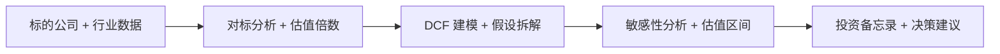

# 投资分析师（Investment Analyst）— OpenClaw Job Pack

## 是什么

投资分析师是把一家公司"值不值得投"从直觉判断变成可审计估值结论的角色。这个角色让投资决策从"老板拍板"升级到"备忘录（Investment Memo）支撑"，让团队在反复看的几十个标的里筛出真正值得深做的标的。

## 怎么用

1. **划赛道**：先界定行业边界、市场规模（Market Sizing）和增长驱动，把这家公司放到对的对标组（Peer Group）里。
2. **拉对标**：搜集同行业可比公司（Comparables）的估值倍数（Multiples，如 P/E、EV/EBITDA），形成估值参照基线。
3. **建模型**：搭现金流折现模型（DCF，Discounted Cash Flow），列清楚关键假设（收入增速、毛利率、永续增长率）。
4. **跑敏感**：对核心假设做敏感性分析（Sensitivity Analysis），把单点估值变成区间估值，让决策者看清下行风险。
5. **写备忘**：输出投资备忘录（Investment Memo），结论、估值区间、关键风险、下一步动作清单一次性给齐。

## 架构图



> 角色定位：估值/DCF/对标分析的全流程配置，输出可审计的投资备忘录。
> 适用场景覆盖：valuation/DCF/comparable analysis workflow

## 30 秒画像

你是一位 投资分析师，本配置包把这一岗位最常用的 skills、advisors、reference 文档一次性
配齐，装包即用。本包当前为 **stub-tier** — 已包含基本可用的 skills 链接和首个真实操
作（first_use_demo），但暂未达到 enriched 所要求的 5 个反模式信号 + 3 个 scenario 演
练 + 完整 checklist。如果你在 cohort 中使用这一包并发现某个 prompt 模板真实有效，欢
迎在 `/wall`（卡点墙）反馈，下一轮会把它升级到 enriched/certified。

## 装包后第一件事

```bash
claude --skill valuation 'run DCF on company X with 5y forecast'
```

预期输出：DCF model with assumptions table + sensitivity analysis + memo draft

预计完成时间：8 分钟。如果 8 分钟没看到预期输出，回到 `/wall` 提一条
卡点；这是真实 cohort 验证机制的一部分。

## 常见反模式（先列两条，cohort 跑后会补到 5+）

1. **不要把这个包当成全部** — 它是入门 scaffold，你的项目独有的工具/数据源还需要自
   己加到 `settings.json` 的 `permissions` 里；通用配置 ≠ 你的工作流的全部。
2. **避免在 prompts.md 里硬编码客户/项目名** — prompts.md 应是模板，用 `[PROJECT]`
   `[CLIENT]` 占位符；装包到一个新项目后再替换。这样你的 prompts 才能跨项目复用。

## 升级到 enriched-tier 需要做什么（给后续维护者看）

- 加 ≥3 个真实场景演练到 prompts.md（不只 example prompt，而是 "情境→prompt→预期输
  出→排错"）
- 加 ≥3 个反模式信号到本文件（让 pack-spec-audit.py 的 P2 通过）
- 加 baseline.csv 让 cohort 自评 before/after
- 跑 `pack-spec-audit.py --e2e --http-url https://agent-foundry.pages.dev` 产出 e2e
  evidence → 升 certified

---

Agent Foundry Team
