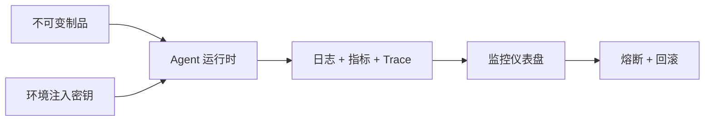

## 是什么

这是给"常驻云端、长跑型"Agent（智能体）准备的运维操作手册：从启动停止、权限边界，到日志、指标、回滚审计，把单次 CLI 跑通的脚本，升级成可以 7×24 跑、可以追责、可以一键熔断的企业级服务。让 Agent 在生产环境里能像普通后端服务一样被监控、被审计、被回滚，故障恢复时间（MTTR）从"靠人翻日志"压到"看仪表盘判断"。

## 怎么用

1. 把发布物固化成不可变制品（immutable artifact），每次上线只换版本号、不改运行时，确保回滚永远有一个干净的"上一版"。
2. 用最小权限（least privilege）发放凭据，密钥从环境变量注入而不是写进代码，杜绝"在仓库里搜出 Token"的事故。
3. 给每个 Agent 调用设硬超时和重试预算（retry budget），避免一个慢下游拖垮整个 Agent 矩阵。
4. 把成功率、平均重试次数、平均恢复时间、每次成功任务成本、失败类型分布这五个指标接进监控，每周看一次趋势。
5. 失败暴增就走预案：先冻结新发布，再抓代表性 trace（执行轨迹），定位问题路由，打最小补丁后跑回归 + 安全检查，再分批放量回到生产。

## 架构图

# Enterprise Agent Ops

Use this skill for cloud-hosted or continuously running agent systems that need operational controls beyond single CLI sessions.

## Operational Domains

1. runtime lifecycle (start, pause, stop, restart)
2. observability (logs, metrics, traces)
3. safety controls (scopes, permissions, kill switches)
4. change management (rollout, rollback, audit)

## Baseline Controls

- immutable deployment artifacts
- least-privilege credentials
- environment-level secret injection
- hard timeout and retry budgets
- audit log for high-risk actions

## Metrics to Track

- success rate
- mean retries per task
- time to recovery
- cost per successful task
- failure class distribution

## Incident Pattern

When failure spikes:
1. freeze new rollout
2. capture representative traces
3. isolate failing route
4. patch with smallest safe change
5. run regression + security checks
6. resume gradually

## Deployment Integrations

This skill pairs with:
- PM2 workflows
- systemd services
- container orchestrators
- CI/CD gates
