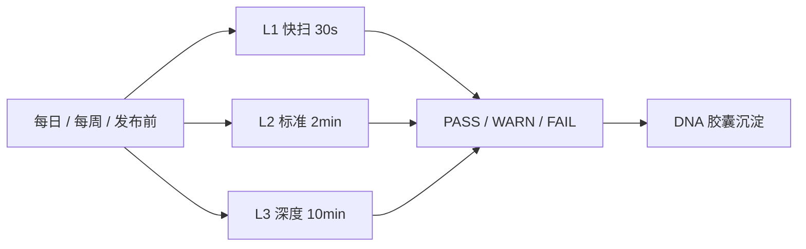

## 是什么

把"扫漏洞 + 验 IaC（基础设施即代码）+ 查隧道"三件事打包成一次例行巡检：用 trivy（安全扫描）、terraform（IaC 校验）、cloudflared（隧道）、wrangler（边缘部署）四条 CLI 串成 L1/L2/L3 三档巡检流程。让基础设施问题在发布前被拦截，故障恢复时间（MTTR）从"线上爆炸后追查"提前到"每周一次主动发现"。

## 怎么用

1. 每天开工前跑一次 L1 快扫（30 秒内出结果），看有没有新出现的高危漏洞或泄露的密钥。
2. 每周做一次 L2 标准巡检（2 分钟内），把漏洞 + 密钥 + 配置错误 + Terraform 校验 + 隧道状态全跑一遍，结果落到周报。
3. 上线前对发布的项目跑 L3 深度审计（10 分钟内），包含 SBOM（软件物料清单）+ Terraform plan 差异检测 + DNS/SSL 证书检查。
4. 把 L1 接到 PreToolUse hook（前置钩子），让 `terraform apply` 和 `wrangler deploy` 之前自动触发安全扫描，发现问题直接 block。
5. 把安全发现自动写入 DNA capsule（基因胶囊），让其他 Agent（智能体）继承同类问题的修复经验，避免同一类漏洞在多个项目重复出现。

## 架构图



# Infrastructure Patrol

Multi-CLI infrastructure health check combining security scanning, IaC validation, and network tunnel verification.

## Quick Start

Run full patrol on current project:
```bash
# 1. Security scan (vulnerabilities + secrets)
trivy fs --scanners vuln,secret --format json . | jq '.Results[] | {Target, Vulnerabilities: (.Vulnerabilities // [] | length), Secrets: (.Secrets // [] | length)}'

# 2. Terraform validate (if .tf files exist)
find . -name '*.tf' -maxdepth 3 | head -1 && terraform validate -json || echo '{"valid": true, "note": "no terraform files"}'

# 3. Cloudflare tunnel status
cloudflared tunnel list --output json 2>/dev/null | jq '.[].name' || echo "no tunnels"

# 4. Wrangler deployment status
wrangler deployments list --json 2>/dev/null | jq '.[0] | {id, created_on, strategy}' || echo "no workers"
```

## Patrol Levels

### L1: Quick Scan (< 30s)
- trivy fs (vuln only, skip db update)
- terraform fmt -check
- ai doctor --cli --json

### L2: Standard Patrol (< 2min)
- trivy fs (vuln + secret + config)
- terraform validate + plan (dry-run)
- cloudflared tunnel list
- wrangler deployments list

### L3: Deep Audit (< 10min)
- trivy repo (full repo scan with SBOM)
- terraform plan -detailed-exitcode
- trivy config (IaC misconfig scan on .tf files)
- DNS + SSL certificate checks

## Output Format

```json
{
  "patrol_level": "L2",
  "timestamp": "ISO8601",
  "results": {
    "security": {"vulnerabilities": 0, "secrets": 0, "misconfigs": 0},
    "iac": {"valid": true, "drift": false},
    "network": {"tunnels_active": 1, "workers_deployed": 3},
    "cli_health": {"total": 12, "ok": 10, "missing": 2}
  },
  "verdict": "PASS|WARN|FAIL",
  "actions": ["list of recommended actions if WARN/FAIL"]
}
```

## Integration

- PreToolUse hook: auto-trigger L1 scan before `terraform apply` or `wrangler deploy`
- Cron: weekly L2 patrol on all devices (fleet-cron-drift.sh compatible)
- DNA: security findings auto-create DNA capsules for cross-agent inheritance

## CLI Dependencies

All CLIs from `configs/cli-registry.json`:
- **trivy** (security): vuln + secret + config scanning
- **terraform** (infra): IaC validation and drift detection
- **cloudflared** (network): tunnel health
- **wrangler** (deploy): Worker deployment status
- **ai doctor --cli**: CLI availability baseline
