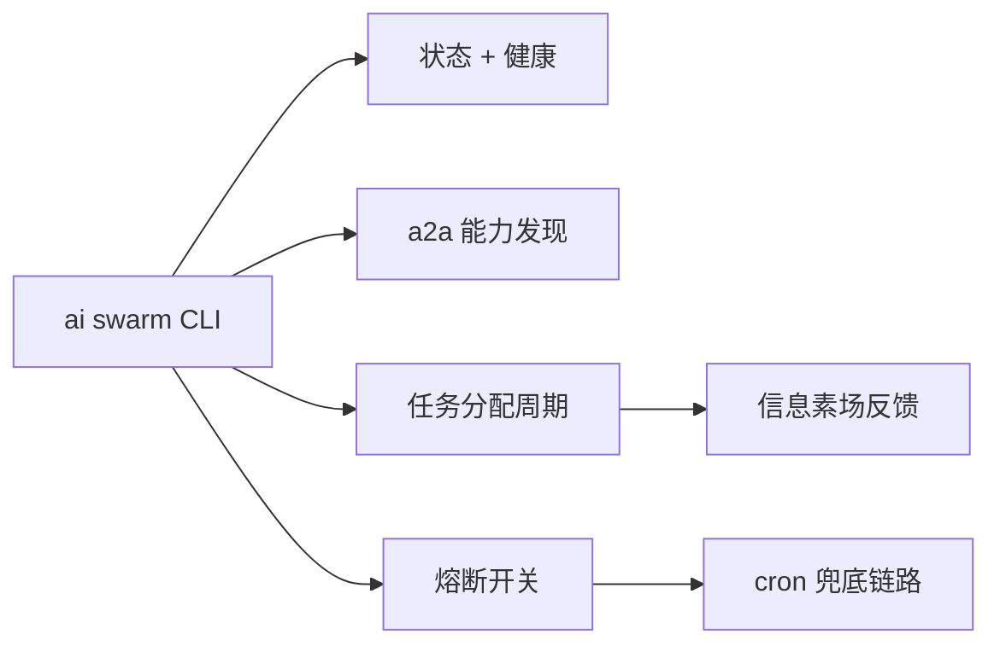

## 是什么

把 Agent Matrix Swarm（233 个 Agent × 9 个领域的蜂群）的状态、健康、能力发现、任务分配、熔断这些操作集成成一组 `ai swarm` CLI 子命令。让产品同学不用进代码也能看清"现在有多少 Agent 在跑、负载分布健不健康、需不需要切到 cron 兜底"，故障恢复时间（MTTR）从"看日志猜哪个 Agent 卡了"压到"一行命令出真相"。

## 怎么用

1. 每天先跑 `ai swarm status`，看注册 Agent 数、空闲/忙碌比、收敛指标，识别是否有领域负载倾斜。
2. 用 `ai swarm health` 跑收敛健康检查（Gini 系数 + 熵 + 负载标准差），数值异常说明分配机制出问题，先看再调。
3. 用 `ai a2a discover "税务 申报"` 做语义能力搜索，找出适合处理某类任务的 Agent，避免随机分配。
4. 用 `ai swarm allocate` 跑一次分配周期，把 pending（等待中）任务推给对应 Agent，看完成情况。
5. 出大事就拉熔断：`ai swarm circuit-open` 立刻把所有任务切到 cron（定时任务）兜底，问题修完再 `ai swarm circuit-close` 恢复蜂群调度。

## 架构图



# Swarm Operations

Operate the Agent Matrix Swarm Intelligence system (233 agents x 9 domains).

## Commands

| Command | Description |
|---------|-------------|
| `ai swarm status` | Show registered agents, idle/busy counts, convergence metrics |
| `ai swarm health` | Run convergence health check (Gini, entropy, load StdDev) |
| `ai swarm init --all` | Initialize all 233 agents into pheromone field |
| `ai swarm init --domain 销售` | Initialize a specific domain |
| `ai swarm allocate` | Run one allocation cycle for pending tasks |
| `ai swarm circuit` | Show circuit breaker state |
| `ai swarm circuit-open` | Emergency: force all tasks to cron fallback |
| `ai swarm circuit-close` | Resume swarm scheduling |
| `ai a2a stats` | Show registry statistics (233 agents, 9 domains) |
| `ai a2a discover "税务 申报"` | Semantic capability search |
| `ai a2a card AG-0042` | View Agent Card details |
| `ai a2a list --domain 销售` | List agents filtered by domain |

## Architecture

```
L4 Control Plane (CLI: ai swarm)
L3 Orchestration (LangGraph DAG + Stigmergy)
L2 Hive Mind (KG + Pheromone Field + Embed-Index)
L1 Agent Registry (A2A Protocol, 233 Agent Cards)
L0 Substrate (9-node Mesh + OpenClaw Runtime)
```

## Pack Contents

- Engine usage is exposed through `ai swarm ...` commands.
- Agent registry and pheromone state are resolved by the installed OpenClaw runtime.
- Architecture notes should live in the user's current project docs or role-pack docs after installation.

## When to Use

- User asks about agent status, health, or allocation
- User wants to find an agent with specific capabilities
- User needs to emergency-stop swarm scheduling
- User mentions "蜂群", "信息素", "智能体调度"
