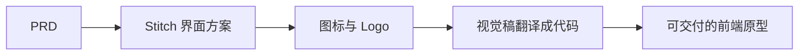

## 是什么

帮你把一份 PRD（产品需求文档）一路自动跑到可交付的视觉原型与前端代码：先在 Stitch（Google 的 AI 设计工具）里出界面方案，再补图标和 Logo，最后把视觉稿翻译成代码。整条流水线无人值守，你只看入和出，中间不需要点鼠标。

## 怎么用

1. 把一份相对完整的 PRD 交给它，确认里面有目标用户、关键场景、品牌调性这三件事。
2. 让它跑 Stitch 那一段，先看它出的初版界面方向对不对，不对就让它整体重生成，不要逐屏改。
3. 通过后让它顺着流水线把图标与 Logo 生成完，所有视觉素材保持同一套调性。
4. 拿到视觉稿后让它翻译成前端代码，重点检查响应式与极端文案是否撑得住。
5. 验收时按"PRD → 原型 → 视觉 → 代码"四段对照，看看是否仍然回到同一个产品意图。

## 架构图



# Stitch Design Pipeline v2.0

Fully automated design workflow: PRD → Stitch prototype → Icon/Logo → Code translation.
All steps automated end-to-end. User touches nothing.

## Gotchas (from production incidents)

1. **Stitch defaults to DARK theme.** Always explicitly specify light theme + exact hex colors in the first prompt. Include "LIGHT theme, white/cream background, NOT dark" prominently. If the first generation is dark, send a follow-up prompt with "IMPORTANT: Completely redesign with LIGHT theme" + exact color palette.

2. **Stitch iframe is cross-origin.** The canvas lives in `app-companion-430619.appspot.com` iframe inside `stitch.withgoogle.com`. `evaluate_script` FAILS with CORS error. Use `click` via accessibility tree (a11y UID) instead — it bypasses cross-origin restrictions because it operates through CDP, not page-level JS.

3. **Export panel has 16-screen limit.** Stitch generates many iterations (design systems + screens per iteration). Before export: Remove all unwanted screens via a11y `click` on Remove buttons. Batch 10 clicks per message for speed. Keep only the final iteration screens.

4. **stitch-mcp CLI auth ≠ browser auth.** The CLI uses `gcloud` ADC (Application Default Credentials), which may point to a different GCP project than the user's Stitch web session. If CLI returns "permission denied", fall through to Browser automation — don't waste time debugging auth. Enable Stitch API on the active GCP project with: `gcloud services enable stitch.googleapis.com --project=<project_id>`

5. **Image/Logo generation MUST use Gemini Pro.** Always call `set_model("pro")` via nanobanana-mcp before generating any visual assets. Never use default Flash model for design work. This is a hard requirement, not a preference.

6. **3 rounds of UI polish is mandatory.** Every UI deliverable must go through 3 polish iterations. The 3rd round catches CJK typography and responsive scaling issues.

7. **Auto-open all visual outputs.** After generating images, icons, screenshots, or exporting files: `open <folder>` or `open <file>` immediately. Never make the user find files manually.

8. **Store Stitch project ID immediately.** Format: `projects/{numeric_id}`. Record in task_plan.md and notes.md right after creation.

## Prerequisites

- `@_davideast/stitch-mcp` installed: `npm i -g @_davideast/stitch-mcp`
- Chrome DevTools MCP connected (autoConnect mode)
- nanobanana-mcp configured with Gemini API access
- `gcloud` CLI authenticated (for Stitch API enablement)

## Three-Channel Routing

Always try channels in this order. Fall through on failure, never skip to image-only fallback.

```
Channel 1: Stitch MCP Server (fastest, ~20 tokens/screen)
  ├── Connected as MCP server in session
  ├── Direct tool calls: generate_screen, get_screen_code, get_screen_image
  └── FAIL → Channel 2

Channel 2: stitch-mcp CLI (medium, non-interactive only)
  ├── npx @_davideast/stitch-mcp tool <toolName> -d '{...}' -o json
  ├── Requires: Stitch API enabled on active GCP project + matching auth
  ├── Interactive commands (site, serve, view) need TTY → won't work in Bash tool
  └── FAIL (permission/auth) → Channel 3

Channel 3: Browser Automation via Chrome DevTools MCP (slowest, always works)
  ├── Navigate to stitch.withgoogle.com
  ├── Type prompts, click generate, wait, iterate
  ├── Export via .zip download
  └── This is the guaranteed fallback — NEVER skip to "mockup images only"
```

## Pipeline Phases

### Phase 0: Preflight

1. Check which Stitch channel is available (try in order above)
2. For image/logo tasks: `set_model("pro")` on nanobanana-mcp
3. Read PRD if exists, or invoke `create-prd` skill first

### Phase 1: Requirements Extraction

From PRD or user description, extract:
1. **Screen list** with Chinese names
2. **Color palette** — per-persona or per-brand, exact hex values
3. **Theme** — always light unless explicitly dark
4. **Key components** per screen (data grids, chat bubbles, cards, progress bars, etc.)

Output: Structured design brief as a single Stitch prompt containing ALL screens.

### Phase 2: Generate in Stitch

**Via MCP Server (Channel 1):**
```
generate_screen({ prompt: "...", projectId: "..." })
get_screen_code({ screenId: "..." })
get_screen_image({ screenId: "..." })
```

**Via CLI (Channel 2):**
```bash
npx @_davideast/stitch-mcp tool generate_screen -d '{"prompt":"..."}' -o json
npx @_davideast/stitch-mcp tool get_screen_code -d '{"name":"projects/{id}/screens/{id}"}' -o raw > screen.html
```

**Via Browser (Channel 3) — Full SOP:**

1. **Open Stitch:**
   ```
   chrome-devtools: new_page({ url: "https://stitch.withgoogle.com" })
   ```

2. **Check login:** `take_snapshot` — look for "我的项目" or "My Projects"

3. **Enter prompt:** Click the textbox (multiline, typically uid ending in `_53` or `_17`), then `type_text` with the full design brief. Include:
   - ALL screens in one prompt (Stitch handles multi-screen generation)
   - Explicit "Light theme" + exact hex colors
   - Chinese UI labels
   - Component-level detail (bubble styles, card layouts, progress bars)

4. **Wait for generation:** `sleep 30-60` then `take_snapshot`. Look for screen names in the a11y tree. If "正在生成" still visible, wait more.

5. **Iterate if needed:** If dark theme or wrong colors:
   - Click Stitch's suggested "Change color scheme" button, OR
   - Type a new prompt: "IMPORTANT: Completely redesign ALL screens with LIGHT theme. Primary: #HEXVAL..."
   - Wait for regeneration

6. **Export:**
   a. Click "导出" button
   b. Click "全选" or wait for all screens to appear in export panel
   c. **If >16 screens:** Remove unwanted screens by clicking Remove buttons (batch 10 clicks per message). Keep only the latest iteration's screens.
   d. Select ".zip" radio button
   e. Click "导出" button (the one inside the export panel, not the toolbar one)
   f. Wait 5-8 seconds for download
   g. `ls -lt ~/Downloads/*.zip | head -1` to find the file
   h. `unzip -o ~/Downloads/stitch.zip -d <project>/design/stitch-export`
   i. `open <project>/design/stitch-export/stitch/` — open folder
   j. `for f in <project>/design/stitch-export/stitch/*/code.html; do open "$f"; done` — open all HTML in browser

### Phase 3: Icon & Logo Generation (Gemini Pro)

**Mandatory: always Gemini Pro.**

```
set_model({ model: "pro", conversation_id: "<project>-icon-design" })
```

Generate 3 directional variants:
1. **Brand letterform** — abstract letter + brand symbol fusion
2. **Conceptual** — metaphorical shapes (overlapping circles, organic forms)
3. **Minimal symbol** — single iconic shape (flame, heart, leaf, etc.)

Prompt template:
```
Premium iOS app icon for "<AppName>" — <one-line description>.
Apple squircle format, 1024x1024.
<Concept description with exact colors (#HEX)>.
Requirements: No text, no photorealistic, no 3D. Must work at 29x29px.
```

Save to `<project>/design/icon-variants/icon-pro-v{1,2,3}.png`
**Auto-open:** `open <project>/design/icon-variants/`

### Phase 4: AI Auto-Compare

Score each Stitch screen variant on 5 dimensions (1-10):

| Dimension | Weight |
|-----------|--------|
| Usability | 25% |
| Aesthetics | 20% |
| Consistency | 20% |
| Accessibility | 15% |
| Responsiveness | 20% |

Output comparison in `design/compare/report.md`. Icon selection requires user input — always present all 3 variants.

### Phase 5: Design → Code Translation

Using exported Stitch HTML + screenshots as reference:
1. Extract design tokens (colors, spacing, corner radius, fonts) from Stitch's DESIGN.md
2. Update the project's theme/design system files
3. Apply visual improvements to existing codebase (SwiftUI / React / etc.)
4. Run 3 rounds of UI polish
5. Build verification (compile / lint / test)

**Translation method by platform:**

| Platform | Theme file | Bubble/Glass | Shadow | Font mapping |
|----------|-----------|-------------|--------|-------------|
| SwiftUI (iOS) | `AnimaTheme.swift` enum | `.ultraThinMaterial` | `.shadow(color:radius:y:)` | `Font.system(design:)` |
| React/Next.js | `theme.ts` / CSS vars | `backdrop-filter: blur(20px)` | `box-shadow` | Google Fonts link |
| Flutter | `ThemeData` | `BackdropFilter` | `BoxShadow` | `GoogleFonts` package |

**Key translation rules (from Stitch DESIGN.md → native code):**
- **Surface nesting**: 3 layers (base cream → card cream → white card). Never use flat single-color backgrounds.
- **No-Line Rule**: No 1px borders for section separation. Use background color shifts only.
- **Warm black**: Text color = `#1D1B19`, never pure `#000000`.
- **Ambient shadow only**: `rgba(85,67,62,0.06)` with 32px blur, 8px Y-offset. No hard drop shadows.
- **No bubble tails**: Chat bubbles use simple rounded rectangles, not custom tail shapes.
- **Quick actions**: Add contextual shortcut chips above input bar (music, breathing, quests, scripts).
- **Editorial font**: Use serif font for hero headlines ("Editorial Moments"), sans for body.

### Phase 6: Product Packaging

Transform the designed and coded app into a shippable product:

**6.1 App Store Assets**
1. Generate App Store screenshots (6.7" + 6.1") from Stitch screens using Gemini Pro
2. Craft App Store description in Chinese (title 30 chars, subtitle 30 chars, description 4000 chars)
3. Choose icon from Phase 3 winners → install into Xcode Assets.xcassets
4. Generate App Preview video (optional: use `remotion` skill or Stitch screen recording)

**6.2 Onboarding Flow**
1. Welcome screen → Persona selection → Soul shaping (conversational) → Main chat
2. Reference Stitch "Welcome & Onboarding" + "Customize Your Anima" screens
3. Implement as SwiftUI PageTabViewStyle or custom onboarding stack

**6.3 Monetization Integration**
1. StoreKit 2 subscription setup (Free / Plus / Soul tiers)
2. iCloud CloudKit sync gating (only for paid users)
3. Paywall screen design — reference Stitch "Profile & Settings" subscription badge
4. Receipt validation + entitlement checking

**6.4 Push Notifications (Proactive Engine → iOS)**
1. APNs certificate + provisioning profile
2. Backend: add push token registration endpoint to Express API
3. Map proactive engine triggers (morning/lunch/evening/goodnight) to push payloads
4. Rich notifications with persona avatar + message preview

**6.5 Analytics & Growth**
1. Event tracking: screen_view, message_sent, persona_switched, subscription_started
2. Funnel: Install → Onboarding complete → First conversation → Day 1 retention → Subscription
3. A/B test onboarding flow variations
4. Integrate PostHog or Mixpanel (privacy-first, no PII in events)

**6.6 Compliance & Review**
1. App Review guidelines check (AI-generated content disclosure, age rating 17+)
2. Privacy nutrition label (data types: usage data, diagnostics; NOT linked to identity)
3. EULA for AI companion interactions
4. Content moderation for user-generated input

**6.7 Launch Checklist**
- [ ] App icon installed (1024x1024 from Phase 3)
- [ ] Screenshots generated (6 screens x 2 sizes)
- [ ] Privacy policy URL hosted
- [ ] Support URL configured
- [ ] StoreKit products created in App Store Connect
- [ ] TestFlight beta distributed
- [ ] App Review submission
- [ ] Marketing: Telegram/Discord announcement + App Store Optimization

### Phase 7: Architecture Documentation

Generate a McKinsey Blue HTML architecture document capturing the full pipeline execution:

1. Invoke `html-style-router` → routes to `html-mckinsey-style`
2. Content: executive summary, channel routing, browser SOP, design system extraction, code translation, product packaging
3. Save to `<project>/doc/00_project/initiative_<name>/STITCH_DESIGN_PIPELINE_V2_ARCHITECTURE.html`
4. Auto-open in browser

## Output Structure

```
<project>/design/
  icon-variants/           # Gemini Pro icon candidates
    icon-pro-v1.png
    icon-pro-v2.png
    icon-pro-v3.png
  screen-variants/         # Gemini Pro UI mockups (optional supplement)
    chat/
    dashboard/
  stitch-export/           # Stitch HTML/PNG export (.zip contents)
    stitch/
      <screen_name>/
        code.html          # Production-reference HTML
        screen.png         # Screenshot
      <design_system>/
        DESIGN.md          # Color tokens + typography + components
  compare/
    report.md              # Auto-compare scores
  winner/
    <screen>.html          # Selected winners
```

## Anti-Patterns

- **NEVER fall back to "generate mockup images with Gemini" when Stitch is requested.** The whole point of the pipeline is real HTML/CSS prototypes, not concept art.
- **NEVER use Gemini Flash for design assets.** Always Pro.
- **NEVER leave generated files unopened.** Auto-open everything.
- **NEVER ask user to manually export from Stitch.** Automate the full export flow.
- **NEVER skip the light-theme iteration.** Stitch almost always defaults dark on first pass.

## Triggers

- "design screens for..."
- "走Stitch管线" / "调用Stitch设计管线"
- "prototype the UI"
- "create mockups from PRD"
- "optimize the design"
- "app icon" / "logo design" (triggers Phase 3 specifically)
- "stitch design pipeline"
