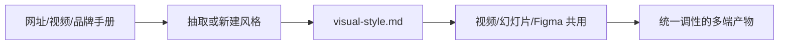

## 是什么

帮你把一套视觉风格沉淀成一份可复用的设计系统文件（visual-style.md），让同一套调性能跨 HeyGen 视频、HTML 幻灯片、Figma、纸质物料一起用。它解决的是"做完一次设计就一次性消耗掉了，没有沉淀"。

## 怎么用

1. 先决定这次是从零创建，还是从一个网址、一段视频、一份 PDF 品牌手册里抽取风格。
2. 让它把颜色、字体、版式、动效、情绪写进同一份 visual-style.md，不要分散在不同文档里。
3. 把这份文件喂给后续的 HeyGen 视频、HTML 幻灯片或 Figma 工程，让它们共用一套调性。
4. 每完成一个产物，把它放回 visual-style 的画廊里做一次自检，看视觉是否被稀释。
5. 把这份风格文件纳入项目的设计系统目录，让新加入的同事一上手就站在统一基线。

## 架构图



# Visual Style

Create, extract, and apply portable visual design systems. A `visual-style.md` file defines colors, typography, layout, motion, and mood in one file that any AI tool can consume.

## Quick Reference

| Mode | Trigger | What it does |
|------|---------|--------------|
| **Create** | "Create a visual-style.md for..." | Build a style from scratch via guided prompts |
| **Extract** | "Extract a visual-style.md from [URL/image/video]" | Analyze a source and generate a style file |
| **Apply** | "Apply this visual-style.md to [tool]" | Use a style with a specific connector |
| **Gallery** | "Show me available visual styles" | Browse and use example styles |

## Default Workflow

### Create

1. **Gather vibe** — Ask about mood, era, references, inspiration
2. **Define colors** — Primary (2+), accent, neutrals with hex values and roles
3. **Set typography** — Display, body, caption families + weight/style rules
4. **Layout & motion** — Grid system, transitions, pacing
5. **Generate** — Output complete `visual-style.md` using [references/templates/minimal.visual-style.md](references/templates/minimal.visual-style.md) or [references/templates/full.visual-style.md](references/templates/full.visual-style.md)
6. **Preview** — Show a small HTML swatch or describe the visual result
7. **Optionally apply** — Ask if user wants to use it with a connector

Questions to batch:
1. What's the vibe? (mood keywords, era, references)
2. Any specific colors? (or derive from the vibe?)
3. Typography preference? (clean, editorial, technical, playful?)
4. What tool will you use this with? (HeyGen, slides, paper.design, Figma?)

### Extract

1. **Receive source** — URL, image, video, or PDF
2. **Load extractor** — Read the appropriate extractor reference file
3. **Analyze** — Identify colors, typography, layout, motion, mood
4. **Generate** — Output complete `visual-style.md` with `source_url` set
5. **Validate** — Ensure all required fields are present

### Apply

1. **Read the style** — Load the `visual-style.md` file
2. **Ask which connector** — Or detect from context
3. **Load connector** — Read the appropriate connector reference file
4. **Transform** — Map style fields to tool-specific format
5. **Generate output** — Produce tool-ready instructions or code

### Gallery

1. **List styles** — Show available styles from [references/gallery/](references/gallery/)
2. **Preview** — Describe the selected style's visual character
3. **Load** — Read the full `visual-style.md`
4. **Apply** — Use with a connector

## Format Quick Reference

### Required fields

```yaml
name: "Style Name"
version: "1.0"
style_prompt_short: "1-2 sentence elevator pitch"
style_prompt_full: "Detailed generation prompt — THE most important field"
colors:
  primary:
    - name: "Color Name"
      hex: "#000000"
      role: "how this color is used"
```

**`style_prompt_full` is king.** If a tool can only read one field, it reads this one. Everything else is structured data for tools that want finer control.

Full spec: [references/spec.md](references/spec.md)

## Reference Files

### Connectors (Apply mode)

| Connector | Use case | File |
|-----------|----------|------|
| HeyGen Video Agent | AI video generation | [references/connectors/heygen-video-agent.md](references/connectors/heygen-video-agent.md) |
| HTML Slides | Web presentations | [references/connectors/html-slides.md](references/connectors/html-slides.md) |
| paper.design | Design documents | [references/connectors/paper-design.md](references/connectors/paper-design.md) |
| Figma | Design tool styles | [references/connectors/figma.md](references/connectors/figma.md) |

### Extractors (Extract mode)

| Source | File |
|--------|------|
| Website URL | [references/extractors/from-website.md](references/extractors/from-website.md) |
| Video keyframes | [references/extractors/from-video.md](references/extractors/from-video.md) |
| PDF / Brand guide | [references/extractors/from-pdf.md](references/extractors/from-pdf.md) |

### Gallery (pre-built styles)

| Style | Era | File |
|-------|-----|------|
| Müller-Brockmann Swiss | 1950s–70s | [references/gallery/mueller-brockmann-swiss.visual-style.md](references/gallery/mueller-brockmann-swiss.visual-style.md) |
| Neville Brody Industrial | Late 1980s–90s | [references/gallery/neville-brody-industrial.visual-style.md](references/gallery/neville-brody-industrial.visual-style.md) |
| Saul Bass Cinematic | 1950s–60s | [references/gallery/saul-bass-cinematic.visual-style.md](references/gallery/saul-bass-cinematic.visual-style.md) |
| Game Boy Color | 1998–2003 | [references/gallery/game-boy-color.visual-style.md](references/gallery/game-boy-color.visual-style.md) |
| HeyGen AI Video | 2020s | [references/gallery/heygen-ai-video.visual-style.md](references/gallery/heygen-ai-video.visual-style.md) |

### Templates & Spec

- [references/templates/minimal.visual-style.md](references/templates/minimal.visual-style.md) — Bare minimum template
- [references/templates/full.visual-style.md](references/templates/full.visual-style.md) — Complete template with all fields
- [references/spec.md](references/spec.md) — Full format specification

## Best Practices

1. **`style_prompt_full` is king** — Always usable as a standalone generation prompt
2. **One style, one file** — No multi-style bundling
3. **Assets are URLs** — Never embed binary data
4. **Show, don't tell** — Generate previews when creating styles
5. **Opinionated defaults, flexible extensions** — Core schema is fixed; `x_*` for tool-specific config
