# Tool Kit 03 · SOP 流程图（产品经理 / 需求分析岗 · before → after）

> WORKSHOP_PLAN.md v7 tool kit 第 3 件 · T-3 days 空投
> 把"3 个场景族 + 12 条 prompts + 5 件工具套件"绑到 PM 一整条工作流上 — 这是 cohort 上墙打印的"作业图"

## 总图：PM 端到端工作流（Mermaid flowchart）

```mermaid
flowchart TD
    Start([业务方提需求]) --> P1[P1·需求收集<br/>族 1 Prompt 1]
    P1 --> P1V{需求清单<br/>有 ≥3 条<br/>带 evidence?}
    P1V -->|否| P1F[降级：人工补访谈<br/>fallback: scenarios/01 P1]
    P1V -->|是| D1[D1·PRD 章节生成<br/>族 1 Prompt 2]
    P1F --> D1

    D1 --> D2[D2·会议纪要<br/>族 1 Prompt 3]
    D2 --> D3[D3·Epic 拆分<br/>族 1 Prompt 4]
    D3 --> C1[C1·竞品分析<br/>族 1 Prompt 5+6]

    C1 --> D4[D4·原型线框<br/>族 2 Prompt 1<br/>Stitch 输入]
    D4 --> D4S{Stitch 输出<br/>3 版本<br/>哪版采用?}
    D4S -->|采用 v1/v2/v3| P2[P2·资产盘点<br/>族 2 Prompt 2]
    D4S -->|都不行| D4R[降级：人工调 Stitch prompt<br/>重跑 ≤3 次]
    D4R --> P2

    P2 --> D5[D5·复用决策<br/>族 2 Prompt 3]
    D5 --> D6[D6·流程图<br/>族 2 Prompt 4]
    D6 --> C2[C2·走查 checklist<br/>族 2 Prompt 5]
    C2 --> A1[A1·走查执行<br/>族 2 Prompt 6]

    A1 --> A1V{P0 阻塞<br/>?}
    A1V -->|有| A1F[阻塞修复<br/>不允许上线<br/>fallback: 回 D6 改流程]
    A1V -->|无| P3[P3·Skill 候选识别<br/>族 3 Prompt 1]
    A1F --> P3

    P3 --> D7[D7·Skill 三件套<br/>族 3 Prompt 2+3]
    D7 --> D8[D8·链路设计<br/>族 3 Prompt 4]
    D8 --> C3[C3·冒烟测试<br/>族 3 Prompt 5]
    C3 --> C3V{Happy/Empty/Adv<br/>3 用例<br/>全过?}
    C3V -->|否| C3F[修复 prompt 或 SOP<br/>≤2 轮迭代]
    C3V -->|是| A2[A2·上线说明<br/>族 3 Prompt 6]
    C3F --> A2

    A2 --> Done([交付 cohort<br/>本周作业完成])

    Done -.周五 T+1.-> Retro[即时回顾<br/>30 min<br/>doc/wave-digest.md]
    Retro -.传递.-> NextWave([W2 产品研发岗<br/>liaison 接力])
```

## 关键节点映射

| 节点 ID | 名称 | 对应 prompt | 对应 baseline 行 | 输出形态 | 验收人 |
|---------|------|-------------|------------------|----------|--------|
| P1 | 需求收集 | 族 1 P1 | 行 1-4 起点 | 结构化清单 JSON | PM 自己 |
| D1 | PRD 章节 | 族 1 D1 | 行 1 | PRD.md 草稿 | 业务方 |
| D2 | 会议纪要 | 族 1 D2 | 行 2 | 3 张 MD 表 | 评审参与人 |
| D3 | Epic 拆分 | 族 1 D3 | 行 3 | Story 表 + Task 清单 | 工程负责人 |
| C1 | 竞品分析 | 族 1 C1 | 行 4 | 对比报告 + 洞察 | 产品负责人 |
| D4 | 原型线框 | 族 2 D4 | 行 5 | Stitch prompt × 5 屏 | 设计 |
| P2 | 资产盘点 | 族 2 P2 | 行 6 起点 | 设计 token 清单 | 设计 |
| D5 | 复用决策 | 族 2 D5 | 行 6 | 复用决策表 | 设计 + PM |
| D6 | 流程图 | 族 2 D6 | 行 7 | Mermaid flowchart | 设计 + 工程 |
| C2 | 走查 checklist | 族 2 C2 | 行 8 起点 | 10 项清单 | PM |
| A1 | 走查执行 | 族 2 A1 | 行 8 | 缺陷分级表 | PM + 设计 |
| P3 | Skill 候选 | 族 3 P3 | 行 9 起点 | 候选表 | PM 自己 |
| D7 | Skill 三件套 | 族 3 D7 | 行 9 | YAML frontmatter | PM 自己 |
| D8 | 链路设计 | 族 3 D8 | 行 10 起点 | Mermaid 链路图 | PM + 工程 |
| C3 | 冒烟测试 | 族 3 C3 | 行 10 | 3 组用例 | PM 自己 |
| A2 | 上线说明 | 族 3 A2 | 行 10 | 1 页 README | PM |

## 整体节奏（5 个工作日内完成）

| 日 | 节点 | 用时（含 AI 调用 + 人工校对） |
|----|------|------------------------------|
| **Day 1** | P1 → D1 → D2 | 3 h（需求 + PRD + 纪要） |
| **Day 2** | D3 → C1 → D4 | 4 h（拆分 + 竞品 + 线框） |
| **Day 3** | P2 → D5 → D6 | 3 h（盘点 + 复用 + 流程） |
| **Day 4** | C2 → A1 | 2 h（走查 checklist + 执行） |
| **Day 5** | P3 → D7 → D8 → C3 → A2 | 3 h（Skill 全流程） |
| **Day 6 (周五)** | 即时回顾 + 传递下一波 | 30 min |

**总投入**：15 h / 周（含 AI + 校对 + 回顾）
**baseline 对比**：原 28.5 h / 周（10 项任务手工）→ 节省 **13.5 h / 47%**

## Fallback 路径（在图中标 `-.fallback.->`）

1. **P1V 失败**（清单 < 3 条 evidence）：人工补访谈，**不要**让 AI 编造证据
2. **D4S 失败**（Stitch 3 版都不行）：迭代 prompt ≤ 3 次后转人工设计，本周不上 Stitch
3. **A1V P0 阻塞**：回到 D6 改流程或回到 D4 改原型；不允许"绕过"
4. **C3V 用例失败**：修 prompt 或 SOP ≤ 2 轮；超过则 Skill 本期不上线，记入下波 backlog

## 何时跳步骤（白名单）

- **没新需求**：跳过 P1 → D1 → D3，从 D6 (流程图) 起 — 适用于"已有需求继续推进"
- **没设计稿迭代**：跳过 D4-A1 整段，直接 P3 起 — 适用于"本周只做 Skill 不碰原型"
- **第一次做不上 Skill**：跳过 P3-A2，本周 Skill 工具留到 W1 buffer / W2 再补 — 防止挫败感

## 与其他工具套件的衔接

- 启动 → 先读 [tool-kit-01-claude-md.md](tool-kit-01-claude-md.md) 把 CLAUDE.md 装到自己项目
- 每节点的具体 prompt → 用 [tool-kit-02-prompt-templates.md](tool-kit-02-prompt-templates.md) 的 PDCA 矩阵 + 复制即用版
- Skill 自建 → 参考 [tool-kit-04-skill-package.md](tool-kit-04-skill-package.md)
- 输出文档 → 参考 [tool-kit-05-document-templates.md](tool-kit-05-document-templates.md) 的 PRD/用户故事/纪要/验收模板
- 交付前 → 跑 [checklist-delivery.md](checklist-delivery.md) 10+ 项清单

---

Maurice | maurice_wen@proton.me
