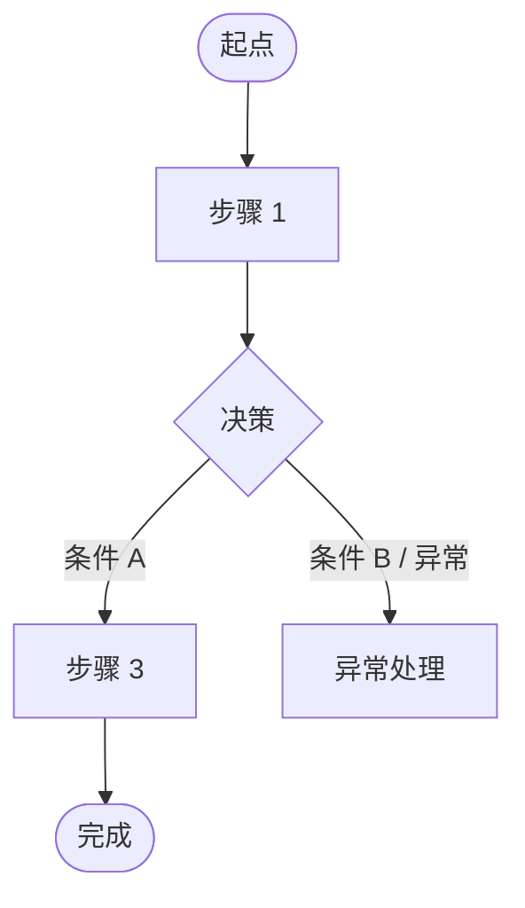

# Tool Kit 05 · 文档模板（产品经理 / 需求分析岗 · 4 件套）

> WORKSHOP_PLAN.md v7 tool kit 第 5 件 · T-3 days 空投
> 4 个最高频 PM 文档的可复用骨架 — cohort 直接复制改填即可

## 使用约定

- 每个模板下方有「填写示例」与「校验 checklist」两段；填完前对照 checklist
- 所有模板默认中文 + 英文术语括号注释（与 CLAUDE.md 一致）
- 不允许把模板"原样上交"— `{占位符}` 必须全部替换，剩余 `{...}` 视为未完成
- 模板配合 [tool-kit-02-prompt-templates.md](tool-kit-02-prompt-templates.md) 使用：先用 prompt 让 AI 草起，再人工填进模板

---

## 模板 1 · PRD（产品需求文档）

适用 [baseline 行 1] · 配合族 1 Prompt 2（D1·PRD 章节生成）

```markdown
# PRD · {功能名称}

| 字段 | 值 |
|------|-----|
| 文档版本 | v0.1 |
| 状态 | Draft / Review / Approved / Frozen |
| 作者 | {你的名字} |
| 创建日期 | YYYY-MM-DD |
| 最后更新 | YYYY-MM-DD |
| 评审日期 | YYYY-MM-DD |
| 干系人 | {业务负责人 / 工程负责人 / 设计负责人} |
| 关联 Epic | E-{编号} |

## 0. TL;DR (≤80 字)

{一段话说清：解决什么人的什么痛点，用什么方法，预期带来什么改变。}

## 1. 背景与问题

### 1.1 现状
{当前业务怎么做？用谁都看得懂的语言。}

### 1.2 问题表现
- 痛点 1：{具体场景 + 数据/证据}
- 痛点 2：...
- 痛点 3：...

### 1.3 业务价值假设
- {金额 / 效率 / 合规} — 选一种作为主假设
- 量化预测：{X% 提升 / Y h 节省 / Z 万元收益}

## 2. 目标 (Goal)

### 2.1 主目标
{一句话：让 {目标用户} 能 {做什么} 以达到 {什么效果}}

### 2.2 SMART 子目标（× 3）
- G1：{Specific - Measurable - Achievable - Relevant - Time-bound}
- G2：...
- G3：...

### 2.3 反向指标（防 Goodhart）
- 主指标提升的同时，不允许 X 指标恶化超过 Y%

## 3. 范围 (Scope)

### 3.1 In-scope（本期做）
- 功能 1：{一句话}
- 功能 2：...
- 功能 3：...

### 3.2 Out-of-scope（明确不做）
- 不做 1：{为什么不做，下一期还是永远不做}
- 不做 2：...
- 不做 3：...

## 4. 用户故事 + 验收标准

### Story 1：{As a... I want... So that...}

验收标准（Given-When-Then）：
- AC1: Given {状态}, When {动作}, Then {结果}
- AC2: ...
- AC3：异常路径 — Given {异常状态}, When {动作}, Then {错误处理}

### Story 2: ...
### Story 3: ...

## 5. 核心流程



## 6. 风险与依赖

| 类型 | 风险描述 | 影响 | 缓解措施 | Owner |
|------|---------|------|----------|-------|
| 技术 | {风险 1} | 高/中/低 | {措施} | {名字} |
| 合规 | {风险 2} | ... | ... | ... |
| 数据 | {风险 3} | ... | ... | ... |

### 上下游依赖
- 依赖方 {部门/系统}：{需要什么 + 何时需要 + 协同窗口}

## 7. 指标定义

| 指标 | 定义 | 数据源 | 报告周期 | Owner |
|------|------|--------|----------|-------|
| 主指标 | {如：DAU} | {埋点 X} | 日报 | {数据团队} |
| 反向指标 | {如：投诉率} | {客服系统} | 周报 | {运营} |

## 待确认 (P0)
- ❓ {阻塞性未决项 1}
- ❓ {阻塞性未决项 2}

---
Author: {你的名字} | {你的邮箱}
```

### PRD 校验 checklist（评审前自查）

- [ ] TL;DR ≤ 80 字且包含"谁 / 痛点 / 方法 / 改变"四要素
- [ ] 业务价值假设是单一主假设（金额/效率/合规之一），不是"全要"
- [ ] In-scope 与 Out-of-scope 各列 ≥ 3 条
- [ ] 用户故事 ≥ 3 条，每条至少 1 条异常路径 AC
- [ ] 核心流程图含 ≥ 3 异常分支 + 每异常 fallback
- [ ] 风险表覆盖技术 + 合规 + 数据 三类
- [ ] 指标表至少 1 个反向指标
- [ ] 待确认 (P0) 集中在末尾，正文中无 ❓

---

## 模板 2 · 用户故事卡（User Story Card）

适用 [baseline 行 3] · 配合族 1 Prompt 4（D3·Epic 拆分）

```markdown
## Story {ID}

**As a** {用户角色}
**I want** {做什么}
**So that** {达到什么效果}

### 估算
| 字段 | 值 |
|------|-----|
| 故事点 | {1/2/3/5/8 — Fibonacci} |
| 优先级 | P0 / P1 / P2 |
| 依赖 | Story {ID list} / 无 |
| 所属 Epic | E-{编号} |

### 验收标准
- AC1 (主路径): Given..., When..., Then...
- AC2 (主路径): Given..., When..., Then...
- AC3 (异常): Given..., When..., Then...

### Task 拆分
- [ ] Task 1: {动词+对象} | Owner: {名字} | 估时: {h} | DoD: {可观察验收}
- [ ] Task 2: ...
- [ ] Task 3: ...

### 设计交付物
- 线框 / 高保真：{Figma 链接}
- 流程图：{文件路径}

### 数据 / 埋点需求
- 埋点 1：{事件名 + 触发条件 + 参数}

### 备注
{评审过程中的关键决策记录}
```

### 用户故事卡 checklist

- [ ] As/I want/So that 三段齐全且符合"角色-动作-价值"语法
- [ ] 故事点 ≤ 5（超过则需继续拆 sub-story）
- [ ] AC 至少 3 条且包含 1 条异常路径
- [ ] Task ≤ 1 天工作量；超过自动拆 sub-task
- [ ] 每 Task 有可观察 DoD（不接受"实现完成"这种空话）
- [ ] Owner 是真人名（不接受"团队"/"大家"）

---

## 模板 3 · 评审纪要（Meeting Minutes 3 张表）

适用 [baseline 行 2] · 配合族 1 Prompt 3（D2·评审纪要）

```markdown
# 评审纪要 · {议题}

| 字段 | 值 |
|------|-----|
| 会议时间 | YYYY-MM-DD HH:MM-HH:MM |
| 参会人 | {名字列表} |
| 主持人 | {名字} |
| 记录人 | {名字} |
| 录音链接 | {链接} |

## TL;DR (≤80 字)

{本次评审最关键 1-2 个决定 + P0 风险若有}

## 1. 决议表

| # | 决议内容 | 决策人 | 时间戳 | 反对意见 |
|---|---------|--------|--------|----------|
| 1 | {明确决议} | {人名} | [HH:MM:SS] | {无 / 谁反对 + 原因} |
| 2 | ... | ... | ... | ... |

**入决议表的门槛**：必须有明确决策方拍板 + 现场无反对（或反对方明确妥协）

## 2. 行动项表

| # | Action | Owner | Due | 状态 | 验收标准 |
|---|--------|-------|-----|------|----------|
| 1 | {动词+对象} | {真人名} | YYYY-MM-DD | Open | {5 min 内可由非当事人判断} |
| 2 | ... | ... | ... | ... | ... |

**入行动项表的门槛**：Owner 是真人名 + Due 是具体日期 + 验收标准是可观察事件

## 3. 未决项表

| # | 议题 | 阻塞原因 | 下次评审节点 |
|---|------|----------|--------------|
| 1 | {未拍板的议题} | {阻塞原因 / 缺什么信息} | YYYY-MM-DD |
| 2 | ... | ... | ... |

**入未决项表的门槛**：评审会上提及但**未拍板**的议题 — "再看看 / 再想想 / 先这样" 都入此表

## 4. 附录

### 4.1 原文关键节选（≤5 条，含时间戳）
- [HH:MM:SS] {发言人}: "{原话}"

### 4.2 文件 / 链接
- {Figma / PRD / 数据看板 链接}

---
记录人: {名字} | {邮箱}
```

### 评审纪要 checklist

- [ ] 3 张表都填，不混用（决议 vs 行动项 vs 未决项）
- [ ] 决议表每行有时间戳证据
- [ ] 行动项 Owner 是真人名，不是"团队"
- [ ] 行动项 Due 是具体日期，不是"尽快"/"近期"
- [ ] 未决项有明确下次评审节点
- [ ] TL;DR ≤ 80 字且包含 P0 风险（如有）

---

## 模板 4 · 上线验收清单（Launch Acceptance Checklist）

适用所有 baseline 行的 closeout · 工作坊 W1 结束时 cohort 自评用

```markdown
# 上线验收清单 · {功能名称}

| 字段 | 值 |
|------|-----|
| 上线日期 | YYYY-MM-DD |
| Release 版本 | v{X.Y.Z} |
| 关联 PRD | {链接} |
| 验收负责人 | {名字} |

## 1. 产品验收（PM）

- [ ] PRD 中 In-scope 功能 100% 实现
- [ ] Out-of-scope 功能确认未被实现（防 scope creep）
- [ ] 所有用户故事 AC 全部通过测试
- [ ] 异常路径 AC 也通过测试（不允许只跑 happy path）
- [ ] 用户文档 / 帮助中心 / FAQ 已更新

## 2. 设计验收（PM + 设计）

- [ ] 视觉与 Figma 一致（≤ 5% 差异）
- [ ] 设计 token 一致性（颜色 / 字体 / 间距）
- [ ] 状态完整（默认 / 加载 / 空 / 错误 / hover / active / disabled）
- [ ] 走查 checklist P0 + P1 缺陷已全部修复
- [ ] 可达性 WCAG AA 通过

## 3. 数据 / 埋点验收（PM + 数据）

- [ ] 主指标埋点已部署且数据可见
- [ ] 反向指标埋点已部署
- [ ] 数据看板已配置且 stakeholder 可访问
- [ ] 首周 daily check 排期已确认（谁看 + 何时看）

## 4. 上线沟通

- [ ] 内部公告已发送（cohort 群 / Slack / 邮件）
- [ ] 客服 / 销售 已收到 FAQ + 训练
- [ ] 客户公告已发送（如适用）
- [ ] 反馈渠道已建立（哪个群 / 谁收 / 多久回）

## 5. 回滚预案

- [ ] 已确认回滚步骤（具体命令 / 配置变更）
- [ ] 已确认回滚触发条件（什么指标恶化到什么程度自动回滚）
- [ ] Oncall 知情且能在 X 分钟内启动回滚

## 6. 30 天采纳目标（Capstone 输入）

- [ ] 主指标目标值：{数字 + 单位}
- [ ] 采纳率目标：{X% 用户使用 ≥ Y 次}
- [ ] 复盘日期：{上线 +30 天}
- [ ] 复盘负责人：{名字}

---
验收人: {名字} | {邮箱} | {日期}
```

### 上线验收 checklist 元检查

- [ ] 5 个大段（产品 / 设计 / 数据 / 沟通 / 回滚 / 30天采纳）全部填完
- [ ] 每个 `- [ ]` 项都有具体责任人（不允许"团队验收"）
- [ ] 回滚步骤是具体命令/配置变更，不是"联系工程"
- [ ] 30 天采纳目标可量化（不允许"采纳率良好"）

---

## 关联资源

- 提示词模板：[tool-kit-02-prompt-templates.md](tool-kit-02-prompt-templates.md)
- SOP 流程图：[tool-kit-03-sop-flowchart.md](tool-kit-03-sop-flowchart.md)
- Skill 包：[tool-kit-04-skill-package.md](tool-kit-04-skill-package.md)
- 完整提示词：[scenarios/01-prd-requirement-design.md](scenarios/01-prd-requirement-design.md)

---

Agent Foundry Team
