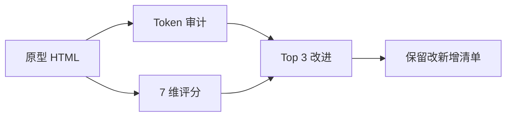

# Skill · aesthetic-probe

> Source: AI-Fleet `aesthetic-quality-probe.py` 钩子的人工版 · prototype-designer pack
> When to use: 原型/HTML 交付前 self-review，避免 token 偏离 / 视觉债务

## 是什么

这是一套原型交付前的视觉自审清单，把"看起来还行"翻译成 7 个可打分的设计维度，让交付前的主观感受变成可复盘的客观证据，避免视觉债务在 cohort 评审时才被发现。

## 怎么用

1. 先把待审原型打开在桌面端 + 手机端两个尺寸，让响应式（responsive）问题在第一眼就暴露而不是上线后才被截图吐槽。
2. 跑一遍 token 审计（design tokens 一致性检查），把硬编码的颜色 / 字号 / 间距标红，确认是不是真的在用统一设计系统。
3. 用 7 维评分表（token 一致、层级清晰、留白、字体协调、配色克制、可点击识别、响应式）打分，让"哪里不对劲"变成"第 3 维只有 2 分"的具体诊断。
4. 把 Top 3 改进项按 (5−当前分) × 业务影响排序，让有限的时间花在最值钱的地方而不是先改最容易的。
5. 最后产出「保留 vs 改 vs 新增」三列清单，让需求方一眼看清这一轮原型评审的边界，避免下一轮再来一次。

## 架构图

## Trigger phrases
- "审一下这个原型" / "原型 review" / "aesthetic 检查"
- "上线前 self-check" / "交付前打分"

## Inputs
- HTML 原型文件路径 OR 在线 URL
- Reference token set（哪个风格的 token）

## Outputs
- 7 维评分（满分 5 分）
- Top 3 改进建议（按优先级）
- 1 张「保留 vs 改」清单

## 7 维度评分

| 维度 | 5 分标准 | 1 分典型 |
|------|---------|---------|
| Token adherence | 100% 走 token | 50%+ 硬编码 |
| Hierarchy clarity | 一眼分主次 | 3+ 同级元素争夺注意力 |
| White space | 呼吸感强 | 元素互相挤压 |
| Type harmony | ≤3 字号 / ≤2 字重 | 字号字重多于 5 种 |
| Color discipline | ≤2 accent | 5+ accent，无主调 |
| Interaction affordance | 可点击元素一眼可识别 | 装饰 vs 可点击混淆 |
| Mobile responsiveness | 320-1920 都可用 | 仅 desktop 可看 |

## Procedure
1. **Open HTML** in browser + dev tools
2. **Token audit** → grep 硬编码颜色 / 字号 / 间距
3. **Visual audit** → 7 维打分
4. **Top 3 改进** → 按 (5-score) × impact 排序
5. **保留 vs 改清单** → 哪些必须改 / 哪些可不改 / 哪些是新加的好东西

## Gotchas
- 不要打 4-5 分通胀 → 7 维平均 ≥4 时强制找 ≥3 个具体缺陷
- 不要只看 desktop → mobile (375px) 必须验
- 不要漏检 dark mode（如风格有定义）
- 不要把 "顺眼" 当 "合格"——hierarchy clarity 才是硬指标

## Worked example
- Input: prototype-onboarding-stripe.html + stripe-minimal tokens
- Output: 评分 4.2/5（token 5 / hierarchy 4 / whitespace 5 / type 4 / color 5 / affordance 4 / responsive 3）
- Top 3 改: ① CTA 按钮在 mobile 太小 ② step indicator 字号偏小 ③ 主标题颜色对比度 4.2:1 不够

Maurice | maurice_wen@proton.me
