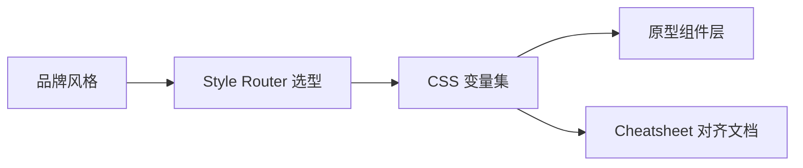

# Skill · design-tokens

> Source: AI-Fleet `html-style-router` token 系统 · prototype-designer pack
> When to use: 需要在原型/网页中应用一致的 design tokens（颜色 / 字号 / 间距 / 圆角 / 阴影）

## 是什么

这是一套把品牌风格沉淀成"可复用变量"的设计令牌（design tokens）系统，让颜色、字号、间距、圆角、阴影变成命名清晰的 CSS 变量或 Tailwind 配置，避免一个原型里出现 3 套配色、5 种字号的失控状态，也让品牌色一改全站联动而不是全文替换。

## 怎么用

1. 先确认这次原型要走哪个风格（如 stripe-minimal / claude-warm / 自定义品牌），让"风格选型"成为一次决定而不是每个组件重复做一次。
2. 通过 html-style-router 找到对应 token 集，让风格落地不靠工程师个人审美，而是有版可依。
3. 把 token 写进 `:root` 的 CSS 变量或 tailwind extend 配置，让组件层只引用变量名而不接触原始值。
4. 输出一份 token cheatsheet（token 名 / 值 / 何时使用三列），让需求方和开发对齐"什么场景用哪个 token"，减少口头沟通误差。
5. 产出 1 段示例 HTML 展示 token 真实应用效果，让评审方一眼看到"换品牌色后整页是什么样"，而不是只看抽象色卡。

## 架构图

## Trigger phrases
- "设计令牌" / "design tokens" / "色板" / "type scale"
- "我需要 stripe / linear / claude warm 的 token"
- "改一下品牌色但保持其他不变"

## Inputs
- 品牌名 / 风格名（claude-warm / stripe-minimal / linear-dark / bloomberg-terminal / mckinsey-blue / 自定义）
- 范围：完整 token set OR 单一 token group（仅颜色 / 仅排版 / 仅间距）

## Outputs
- 1 份 CSS `:root` 变量定义（推荐）OR Tailwind `tailwind.config.js` extend 块
- 1 份 token cheatsheet `.md`：每个 token 名 + 值 + 何时使用

## Procedure
1. **路由风格** → `html-style-router` SPEC 找匹配 token 集
2. **导出 CSS variables** → 写入 `:root { --color-primary: ...; }` 命名层次
3. **生成 cheatsheet** → token name / value / usage 三列
4. **示例片段** → 给出 1 段 HTML 示范 token 应用

## Gotchas
- 不要在原型里硬编码颜色（如 `bg-blue-500`），全部走 token（`bg-[var(--color-primary)]` 或 tailwind theme extend）
- 不要混用 2 套 token 系统 → 一个原型一个风格
- token 命名用语义化（`--color-error` not `--color-red`），避免风格变更时全文替换

## Worked example
- Input: "stripe-minimal 完整 token"
- Output:
  - `tokens.css` ~30 行（colors / type-scale / spacing / radius / shadow）
  - `tokens-cheatsheet.md` ~20 行（每个 token 一行说明）

Maurice | maurice_wen@proton.me
