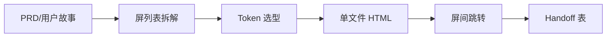

# Skill · stitch-prototype

> Source: AI-Fleet `stitch-design-pipeline` 简化版 · prototype-designer pack
> When to use: 收到 PRD / 用户故事 / 草图 → 需要 ≤30 分钟出可点击 HTML 原型

## 是什么

这是一套把 PRD / 用户故事快速翻译成"单文件可点击 HTML 原型"的轻量管线，让需求方在评审会上就能点开屏间跳转看真实交互，而不是隔着 Figma 静态图猜体验，把"看起来对"和"用起来对"两件事提前一周对齐。

## 怎么用

1. 先把 PRD 拆成 ≤5 屏的核心 flow，让原型的边界一开始就是收敛的而不是越做越大。
2. 根据品牌氛围（brand vibe）选 token 集，让视觉风格不靠当场拍脑袋而是有版可依。
3. 每屏先用文字写清"布局 / 层级 / 数据"，让原型动手前先过一遍语义而不是直接堆 UI 组件。
4. 用 HTML + Tailwind + 一点原生 JS 生成单文件，让 cohort 双击就能看而不需要本地起服务。
5. 在底部加 handoff 表（屏 / 组件 / 状态 / 数据形状），让设计交付到前端开发的那一刻每个组件都有明确的状态契约（state contract）。

## 架构图

## Trigger phrases
- "出原型" / "做个 prototype" / "stitch 设计" / "我需要看个 mock"
- "PRD 转 UI" / "用户故事转 wireframe"
- 任何含 PRD + screen count + brand vibe 的请求

## Inputs
- PRD（≤2 页 markdown）OR 用户故事（≥1 个核心 flow）
- Screen count（默认 3-5 屏）
- Brand vibe（≥1 个参考：claude warm / stripe minimal / linear dark / 自定义品牌 token）
- Target device（web / mobile / both）

## Outputs
- `prototype-<slug>.html` 单文件，含全部屏 + 屏间跳转
- 内嵌：tailwind class / design tokens / mock data
- 末尾 `<footer>`：handoff spec 表（screen → component → state → data shape）

## Procedure
1. **Parse PRD** → 抽 screen list + 每屏 ≤3 个核心交互
2. **Pick visual base** → 按 brand vibe 走 html-style-router 选 token 集
3. **Sketch screens** → 每屏先文字描述（layout / hierarchy / data）
4. **Generate HTML** → 单文件，每屏一个 section，class 重用，token-driven
5. **Wire jumps** → 屏间跳转用 `<a href="#screen-N">`，CTA 用 button → onclick scroll
6. **Add handoff** → 末尾表格清单：每个 component 标 state / data / API

## Gotchas
- 不要内嵌 React/Vue，HTML+Tailwind+vanilla JS 即可（cohort 容易看懂）
- 不要超过 5 屏（>5 屏说明 scope creep，回头跟需求方对齐）
- Mock data 必须有真实感（"姓名：张伟" 不要写 "Name: User"），否则 PRD owner 不信
- 不要在 HTML 里写 `// TODO`，cohort 会以为是未完成；用 `<!-- handoff: ... -->` 注释代替

## Worked example
- Input: "3 屏 onboarding flow，stripe minimal vibe，web"
- Output: `prototype-onboarding-stripe.html` 含 ① welcome ② plan-select ③ confirm，全部用 Inter + neutral gray + minimal accent
- Handoff 表：3 行 × 4 列（screen / component / state / data shape）

Maurice | maurice_wen@proton.me
