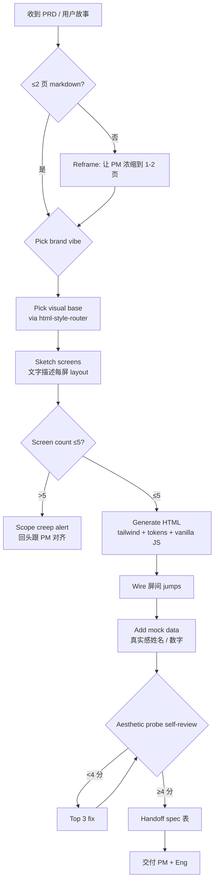
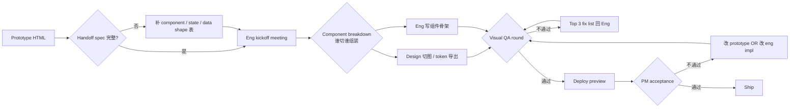
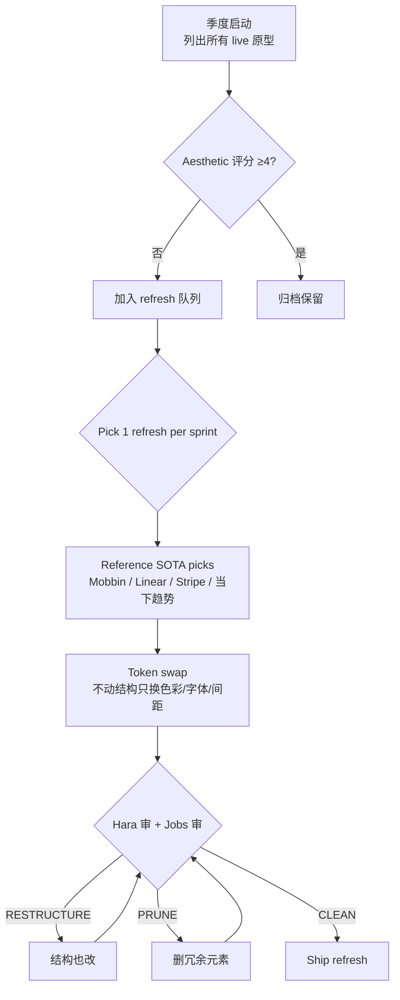

# Tool-Kit 03 · SOP Flowchart · Prototype Designer

> 3 张 mermaid 流程图覆盖原型设计最高频工作流。

## SOP-A · PRD → Clickable HTML Prototype（30 分钟内）

**关键控制点**：
- 节点 B：PRD ≤2 页是硬约束，超过说明需求未收敛，先回头
- 节点 G：>5 屏是 scope creep 信号，必须对齐
- 节点 L：aesthetic probe <4 分不交付（除非 PM 紧急确认）

**失效信号**：
1. PRD >3 页 → 需求没收敛，做原型是错的
2. >5 屏 → scope creep
3. Mock data 无真实感 → PM 不信
4. Token 硬编码 >20% → 后续改主题工作量大

## SOP-B · 原型 → 工程交付（handoff）

**关键控制点**：
- 节点 B：handoff spec 表必须 (screen / component / state / data shape) 4 列齐
- 节点 H：visual QA 要原型 + 实现 side-by-side 对比，不能只看实现
- 节点 K：PM 不通过时优先改 prototype（如果原型本身就错了）

**失效信号**：
1. Handoff spec 缺 data shape → eng 用 mock data 上线
2. Visual QA 跳过 → 上线后 PM 才发现"不像设计"
3. PM 不通过后只改 eng 不动 prototype → 下次复用还是错

## SOP-C · 原型 → SOTA design refresh（季度）

**关键控制点**：
- 节点 B：评分 <4 分的原型才进 refresh 队列（防止低 ROI 折腾）
- 节点 G：先试 token swap（最小改动）；不行再动结构（高成本）
- 节点 H：双 advisor 审，防止"我觉得好看了"的自评通胀

**失效信号**：
1. Refresh 队列 >5 → 季度产能不够，需要砍 scope
2. Token swap 后评分没上 0.5 → 改 token 没解决根本问题，要动结构
3. Hara/Jobs 评分差 ≥1 → 两个 advisor 不一致，需要回 PM 拍板

---

Maurice | maurice_wen@proton.me
