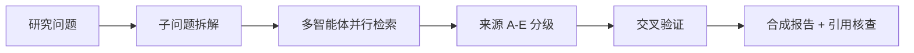

## 是什么

把"一个模糊的研究问题"拆成多智能体并行检索 + 来源分级 + 交叉验证的七阶段流水线，帮你在几小时内把碎片信息汇成一份带可追溯引用的研究报告，而不是攒一堆链接自己头大。

## 怎么用

1. 先把研究问题、成功标准、输出格式说清楚（这一步省了，后面整份报告都会跑偏）。
2. 把大问题拆成 3-5 个子问题，每个子问题指定优先来源类型（学术 / 行业 / 一手数据）。
3. 让多个子智能体并行去查，每条结论必须挂上 A-E 来源分级（A 同行评议 / E 道听途说）。
4. 进入交叉验证阶段，把不同来源的冲突结论摆出来调和，B 级以下的结论必须标注不确定性。
5. 最后做合成 + 引用核查 + 报告封装，交付带执行摘要、参考文献、不确定性说明的成品。

## 架构图



# Deep Research -- Graph of Thoughts Pipeline

## Gotchas

1. **Don't skip Phase 1 (scoping).** Most research failures come from a vague question, not bad searching. Clarify output format, success criteria, and constraints BEFORE spawning agents.

2. **Sub-agent count matters.** 3-5 Web research agents + 1-2 academic agents + 1 cross-validation agent. More than 8 total agents = context explosion with diminishing returns.

3. **Source quality rating is non-negotiable.** Every claim needs a grade:

| Grade | What counts |
|-------|------------|
| **A** | Peer-reviewed RCT, systematic review, meta-analysis |
| **B** | Cohort study, clinical guideline, official report |
| **C** | Expert opinion, case report |
| **D** | Preprint, conference abstract |
| **E** | Anecdote, speculation |

4. **Claims below B-grade need explicit uncertainty labels.** Don't present D/E sources as facts.

5. **Cross-validation is a phase, not a suggestion.** Phase 4 (triangulation) must run before synthesis. Skip it and you get confident-sounding hallucinations.

## 7-Stage Pipeline

```
Phase 1: Question Scoping -> clarify with user, define success criteria
Phase 2: Retrieval Planning -> decompose into sub-queries, select sources
Phase 3: Iterative Querying -> spawn sub-agents, execute searches
Phase 4: Source Triangulation -> cross-reference, resolve conflicts, grade sources
Phase 5: Knowledge Synthesis -> structure findings, inline citations
Phase 6: Quality Assurance -> verify citations match content, check for hallucination
Phase 7: Output & Packaging -> format report, executive summary, bibliography
```

## Usage

```bash
ait deep-research "research topic"
# Or in conversation: "Deep research [topic]"
```

## Quality Gate

- [ ] Every factual claim has a graded, verifiable source
- [ ] Key findings confirmed by 2+ independent sources
- [ ] Contradictions acknowledged and explained
- [ ] No unsupported claims (check for hallucination in Phase 6)

---

Agent Foundry Team
