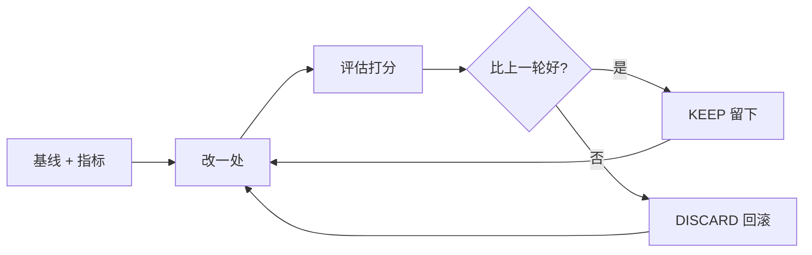

## 是什么

把"改一处 → 打分 → 好的留下、差的扔掉 → 再改下一处"做成一个能自己跑下去的迭代框架，帮你在睡觉时把任何"可以打分的东西"（代码 / 文案 / Prompt / 定价策略）持续优化到当前能力上限。

## 怎么用

1. 先把研究对象的基线跑通，明确单一核心指标（越小越好或越大越好，二选一）。
2. 划定改动边界：哪些文件可改、哪些只读（评估器永远只读，改了就没法和历史结果比较了）。
3. 进入循环：每轮只改一处 → 提交 → 跑评估 → 记一行到 results.tsv（不入 git，避免 reset 丢日志）。
4. 按规则裁决：指标更好就留，更差或崩溃就 git reset 回滚；连续 3 次回滚就换策略方向。
5. 卡住时按"微调 → 替换组件 → 简化删除 → 组合近似成功 → 激进重构"的优先级换打法，连续 5 次崩溃才停下来写 HANDOFF。

## 架构图



# Autoresearch 自动迭代框架

> **核心公式：change → score → keep/rollback → repeat**
> — Karpathy, 630 行代码，5 万 star，MIT 协议

---

## 为什么这不只是 ML 工具

把"训练代码"换成任何东西：

| 被优化的对象 | 评估指标 | 改什么 |
|-------------|---------|-------|
| ML 训练代码 | val_bpb (越小越好) | 模型结构/超参/优化器 |
| 小红书帖子 | checklist 通过率 (越高越好) | 标题/开头/比喻/标签 |
| SKILL.md | 触发准确率 (越高越好) | description/gotchas/triggers |
| Landing page | 转化率/Lighthouse 分 | CTA 文案/布局/颜色 |
| API 性能 | 延迟 p99 (越小越好) | 缓存策略/查询/索引 |
| Prompt | 输出质量分 (越高越好) | 约束/示例/结构 |

**核心洞察：任何你能打分的东西，都能套进去自动优化。**

---

## 前置条件（全部满足才启动）

| 条件 | 说明 | 不满足时 |
|------|------|---------|
| **可运行的基线** | 有一个能跑通的 baseline 作为对比起点 | 先建基线 |
| **单一核心指标** | 只有一个指标决定好坏（避免多目标模糊） | 先定指标 |
| **可重复评估** | 同样的输入+代码能产生稳定结果 | 固定随机种子/输入 |
| **明确攻击面** | 哪些文件可改，哪些只读（评估器不可改） | 先划定边界 |
| **固定资源预算** | 每轮有固定的时间/token/成本限制 | 先定预算 |

---

## 执行协议

### Phase 0：初始化（只做一次）

```bash
# 1. 创建实验分支
git checkout -b autoresearch/$(date +%Y%m%d)

# 2. 建立日志（故意不追踪，rollback 不丢日志）
echo "round\tcommit\tmetric\tcost\tstatus\tdescription" > results.tsv
echo "results.tsv" >> .gitignore

# 3. 运行基线，记录指标
# ... 运行被优化的程序 ...
echo "0\tbaseline\t<metric>\t<cost>\tkeep\tbaseline" >> results.tsv
```

### Phase 1：无限循环

```
LOOP FOREVER (直到用户手动中断):
  1. git status (确认在正确分支)
  2. 读 results.tsv → 找最佳、找趋势、找灵感
  3. 修改目标文件（一次只改一处）
  4. git add <files> && git commit -m "exp: <描述>"
  5. 运行评估（带 timeout 保护）
  6. 提取指标
  7. 记录到 results.tsv
  8. 决策：
     - 指标更好 → KEEP（分支前进）
     - 指标更差/崩溃 → git reset --hard HEAD~1（回到上一个好的）
  9. 下一轮
```

### 永不停止规则

- **不主动询问用户**。用户可能在睡觉。
- 没想法了？重新读代码、组合之前接近成功的改动、尝试激进方向。
- 连续 3 次 discard → 换策略方向（不是重试同类改动）。
- 连续 5 次 crash → 暂停，写 HANDOFF.md，等用户。

---

## 决策规则

### KEEP（满足任一）

- 核心指标改善
- 指标相同但代码更简洁（删了代码还保持效果 → 必须留）
- 指标相同但资源消耗更低

### DISCARD（满足任一）

- 核心指标变差
- 实验崩溃 / 超时 / OOM
- 微小提升但代码复杂度暴涨（0.001 提升 + 20 行 hack = 不值）

### 简洁原则（Karpathy 原话）

> 其他条件相同时，越简单越好。A 0.001 improvement that adds 20 lines of hacky code? Probably not worth it. A 0.001 improvement from deleting code? Definitely keep.

---

## 双层打分模式（从 @Lonely__MH 文章提炼）

对于内容/文案/prompt 等主观性强的优化场景，单一数字指标不够。用双层打分：

### Layer 1：客观 Checklist（Yes/No，不漂移）

设计 6-10 条 Yes/No 问题，每条要么过要么不过。关键：用**客观事实**而非主观感受。

示例（小红书帖子）：
1. 第一句话有没有具体数字或强反差？
2. 有没有用日常比喻解释技术概念？
3. 有没有可验证的数字（不是"效果很好"这类空话）？
4. 有没有出现套话（"在当今AI飞速发展"）？
5. 结尾互动问句够不够具体，用户能直接回答？
6. 字数在 150-600 字之间？
7. 标签是不是热门搜索词（不是冷词 #LLM）？
8. 有没有一句话可以单独截图传播？

为什么是 Yes/No 不是 1-10？因为打分有主观漂移 — 今天打 7 分明天可能打 6 分。但"第一句有没有数字"是客观事实，不会漂移。**标准越客观，迭代越稳定。**

### Layer 2：主观感受（切换读者视角）

放下所有规则，只凭直觉问：
- 作为目标读者，看到这个你会停下来吗？（1-10）
- 你会转发吗？（1-10）

### 综合决策

```
total_score = checklist_pass_rate * 0.6 + subjective_avg * 0.4

if total_score >= 0.8:
    status = "PASS"  # 直接通过
elif total_score >= 0.5:
    status = "REVISE"  # 针对扣分项定向重写
else:
    status = "REWRITE"  # 整稿推倒重来
```

---

## 场景模板

### 场景 A：ML 训练优化（Karpathy 原始场景）

```
指标: val_bpb (越小越好)
可改: train.py (模型/优化器/超参/训练循环)
只读: prepare.py (数据加载 + 评估函数)
预算: 每轮 5 分钟
日志: results.tsv (commit / val_bpb / peak_vram_mb / status / description)
提取: grep "^val_bpb:\|^peak_vram_mb:" run.log
```

### 场景 B：代码性能优化

```
指标: 执行时间 ms (越小越好)
可改: 目标函数/算法实现
只读: benchmark 脚本 + 测试用例
预算: 每轮 30 秒
日志: results.tsv (commit / latency_ms / memory_mb / status / description)
提取: 运行 benchmark → 解析输出
约束: 所有测试必须通过（正确性不可牺牲）
```

### 场景 C：Prompt/Skill 质量优化

```
指标: checklist 通过率 + 主观分 (越高越好)
可改: SKILL.md / prompt 文本
只读: 测试用例集（3-5 个固定场景）
预算: 每轮 3 个测试场景
日志: results.tsv (round / checklist_score / subjective_score / status / description)
提取: 用 LLM 自评 checklist → 用第二 LLM 做主观评分
约束: 每轮只改一处（description 或 gotchas 或 constraints）
```

### 场景 D：内容生成优化（小红书/公众号/Twitter）

```
指标: 双层打分 total_score (越高越好)
可改: 内容生成 skill 的约束规则
只读: 评分 checklist + 测试主题集
预算: 每轮 3 个测试主题
日志: results.tsv (round / checklist_rate / subjective / total / status / changes)
提取: 生成 3 篇 → 评分 → 取平均
约束: checklist 随迭代可扩展（发现新问题就加条目）
```

### 场景 E：前端 UI 优化

```
指标: Lighthouse 分 (越高越好)
可改: CSS/组件实现
只读: 设计稿 + 功能测试
预算: 每轮 build + Lighthouse audit
日志: results.tsv (commit / perf / a11y / seo / status / description)
提取: lighthouse --output json → jq '.categories'
约束: 视觉回归不可接受（截图对比）
```

---

## 策略库（卡住时按优先级）

1. **微调参数** — 最安全，快速验证
2. **替换组件** — 换实现方式，保持接口不变
3. **简化删除** — 移除不必要的复杂度
4. **组合近似成功** — 把之前单独不够的改动叠加
5. **激进重构** — 完全换思路，打破局部最优

---

## 与 AI-Fleet 基础设施的连接

| autoresearch 概念 | AI-Fleet 对应设施 | 连接方式 |
|-------------------|-------------------|---------|
| LOOP FOREVER | Away Mode + Queue Execution | `02-workflow-discipline.md` 的 "do not ask, do not stop" |
| keep/discard | loop_detector.py | 连续 discard = 触发策略轮换 |
| results.tsv | notes.md experiment section | 实验日志追加到 notes.md |
| 固定预算 | verification_gate.py timeout | 每轮有 timeout 保护 |
| 基线对比 | git baseline commit | 第一个 commit 是 baseline |
| 简洁原则 | `01-coding-philosophy.md` | "Readability > Performance > Brevity" |
| 双层打分 | skill-group-loop gateCommand | checklist 作为 gate，主观分作为 tiebreaker |

### 与 LoopDetector 联动

AI-Fleet 的 `core/harness/loop_detector.py` 已有连续失败检测。autoresearch 循环中：
- 连续 2 次 discard → loop_detector L1 WARN（换调试方法论）
- 连续 3 次 discard → loop_detector L2 PIVOT（强制切换策略方向）
- 连续 5 次 crash → loop_detector L3 ESCALATE（写 HANDOFF.md → 新 session）

### 与 Skill Group Loop 联动

当 autoresearch 用于优化 skill 本身时，可以嵌入 skill-group-loop：
1. 修改 skill → 运行测试场景 → 打分
2. gateCommand = `python3 -c "import json; d=json.load(open('results.tsv')); print('PASS' if d[-1]['status']=='keep' else 'FAIL')"`
3. maxIterations 限制防止无限循环

---

## Gotchas

1. **评估器不可改** — 这是 autoresearch 最重要的约束。如果你改了评估标准，所有之前的结果都不可比了。宁可换指标重跑，不要改评估函数。

2. **results.tsv 不入 git** — 故意的。`git reset --hard` 会清掉 tracked 文件，但 untracked 的 TSV 会保留完整实验历史。

3. **一次只改一处** — 多处同时改，你不知道哪个改动有效。如果急需组合，先单独验证每个改动，再组合。

4. **Yes/No > 1-10 分** — 主观评分会漂移（今天 7 分明天 6 分），Yes/No 是客观事实。checklist 越客观，迭代越稳定。

5. **简洁是免费的提升** — 删代码还能保持效果 = 必须留。这不是审美偏好，是降低后续迭代的认知负担。

6. **超时 = 失败** — 不要等超时的实验跑完。kill 掉，记为 crash，继续下一轮。等待 = 浪费预算。

7. **checklist 可以扩展** — 发现新问题就加条目。从 6 条扩到 8 条是进步，但要用新 checklist 重新评估基线。

---

> **最后一句：工具会过时，框架不会。Karpathy 贡献的不是 630 行代码，是"改一个→打分→好的留差的扔"这个任何人都能拿走的迭代方法论。**
