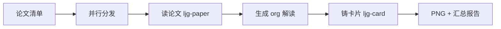

## 是什么

一条指令把"读论文 → 出深度解读 → 铸成可分享卡片"串成流水线，多篇论文还能并行跑，帮你在一杯咖啡的时间内把一摞 arXiv 链接变成一组可发圈的研究卡片。

## 怎么用

1. 把论文来源（arXiv 链接 / PDF 路径 / 论文名）一次性丢给流水线，不用一篇一篇发。
2. 选卡片模具：默认长图、`-c` 多卡、`-i` 信息图（按你要分享的渠道决定）。
3. 流水线为每篇论文起一个子智能体，串行执行"读论文 → 铸卡片"两步。
4. 多篇论文之间并行，互不阻塞，等所有子智能体收工。
5. 最后看汇总报告，每篇论文都带 org 解读路径 + PNG 卡片路径，可直接转发或归档。

## 架构图



# ljg-paper-flow: 论文流

一条命令完成：读论文 → 生成解读 → 铸成卡片。支持多篇并行。

## 模式

**强制 NATIVE 模式。** 本 workflow 是纯 skill 管道（ljg-paper → ljg-card），不需要 Algorithm 的七步流程。直接按下方执行步骤调用 skill，不走 OBSERVE/THINK/PLAN/BUILD/EXECUTE/VERIFY/LEARN。

## 参数

| 参数 | 说明 |
|------|------|
| 无参数 | 对话中已提供的论文链接/文件 |
| `-c` | 卡片模具改用多卡模式（默认 `-l` 长图） |
| `-i` | 卡片模具改用信息图模式 |

## 执行

### 1. 收集论文列表

从用户消息中提取所有论文来源（arxiv URL、PDF 路径、论文名称等）。

### 2. 并行处理每篇论文

对每篇论文，启动一个 Agent subagent，每个 subagent 按顺序执行两步：

**步骤 A — 读论文（ljg-paper）：**

调用 Skill tool 执行 `ljg-paper`，传入该论文的来源。等待完成，获得生成的 org 文件路径。

**步骤 B — 铸卡片（ljg-card）：**

读取步骤 A 生成的 org 文件，调用 Skill tool 执行 `ljg-card`（默认 `-l`，或按用户指定的模具参数），以 org 文件内容为输入。等待完成，获得 PNG 文件路径。

### 3. 汇总报告

所有论文处理完成后，汇总输出：

```
════ 论文流完成 ═══════════════════════
📄 {论文标题1}
   📝 解读: {org 文件路径}
   🖼️ 卡片: {PNG 文件路径}

📄 {论文标题2}
   📝 解读: {org 文件路径}
   🖼️ 卡片: {PNG 文件路径}
...
```

## 关键约束

- 每篇论文的两步必须串行（先 paper 后 card），但多篇论文之间并行
- ljg-paper 和 ljg-card 各自的质量标准、红线、品味准则不变
- 卡片内容来自生成的 org 文件，不是原始论文
