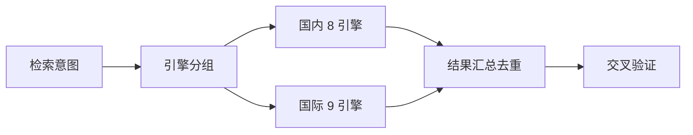

## 是什么

把 17 个中外搜索引擎（百度 / 搜狗 / 微信 / Google / Bing / DuckDuckGo / WolframAlpha 等）做成一个"无需 API Key 的并行抓取入口"，帮你在跨境市场调研、隐私敏感检索、知识计算这类场景里同时拿到中文 + 国际 + 隐私三类信源的原始结果。

## 怎么用

1. 想清楚检索意图属于哪一类（行业市场 / 政策法规 / 学术 / 隐私敏感 / 数学计算），决定要不要全引擎并行。
2. 用 web_fetch 直接拼搜索 URL，国内信源用百度 + 搜狗微信，国际用 Google + DuckDuckGo + Brave。
3. 善用高级算子：`site:` 限定站内、`filetype:pdf` 找报告、`""` 精确匹配、`tbs=qdr:w` 限定一周内的内容。
4. 隐私敏感场景优先 DuckDuckGo + Startpage + Brave + Qwant；数字 / 单位换算 / 股价直接走 WolframAlpha。
5. 并行结果记得做去重和交叉验证，不同引擎对同一关键词的排序差异本身就是信号。

## 架构图



# Multi Search Engine v2.0.1

Integration of 17 search engines for web crawling without API keys.

## Search Engines

### Domestic (8)
- **Baidu**: `https://www.baidu.com/s?wd={keyword}`
- **Bing CN**: `https://cn.bing.com/search?q={keyword}&ensearch=0`
- **Bing INT**: `https://cn.bing.com/search?q={keyword}&ensearch=1`
- **360**: `https://www.so.com/s?q={keyword}`
- **Sogou**: `https://sogou.com/web?query={keyword}`
- **WeChat**: `https://wx.sogou.com/weixin?type=2&query={keyword}`
- **Toutiao**: `https://so.toutiao.com/search?keyword={keyword}`
- **Jisilu**: `https://www.jisilu.cn/explore/?keyword={keyword}`

### International (9)
- **Google**: `https://www.google.com/search?q={keyword}`
- **Google HK**: `https://www.google.com.hk/search?q={keyword}`
- **DuckDuckGo**: `https://duckduckgo.com/html/?q={keyword}`
- **Yahoo**: `https://search.yahoo.com/search?p={keyword}`
- **Startpage**: `https://www.startpage.com/sp/search?query={keyword}`
- **Brave**: `https://search.brave.com/search?q={keyword}`
- **Ecosia**: `https://www.ecosia.org/search?q={keyword}`
- **Qwant**: `https://www.qwant.com/?q={keyword}`
- **WolframAlpha**: `https://www.wolframalpha.com/input?i={keyword}`

## Quick Examples

```javascript
// Basic search
web_fetch({"url": "https://www.google.com/search?q=python+tutorial"})

// Site-specific
web_fetch({"url": "https://www.google.com/search?q=site:github.com+react"})

// File type
web_fetch({"url": "https://www.google.com/search?q=machine+learning+filetype:pdf"})

// Time filter (past week)
web_fetch({"url": "https://www.google.com/search?q=ai+news&tbs=qdr:w"})

// Privacy search
web_fetch({"url": "https://duckduckgo.com/html/?q=privacy+tools"})

// DuckDuckGo Bangs
web_fetch({"url": "https://duckduckgo.com/html/?q=!gh+tensorflow"})

// Knowledge calculation
web_fetch({"url": "https://www.wolframalpha.com/input?i=100+USD+to+CNY"})
```

## Advanced Operators

| Operator | Example | Description |
|----------|---------|-------------|
| `site:` | `site:github.com python` | Search within site |
| `filetype:` | `filetype:pdf report` | Specific file type |
| `""` | `"machine learning"` | Exact match |
| `-` | `python -snake` | Exclude term |
| `OR` | `cat OR dog` | Either term |

## Time Filters

| Parameter | Description |
|-----------|-------------|
| `tbs=qdr:h` | Past hour |
| `tbs=qdr:d` | Past day |
| `tbs=qdr:w` | Past week |
| `tbs=qdr:m` | Past month |
| `tbs=qdr:y` | Past year |

## Privacy Engines

- **DuckDuckGo**: No tracking
- **Startpage**: Google results + privacy
- **Brave**: Independent index
- **Qwant**: EU GDPR compliant

## Bangs Shortcuts (DuckDuckGo)

| Bang | Destination |
|------|-------------|
| `!g` | Google |
| `!gh` | GitHub |
| `!so` | Stack Overflow |
| `!w` | Wikipedia |
| `!yt` | YouTube |

## WolframAlpha Queries

- Math: `integrate x^2 dx`
- Conversion: `100 USD to CNY`
- Stocks: `AAPL stock`
- Weather: `weather in Beijing`

## Documentation

- `references/advanced-search.md` - Domestic search guide
- `references/international-search.md` - International search guide
- `CHANGELOG.md` - Version history

## License

MIT
