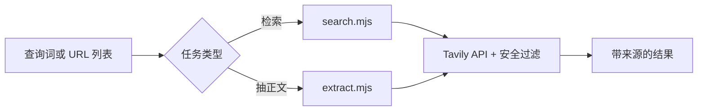

## 是什么

把 Tavily API 包装成一条"安全检索 + 指定 URL 抽正文"的轻量通道，帮你在写报告前几分钟就拿到一组带来源的检索结果，或者把若干指定网页的正文一次性提取出来做摘要，而不必逐个手动复制粘贴。

## 怎么用

1. 先确认环境里有 `TAVILY_API_KEY`，绝不要把它写进文件、提交到仓库、或者出现在任何输出里。
2. 普通检索调用 `search.mjs`，传入查询词；要扩大召回用 `-n 8`，要更深的来源走 `--deep`。
3. 新闻类话题用 `--topic news --days 3` 限定近 3 天，避免拿到过期素材污染分析。
4. 已知 URL 的正文抽取走 `extract.mjs`，可以一次传多个 URL，按需做并行摘要。
5. 严格遵守安全护栏：只接受 http / https，拒绝 localhost、私有 IP、`.local` / `.internal` 域名，单次请求 URL 数量控制在脚本默认上限内。

## 架构图



# Tavily Search (Secure)

Tavily API ile güvenli arama/extract akışı çalıştır.

## Gereksinim

- `TAVILY_API_KEY` ortam değişkeni tanımlı olmalı.
- API anahtarını dosyaya yazma, commit etme veya çıktıda gösterme.

## Arama

```bash
node {baseDir}/scripts/search.mjs "query"
node {baseDir}/scripts/search.mjs "query" -n 8 --deep
node {baseDir}/scripts/search.mjs "query" --topic news --days 3
```

## URL içerik çıkarma

```bash
node {baseDir}/scripts/extract.mjs "https://example.com/article"
node {baseDir}/scripts/extract.mjs "https://a.com" "https://b.com"
```

## Güvenlik kuralları

- Sadece `http` / `https` URL kabul et.
- Localhost, loopback, private IP ve `.local/.internal` alan adlarını reddet.
- Tek istekte URL sayısını sınırlı tut (script varsayılanı uygular).
- Hata durumunda kısa ve temiz hata ver; anahtar veya hassas veri dökme.
