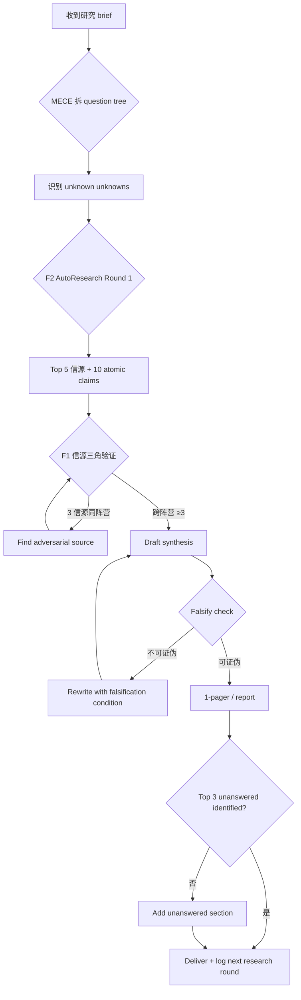
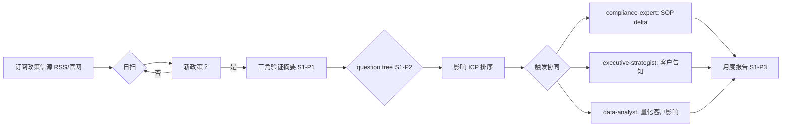
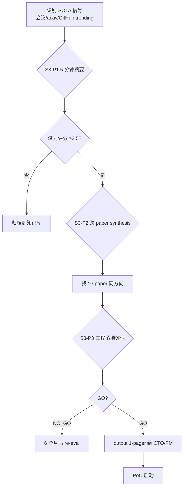

# Tool-Kit 03 · SOP Flowchart · Research Analyst

> 3 张 mermaid 流程图覆盖最高频研究工作流。

## SOP-A · 新研究任务启动 → 交付

**关键控制点**：
- 节点 B：question tree 必须 MECE，≤7 leaf，每 leaf 有 deliverable 形式
- 节点 F：3 信源必须跨阵营（primary + secondary + adversarial），单阵营 ≥3 都不算合格
- 节点 I：falsify check 强制 → 不可证伪的研究等于零价值
- 节点 L：unanswered 段强制 → 不识别 gap 等于自满

**失效信号**：
1. ≥1 leaf 的 deliverable 与 brief 偏离 → 解读偏差
2. 信源全部 <12 个月 → 缺历史 context；全部 >24 个月 → stale
3. unanswered 段空 → 研究价值低

## SOP-B · 政策追踪 → SOP 落地

**关键控制点**：
- 节点 B：每日固定时段扫，至少 3 个独立信源（避免单源依赖反模式）
- 节点 F：ICP 排序必须用客观数据（影响数字 / 概率估算 / 控制成本），不允许"凭感觉"
- 节点 K：月度报告必须包含上月 unanswered 是否已解答

**失效信号**：
1. 日扫覆盖 <3 信源 → 单源风险
2. 月度报告无 unanswered follow-up → 闭环断
3. 协同延迟 >7 日 → 政策影响延期

## SOP-C · SOTA paper 研究 → 工程落地

**关键控制点**：
- 节点 B：5 分钟硬约束，超时则放弃这篇（防止 paper-rabbit-hole）
- 节点 G：ROI 估算必须含 break-even 时长，否则不允许 GO
- 节点 H：GO 决策必须有 1 个 NO_GO 的 falsification condition

**失效信号**：
1. 5 分钟摘要 >15 分钟 → paper 太深，不适合作为本周 SOTA scan 单元
2. GO 但 6 个月后 PoC 仍未启动 → 研究→落地链路断
3. 跨 paper synthesis 全部一致 → 没找到 adversarial paper

---

Agent Foundry Team
